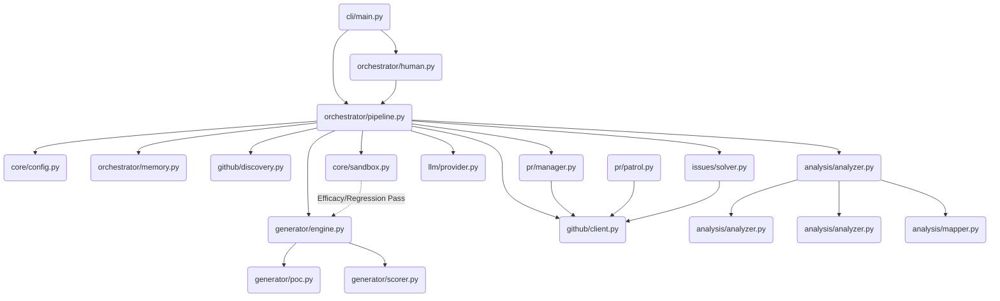

# 🗺️ Agent-Farm Project Architecture Map

This document serves as the architectural blueprint for the Agent-Farm v4.0.0 codebase. It details the core components, their dependencies, execution loops, and the SQLite state schema.

---

## 1. System Overview & Tech Stack

| Technology | Role |
| :--- | :--- |
| **Python 3.11+** | Core programming language driving the CLI, orchestration, and async operations. |
| **Hatchling** | Build backend and project metadata manager (`pyproject.toml`). |
| **Docker >= 7.1** | Provides the `DockerSandbox` for dynamically executing Proof-of-Concept scripts and validating patches against regressions. |
| **aiosqlite** | Asynchronous SQLite driver managing persistent memory (`memory.db`), tracking PR outcomes, targets, and API usage. |
| **ChromaDB** | Vector database powering the Omniscient Context Engine (RAG) to index and retrieve documentation context. |
| **Pydantic / Pydantic Settings** | Strict configuration validation and environment variable resolution. |
| **Click & Rich** | Powers the rich CLI interface and terminal UI. |
| **httpx** | Async HTTP client for communicating with GitHub APIs and LLM providers. |
| **OpenRouter / Google GenAI** | Orchestrates access to `deepseek-v4-pro`, `qwen3.7-max`, and `gemini-3.5-flash` for multi-layer evaluation. |

---

## 2. Directory Structure

```text
.
├── Dockerfile                  # Defines the agent-farm Docker service
├── LICENSE
├── Makefile                    # Make targets (install, test, lint, docker, etc)
├── PROJECT_MAP.md
├── README.md                   # Project overview and entry point documentation
├── config.example.yaml         # Example configuration for the agent pipeline
├── docker-compose.yml          # Docker composition with isolated/internet networks
├── farm_agent
│   ├── agents
│   │   └── registry.py         # Registry for modular Agent components
│   ├── analysis
│   │   ├── analyzer.py         # Bloodhound and CodeAnalyzer
│   │   └── mapper.py           # AST-based dependency graph generator
│   ├── cli
│   │   └── main.py             # CLI Entry points (run, superhuman, hunt, etc.)
│   ├── core
│   │   ├── config.py           # Pydantic configuration schemas
│   │   ├── daily_log.py        # Markdown logger for daily operations
│   │   ├── exceptions.py       # Custom pipeline exceptions
│   │   ├── leaderboard.py      # Computes contributor leaderboards
│   │   ├── logger.py           # Rich and rotating log configurations
│   │   ├── middleware.py       # Pipeline middleware chains
│   │   ├── models.py           # Core dataclasses (Repository, Contribution, etc.)
│   │   ├── notifier.py         # Telegram/Slack/Discord notification dispatch
│   │   ├── profiles.py         # Configuration profile manager
│   │   ├── quotas.py           # LLM rate limiting logic
│   │   ├── rag.py              # ChromaDB RepoIndexer and retrieval
│   │   ├── retry.py            # Async retry mechanisms
│   │   └── sandbox.py          # DockerSandbox logic for dynamic validation
│   ├── generator
│   │   ├── engine.py           # ContributionGenerator (Patch creation)
│   │   ├── poc.py              # PoCGenerator (Proof of Concept script generation)
│   │   ├── reviewer.py         # AI reviewer component
│   │   └── scorer.py           # QAHardcoreScorer for the DEV-QA Loop
│   ├── github
│   │   ├── client.py           # GitHubClient wrapper around HTTPx
│   │   ├── discovery.py        # DatabaseTargetDiscovery / RepoDiscovery
│   │   ├── guidelines.py       # Fetches repo guidelines and templates
│   │   └── security_gate.py    # Diplomat Protocol: Security Disclosure
│   ├── issues
│   │   └── solver.py           # Issue-First Pipeline logic
│   ├── llm
│   │   ├── agents.py
│   │   ├── context.py          # LLM Context Window management
│   │   ├── models.py
│   │   ├── provider.py         # Factory to spawn LLM providers
│   │   └── router.py           # Multi-model routing strategies
│   ├── notifications
│   │   └── notifier.py
│   ├── orchestrator
│   │   ├── human.py            # SuperHumanLoop (Terminator Mode) execution
│   │   ├── memory.py           # SQLite Persistent State backend
│   │   └── pipeline.py         # Main Orchestrator (FarmAgentPipeline)
│   ├── plugins                 # Submodule for extended functionalities
│   ├── pr
│   │   ├── manager.py          # PRManager (Commit, push, create PR)
│   │   └── patrol.py           # PRPatrol (Review responses and auto-fixes)
│   ├── templates
│   │   ├── builtin
│   │   └── registry.py         # Registers PR description templates
│   └── tools
│       └── protocol.py         # Tool abstraction registry
├── fix.py
├── progress.txt
├── pyproject.toml              # Build backend and dependencies
├── requirements.txt            # Core environment package definitions
├── scripts
│   ├── cleanup_forks.py
│   ├── ingest_architecture_context.py
│   ├── inject_ci_trap.py
│   ├── inject_maintainer_feedback.py
│   ├── perf_benchmark_io.py
│   └── vip_repos_radar.py
├── secret_findings
│   └── mock_repo.json
├── sg-extract                  # Static analyzers (ast-grep, semgrep binaries)
│   ├── ast-grep
│   └── sg
├── start.bat                   # Windows 1-Click Launch Script
├── start.sh                    # Unix 1-Click Launch Script
├── target_repo.json            # Seed file for Circular Target Loop
└── tests
```

---

## 3. Core Module Dependency Graph



---

## 4. Core Execution Loops / Entry Points

### Single Repo Pipeline Pass (`FarmAgentPipeline`)
1. **Init:** Reads config, spawns `GitHubClient`, `Memory`, `CodeAnalyzer`, `ContributionGenerator`, and `DockerSandbox`.
2. **Pre-Checks:** Evaluates AI ban policies (`AI_POLICY.md`) and interaction limits on the target.
3. **Analyze:** RAG context indexed. `BloodhoundAnalyzer` runs Semgrep. AST mapping occurs.
4. **Anti-Farming Filter:** Zero-tolerance checks discard doc tweaks and false positives.
5. **Appraisal (Layer 1):** Qwen-3.7-Max evaluates the finding severity.
6. **Dynamic Verification (PoC):** DeepSeek generates a PoC script; `DockerSandbox` runs it.
7. **Generation (DEV-QA Loop):** Fix patches are proposed. `QAHardcoreScorer` grades them (max 3 cycles).
8. **Blast Radius Validation:** `DockerSandbox` verifies PoC efficacy against the patch and runs native regression tests.
9. **Supreme Audit (Layer 2):** Gemini-3.5-Flash audits the entire dossier + sandbox logs.
10. **PR Creation:** `PRManager` initiates the commit and GitHub PR creation.

### Terminator Mode / Circular Loop (`SuperHumanLoop`)
1. **Initialization:** Starts the relentless execution loop. Syncs daily PR quota state.
2. **Target Acquisition:** Atomically queries the `target_repos` table for the oldest scanned target (`scanned_at` ASC).
3. **Action Routing:**
   - **Hunt Mode:** Triggers a Pipeline Pass on the target.
   - **Patrol Mode:** If daily PR limits hit or open PR comments exist, spawns `PRPatrol` to fix CI or reply to reviews.
4. **Graceful Rotation:** Handles SIGINT/SIGTERM to drain gracefully, checkpointing SQLite WAL to prevent corruption.

---

## 5. Database/State Schema (`memory.db`)

Agent-Farm leverages `aiosqlite` to persist crucial state, API tracking, and targeting information across restarts.

| Table Name | Description |
| :--- | :--- |
| `analyzed_repos` | Tracks GitHub repositories already analyzed to prevent repeated effort. Stores findings count and last analyzed timestamp. |
| `submitted_prs` | Central store for PRs successfully submitted by the bot. Crucial for tracking `ci_fix_attempts` and `status` ('open', 'merged', 'closed'). |
| `findings_cache` | Temporarily caches potential findings between analysis and generation cycles. |
| `run_log` | High-level tracking of pipeline execution iterations (started at, finished at, errors). |
| `pr_outcomes` | Logs final outcomes (e.g., 'merged', 'rejected') and feedback to train `repo_preferences`. |
| `repo_preferences` | Aggregated insights per repo (preferred types, merge rates) enabling Contextual Intelligence. |
| `blacklisted_repos` | Repos excluded from the pipeline due to `toxic_maintainer` or repeated failures. |
| `api_usage_log` | Rotating usage metrics to prevent violating LLM API rate limits. |
| `task_schedule` | Persistent tracking for background tasks like `quota_cleanup` and Garbage Collection. |
| `knowledge_base` | The corpus containing accumulated `qa_lesson` and `FILTER_REJECTION_LESSON` contexts for the AI. |
| `target_repos` | The primary queue for the Circular Target Loop, tracking `repo_url`, `status`, and atomic `scanned_at` rotation timestamps. |
| `repo_style_guides` | Summarized contributing instructions (`CONTRIBUTING.md`) used during QA scoring to align patches with repository styles. |
