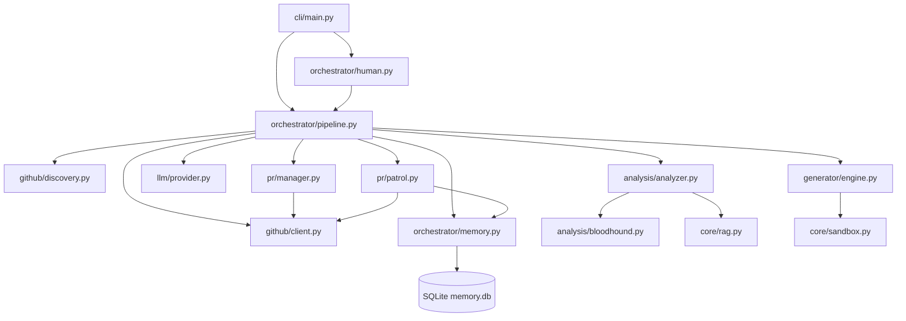

# PROJECT_MAP.md — Farm-Agent Ground Truth

**Generated:** 2026-04-15
**Version:** v3.0.0
**Entry Point:** `farm_agent/cli/main.py` → `cli()` (Click-based CLI)
**Language:** Python 3.11+

---

## 1. System Overview & Tech Stack

**What the system actually does:**

Farm-Agent is an autonomous AI agent that discovers open-source GitHub repositories matching criteria (language, star range, activity), scans their code for issues (security vulnerabilities, code quality bugs, performance problems, etc.), generates patches via LLM, validates patches in Docker sandboxes, and creates PRs or GitHub Issues to contribute back.

**Active Tech Stack:**

| Component | Technology | Evidence |
|-----------|------------|----------|
| Language | Python 3.11+ | `requires-python = ">=3.11"` in `pyproject.toml` |
| HTTP client | `httpx` (async) | `httpx>=0.27,<1.0` |
| LLM Providers | MiniMax, OpenRouter (via `google-genai` + `openai` + `anthropic`) | `config.py:55-68` |
| Database | SQLite via `aiosqlite` | `memory.py` — WAL mode, `data/memory.db` default |
| Docker | `docker>=7.1,<8.0` | `pyproject.toml`, `sandbox.py` |
| Scheduling | `apscheduler>=3.10,<4.0` | `pyproject.toml` |
| Config | Pydantic v2 + YAML | `config.py` — all config in `FarmAgentConfig` |
| CLI | `click>=8.1,<9.0` + `rich>=13.0,<14.0` | `main.py` |
| Vector DB | `chromadb>=0.4,<1.0` | `pyproject.toml` |
| Git Python | `gitpython>=3.1,<4.0` | `pyproject.toml` |

---

## 2. Directory Structure

```text
farm_agent/
├── cli/                 # CLI entrypoints
│   └── main.py          # Click CLI, all commands (run, hunt, patrol, target, etc.)
├── core/                # Core domain components and utilities
│   ├── config.py        # Pydantic configuration and env var loading
│   ├── exceptions.py    # Custom exceptions (GitHubAPIError, RateLimitError, etc.)
│   ├── logger.py        # Daily rolling file logger
│   ├── memory.py        # SQLite persistent memory interactions
│   ├── middleware.py    # DeerFlow pattern middleware execution
│   ├── models.py        # Core pydantic models (Repository, Finding, PR etc)
│   ├── notifier.py      # Notifications mapping
│   ├── rag.py           # ChromaDB Retrieval-Augmented Generation indexing
│   ├── retry.py         # Retry decorators and caches
│   └── sandbox.py       # DockerSandbox — isolated patch execution
├── analysis/            # Code scanning logic
│   ├── analyzer.py      # Main static and semantic code analyzer
│   └── bloodhound.py    # Red Team analysis orchestrator and Semgrep tools
├── generator/           # Patch code synthesis
│   ├── engine.py        # Contribution generator (LLM interface for patches)
│   ├── reviewer.py      # Evaluates and reviews the patch
│   └── scorer.py        # Advanced hardcore scoring evaluator
├── github/              # External provider interaction
│   ├── client.py        # Async client for REST and GraphQL GitHub API
│   ├── discovery.py     # GitHub repo hunting and internal database targeting
│   ├── guidelines.py    # Fetching PR templates and CONTRIBUTING.md
│   └── security_gate.py # Security disclosure phrase detection
├── issues/              # Issue handling specific features
│   └── solver.py        # Automatic GitHub issue resolution logic
├── llm/                 # Agent logic mapping
│   ├── models.py        # Supported LLM catalogs, capabilities, pricing
│   ├── provider.py      # LLM Provider factory (MiniMax, OpenRouter, local)
│   └── router.py        # Auto-routes tasks to optimal LLMs based on capability
├── orchestrator/        # Master logic engines
│   ├── human.py         # SuperHumanLoop - runs pipeline with pseudo-organic timing
│   ├── memory.py        # Core memory schema logic
│   └── pipeline.py      # ContribPipeline - main discovery/analysis/execution loop
├── pr/                  # Lifecycle management of PRs
│   ├── janitor.py       # Cleans up/closes low-quality or inactive PRs
│   ├── manager.py       # Handles PR branch pushing, commits and fork state
│   └── patrol.py        # Interacts with maintainer comments on open PRs
└── tools/               # Agent action tools
    └── protocol.py      # Executable sub-tools definitions
```

---

## 3. Core Module Dependency Graph



---

## 4. Core Execution Loops

### Pipeline Data Flow (for `run` command)

1. `CLI.run()` -> `load_config()`
2. `ContribPipeline.run()` execution initialized
3. `RepoDiscovery.discover()` fetches a list of `Repository` instances.
4. An `asyncio.Semaphore` processes repositories concurrently.
5. `_process_repo()`:
    - **Policy Enforcement:** `_check_ai_policy()`, `check_interaction_limits()`, `run_security_gate()`, `check_maintainer_vibe()`. (Aborts if hostile, banned, or strictly contributor-only).
    - **Setup:** `fetch_repo_guidelines()` resolves PR/Commit formats.
    - **Analysis:** `CodeAnalyzer.analyze()` generates a list of `Finding`.
    - **Anti-Farming Gate:** Skips docs/txt/md files and trivial/low severity issues, limits findings to maximum 2.
    - **Validation:** Finds duplicate local and GH PRs, uses an LLM to re-validate remaining findings.
    - **Route & Generate:**
        - High/Critical/Security gets direct PR via `ContributionGenerator.generate()`.
        - Else runs the Issue-First protocol.
    - **Validation:** Executes code via `DockerSandbox.run_in_sandbox()` (Max 3 retries, self-correction on failure).
    - **Submit:** If successful, `PRManager.create_pr()`, logs result in SQLite.

### Super Human Mode (`superhuman`)

Runs an organic, infinite background loop:
1. Sleeps to mimic real developer circadian rhythms based on an internal clock schedule.
2. Performs hunting rounds (`farm_agent hunt`), discovery and processing.
3. Randomizes daily quotas of PRs generated to simulate natural pacing.

### Patrol & Maintainer Interaction (`patrol`)

1. Fetches all open Agent-created PRs from memory.
2. Interacts with new discussion comments.
3. Generates auto-replies or pushes fix commits.
4. Closes PR gracefully and stochastically if maintainers reject or ignore the contribution for too long.

---

## 5. Database Schema & State

**SQLite DB at:** `data/memory.db` (default, configurable via `storage.db_path`)

**WAL Journal Mode** — falls back to DELETE on Docker volume filesystems.

**Core Tables:**

| Table | Primary Columns | Purpose |
|-------|-----------------|---------|
| `analyzed_repos` | `full_name` (PK), `language`, `stars`, `analyzed_at`, `findings`, `metadata` | Track which repos have been scanned |
| `submitted_prs` | `id`, `repo`, `pr_number` (UNIQUE), `pr_url`, `title`, `type`, `status`, `branch`, `fork`, `created_at`, `updated_at`, `ci_fix_attempts`, `discussion_replies` | All PRs submitted by the agent |
| `findings_cache` | `id`, `repo`, `type`, `severity`, `title`, `file_path`, `status`, `created_at` | Cached analysis findings |
| `run_log` | `id`, `started_at`, `finished_at`, `repos_analyzed`, `prs_created`, `findings`, `errors`, `metadata` | Historical pipeline runs |
| `pr_outcomes` | `id`, `repo`, `pr_number` (UNIQUE), `pr_url`, `pr_type`, `outcome`, `feedback`, `time_to_close_hours`, `recorded_at` | Outcome tracking for learning |
| `repo_preferences` | `repo` (PK), `preferred_types`, `rejected_types`, `merge_rate`, `avg_review_hours`, `notes`, `updated_at` | Per-repo learned preferences |
| `blacklisted_repos` | `repo` (PK), `reason`, `pr_number`, `blacklisted_at` | Permanently blocked repos |
| `api_usage_log` | `id`, `timestamp` (Unix epoch), `provider` | LLM API usage for quota tracking |
| `task_schedule` | `task_key` (PK), `next_run`, `updated_at` | Persistent task scheduling |
| `knowledge_base` | `repo_name`, `entry_type`, `content`, `created_at` (UNIQUE) | QA lessons, audit history |
| `target_repos` | `repo_url` (PK), `status`, `scanned_at` (Unix ts), `language`, `bounty_amount`, `diamond_target` | Circular loop targets |
| `repo_style_guides` | `repo` (PK), `style_summary`, `contributing_md`, `pr_template`, `created_at`, `updated_at` | Cached CONTRIBUTING.md parses |

---

## 6. Critical Safeguards and Gates

1. **AI / Maintainer Blocks:** Drops PR routines if `SECURITY.md`, `AI_POLICY.md` or `CODE_OF_CONDUCT` mention restrictions against auto-generated PRs or enforce private disclosure for vulns.
2. **Docker Guillotine Sandbox:** Always ON (`sandbox_validation_enabled=True`). Disallows network usage (`network_mode="none"`) and executes code in memory constraint containers (`512m` ram, limited pids, dropped capabilities).
3. **Guarded Artifacts:** Disallows altering `.json` package lockers (`package.json`, `pnpm-lock.yaml`), typescript/node configs, licenses, action `.yml`s and `.env` formats.
4. **LLM Quota Protection:** Internal database token-tracking ensures the `api_usage_log` avoids overruns against API limits within 5H / 7D sliding windows.
