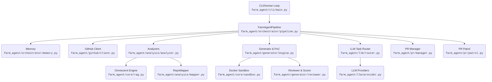

# 🗺️ Farm-Agent Project Blueprint (v4.0.0)

This document serves as the canonical architectural guide for the Agent-Farm system. It details the tech stack, directory structure, core module dependencies, execution loops, and database schemas.

---

## 1. System Overview & Tech Stack

| Technology / Library | Role in System |
| --- | --- |
| **Python (3.11+)** | Core programming language executing all business logic. |
| **Docker Engine** | Isolated sandboxing (`DockerSandbox`) for dynamic PoC vulnerability verification and blast radius regression testing. |
| **Hatchling** | Build backend and project metadata manager (`pyproject.toml`). |
| **Pydantic & Settings** | Data structure validation (`farm_agent/core/models.py`) and `.env`/YAML configuration loading. |
| **aiosqlite / SQLite** | Persistent WAL-mode memory database (`memory.db`) to track repos, PRs, quotas, and learnings. |
| **ChromaDB** | Vector DB powering the Omniscient Context Engine (Local RAG) with semantic markdown chunking for subsystem context. |
| **Click & Rich** | CLI command routing (`farm_agent/cli/main.py`) and terminal-based UI rendering. |
| **GitPython** | Programmatic GitHub repository cloning, branch management, and patch application. |
| **HTTPX** | Async network requests to GitHub API and LLM providers. |
| **OpenRouter / LLMs** | Multi-model routing. DeepSeek/Minimax for primary logic; Qwen-3.7-Max for Layer 1 Appraisals; Gemini-3.5-Flash for Layer 2 Audits. |

---

## 2. Directory Structure

```text
.
├── Dockerfile                          # Two-stage Dockerfile (builder -> runtime)
├── docker-compose.yml                  # Daemon service definition with volume mounts
├── .env.example                        # Example environment variables required to run
├── start.sh / start.bat                # 1-click Docker Quick-Start wrappers
├── pyproject.toml                      # Hatchling build, Ruff styling, and dependency definitions
└── farm_agent/                         # Core Python Package (v4.0.0)
    ├── __init__.py
    ├── cli/
    │   └── main.py                     # Entry point containing all `farm_agent` Click commands
    ├── core/
    │   ├── config.py                   # Centralized Pydantic settings loading
    │   ├── exceptions.py               # System-wide exception class hierarchy
    │   ├── leaderboard.py              # Performance tracking metrics
    │   ├── memory.py                   # DEPRECATED -> moved to orchestrator/memory.py
    │   ├── middleware.py               # Middleware chain (Rate limits, DCO, Quality Gates)
    │   ├── models.py                   # Pydantic core data schemas (Issue, Repository, PRStatus, etc.)
    │   ├── quotas.py                   # Quota and rate-limit tracking for LLM providers
    │   ├── rag.py                      # Local RAG setup using ChromaDB for code intelligence
    │   └── sandbox.py                  # `DockerSandbox` for PoC/test execution in isolated containers
    ├── analysis/
    │   ├── analyzer.py                 # Scanners for security, UX, and `BloodhoundAnalyzer`
    │   └── mapper.py                   # AST/Regex parsers to build local dependency graphs
    ├── generator/
    │   ├── engine.py                   # Generates contributions and diffs
    │   ├── poc.py                      # Creates and validates vulnerability Proof-of-Concepts
    │   ├── reviewer.py                 # Self-correcting agent for blast-radius test validation
    │   └── scorer.py                   # Multi-layered PR patch quality scorer
    ├── github/
    │   ├── client.py                   # Resilient async GitHub client with token rotation
    │   ├── discovery.py                # Modules to crawl/search GitHub for targets
    │   ├── guidelines.py               # Extracts repository contribution constraints
    │   └── security_gate.py            # Pre-flight check preventing public PRs for private vulnerabilities
    ├── issues/
    │   └── solver.py                   # Dedicated pipeline to evaluate and solve open GitHub issues
    ├── llm/
    │   ├── agents.py                   # Specialized agent prompts
    │   ├── context.py                  # Context aggregators for LLM injections
    │   ├── models.py                   # Model capabilities, costs, and tier registry
    │   ├── provider.py                 # Integration with standard and OpenRouter backends
    │   └── router.py                   # Maps task types to best available model logic
    ├── notifications/
    │   └── notifier.py                 # Telegram/Discord/Slack webhook broadcasters
    ├── orchestrator/
    │   ├── human.py                    # The `SuperHumanLoop` that schedules 24/7 autonomous work
    │   ├── memory.py                   # Persistent state SQLite interfaces
    │   └── pipeline.py                 # The `FarmAgentPipeline` encompassing the DEV-QA loops
    ├── pr/
    │   ├── manager.py                  # PR state management (commits, pushes, branching)
    │   └── patrol.py                   # Subsystem to read review comments and apply CI fixes
    ├── templates/
    │   └── registry.py                 # Load custom YAML prompt templates
    └── tools/
        └── protocol.py                 # Standardize tool execution for agents
```

---

## 3. Core Module Dependency Graph



---

## 4. Core Execution Loops / Entry Points

**1. Super Human Loop (`farm_agent superhuman`)**
- Handled by `SuperHumanLoop` (`farm_agent/orchestrator/human.py`).
- Implements a relentless 24/7 task scheduling loop that balances discovering targets (Hunt Mode) and monitoring existing PRs (Patrol Mode).
- Integrates randomized sleep delays to simulate human coding patterns.

**2. Hunt/Target Pipeline (`farm_agent hunt` | `farm_agent target`)**
- Triggered via `FarmAgentPipeline` (`farm_agent/orchestrator/pipeline.py`).
- **Phase A:** Downloads target source, triggers RAG indexing (`rag.py`) and dependency mapping (`mapper.py`).
- **Phase B:** `BloodhoundAnalyzer` identifies flaws. The system attempts to write a PoC (`poc.py`) to verify it inside `DockerSandbox`.
- **Phase C:** The `ContributionGenerator` outputs a patch. The Patch undergoes *Blast Radius Check* and test suite runs inside the sandbox.
- **Phase D:** Strict Qwen/Gemini filters (`pipeline.py` Layer 1 & 2 gates) veto trivial changes.
- **Phase E:** Changes are submitted using `PRManager` (`farm_agent/pr/manager.py`).

**3. Issue-First Flow (`farm_agent solve`)**
- Evaluates existing issues via `IssueSolver` (`farm_agent/issues/solver.py`), sorting by complexity heuristics (labels, body length, file refs).
- Integrates with the main generation loop to create specific fixes.

---

## 5. Database/State Schema (`data/memory.db`)

The orchestrator operates over a robust WAL-mode SQLite database tracking operations:

*   **`analyzed_repos`**: Tracks target repos avoiding redundant scanning. Fields: `full_name`, `language`, `stars`, `analyzed_at`, `findings`.
*   **`submitted_prs`**: Logs created PRs, their state, and URLs. Fields include `repo`, `pr_number`, `status`, `ci_fix_attempts`. Unique by `(repo, pr_number)`.
*   **`pr_outcomes`**: Stores merged/closed state outcomes and maintainer review feedback for learning preferences.
*   **`repo_preferences`**: Dynamic repository persona map (preferred contributions vs rejected traits).
*   **`blacklisted_repos`**: Tracks explicitly blocked repositories to prevent system abuse/loops.
*   **`api_usage_log`**: Collects provider queries vs quotas timestamps to manage token expenses.
*   **`task_schedule`**: Priority queue dictating what the `SuperHumanLoop` executes next.
*   **`knowledge_base`**: Embedded architectural context / lessons-learned mappings.
*   **`target_repos`**: A list mapping repositories slated for processing.
*   **`findings_cache`**: Caches localized code findings, including unsubmitted PoC data.
*   **`repo_style_guides`**: Captured templates (e.g. `PULL_REQUEST_TEMPLATE.md`) to mimic repo PR structures.
*   **`run_log`**: High-level execution logs detailing overall run durations and metrics.