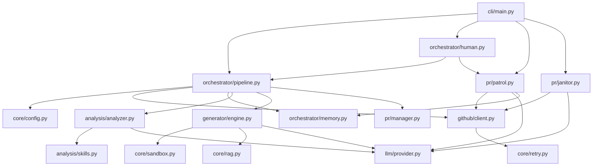

# 🗺️ PROJECT_MAP.md

> **Architecture Blueprint for Farm-Agent (v2.5.0)**
> This document reflects the raw reality of the active codebase.

## 1. System Overview & Tech Stack

Farm-Agent is an autonomous AI agent that discovers open-source GitHub repositories, analyzes their code, generates fixes, submits pull requests, monitors feedback, and auto-responds without human intervention.

| Layer | Technology | Role |
| :--- | :--- | :--- |
| **Language** | Python 3.11+ | Core implementation language using `async/await` for all I/O |
| **CLI Framework** | `click` + `rich` | Rich command-line interface, logging, and tables |
| **HTTP Client** | `httpx` (async) | Persistent `AsyncClient` for GitHub API and LLM API requests |
| **Database** | SQLite via `aiosqlite` | Persistent memory storage with WAL mode (`memory.db`) |
| **LLM Provider** | Minimax (ABAB models) | Primary LLM engine for analysis, generation, and issue solving |
| **Config** | `pydantic` + `PyYAML` | Configuration management via `FarmAgentConfig` and `config.yaml` |
| **Docker** | `docker` (Python SDK) | Polyglot sandbox environment for testing and validating patches |
| **RAG** | `chromadb` (ephemeral) | In-memory vector database for semantic search and context retrieval |
| **Tests & Linting** | `pytest`, `ruff` | Testing framework and code styling/linting |

## 2. Directory Structure

```text
farm_agent/
├── __init__.py                    # Version (__version__)
├── agents/                        # Sub-agent registry wrapping core components
│   └── registry.py
├── analysis/                      # CodeAnalyzer and progressive skills
│   ├── analyzer.py
│   ├── mapper.py
│   └── skills.py
├── cli/                           # Click CLI and Interactive TUI
│   ├── __init__.py
│   ├── main.py
│   └── tui.py
├── core/                          # Shared models, config, sandbox, and RAG
│   ├── config.py
│   ├── daily_log.py
│   ├── exceptions.py
│   ├── leaderboard.py
│   ├── logger.py
│   ├── middleware.py
│   ├── models.py
│   ├── notifier.py
│   ├── profiles.py
│   ├── quotas.py
│   ├── rag.py
│   ├── retry.py
│   └── sandbox.py
├── generator/                     # Contribution generation and scoring
│   ├── engine.py
│   └── scorer.py
├── github/                        # GitHub API client and repo discovery
│   ├── client.py
│   ├── discovery.py
│   └── guidelines.py
├── issues/                        # Issue solver logic
│   └── solver.py
├── llm/                           # LLM provider abstractions
│   ├── agents.py
│   ├── models.py
│   ├── provider.py
│   └── router.py
├── notifications/                 # External notification integrations
│   └── notifier.py
├── orchestrator/                  # Main execution loops and memory layer
│   ├── __init__.py
│   ├── human.py
│   ├── memory.py
│   └── pipeline.py
├── plugins/                       # Extensibility plugins
├── pr/                            # Pull Request lifecycle, patrol, and janitor
│   ├── janitor.py
│   ├── manager.py
│   └── patrol.py
├── scheduler/                     # Job scheduling
├── templates/                     # Jinja2 templates for PRs and commits
│   └── registry.py
└── tools/                         # Tool protocol for LLM function calling
    └── protocol.py
```

## 3. Core Module Dependency Graph



## 4. Core Execution Loops / Entry Points

### Main Pipeline (`run`, `hunt`, `target`)
1. **Discovery:** Finds open-source repositories based on language and star configurations (`github/discovery.py`).
2. **Analysis:** Fetches the file tree, loads progressive skills, and uses the LLM to analyze the code for issues (`analysis/analyzer.py`).
3. **Filtering:** Applies strict Anti-Farming gates to drop trivial or low-impact findings.
4. **Generation:** Utilizes an ephemeral ChromaDB RAG to retrieve cross-file context. The LLM generates code patches iteratively using function-calling to read actual file contents (`generator/engine.py`).
5. **Validation:** Executes the patch in an isolated Docker container appropriate for the repository's language to ensure tests pass (`core/sandbox.py`).
6. **Submission:** Forks the repository, creates a branch, commits the changes with DCO sign-off, and opens a Pull Request (`pr/manager.py`).

### Super Human Mode (`superhuman`)
An infinite 24/7 loop (`orchestrator/human.py`) that interleaves Hunting and Patrolling.
- Randomizes daily PR quotas (e.g., 4-10 PRs).
- Incorporates human-like delays (circadian rhythm, typing delays, coffee breaks).
- Shifts to Patrol-only mode once the daily PR quota is reached.

### PR Patrol (`patrol`)
Monitors open PRs for maintainer feedback (`pr/patrol.py`).
- Fetches unread review comments and uses the LLM to classify them.
- Auto-generates code fixes for `CODE_CHANGE` requests and pushes them.
- Answers maintainer `QUESTION`s and addresses `STYLE_FIX`es.
- Auto-heals CI failures by analyzing CI logs and pushing corrective commits (up to a limit).

### PR Janitor (`janitor`)
Scans all open PRs created by the bot (`pr/janitor.py`).
- Evaluates PR titles and bodies using the Minimax LLM.
- Identifies and automatically closes any PR deemed "GARBAGE" (e.g., exploratory, docs, formatting) while deleting its branch.

## 5. Database/State Schema

State is persisted using SQLite with WAL mode (`orchestrator/memory.py`).

- **`analyzed_repos`:** Tracks repositories that have been analyzed (Columns: `full_name`, `analyzed_at`, `findings`).
- **`submitted_prs`:** Stores all submitted PRs and issue proposals (Columns: `repo`, `pr_number`, `status`, `type`, `ci_fix_attempts`, `discussion_replies`).
- **`findings_cache`:** Caches analysis findings to avoid redundant LLM calls (Columns: `id`, `repo`, `type`, `severity`, `status`).
- **`run_log`:** Maintains a history of pipeline runs (Columns: `started_at`, `repos_analyzed`, `prs_created`).
- **`pr_outcomes`:** Logs PR merge/close outcomes and maintainer feedback text (Columns: `repo`, `pr_number`, `outcome`).
- **`repo_preferences`:** Stores learned preferences for repositories (Columns: `repo`, `preferred_types`, `merge_rate`).
- **`blacklisted_repos`:** Repositories banned from future PRs (Columns: `repo`, `reason`, `blacklisted_at`).
- **`api_usage_log`:** Tracks LLM API call usage for sliding window quotas (Columns: `timestamp`, `provider`).
- **`task_schedule`:** Throttles cron-like tasks (Columns: `task_key`, `next_run`).
