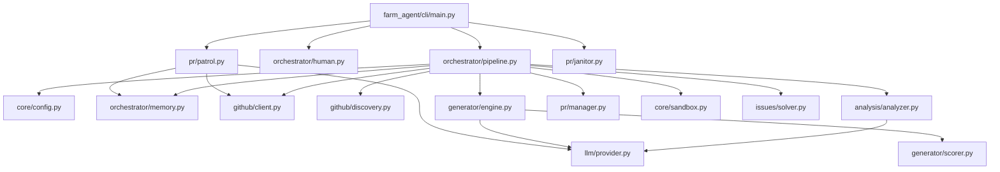

# PROJECT_MAP

This document serves as the canonical architectural blueprint for Farm-Agent. It details the system overview, directory structure, module dependencies, core execution loops, and the database schema.

## 1. System Overview & Tech Stack

| Technology / Library | Role in Project |
| :--- | :--- |
| **Python 3.11+** | Core programming language for the entire orchestrator and pipeline logic. |
| **aiosqlite / SQLite** | Persistent memory storage for tracking analyzed repositories, submitted PRs, targets, learning outcomes, and quotas. |
| **Httpx** | Asynchronous HTTP client used heavily for interacting with the GitHub API. |
| **Pydantic** | Configuration management (`FarmAgentConfig`) and data validation (`models.py`). |
| **Docker** | Provides the isolated `Polyglot Sandbox` environment for validating generated code patches before PR creation. |
| **Click & Rich** | Powers the advanced CLI (`main.py`) with structured console formatting, tables, and logging. |
| **PyYAML** | Parses the main `config.yaml` and profile configurations. |
| **ChromaDB** | (If local RAG is enabled) Local Retrieval-Augmented Generation indexing for precise context tracking. |
| **Semgrep** | External tool utilized by the `BloodhoundAnalyzer` to perform initial fast-pass security audits before consuming LLM tokens. |
| **Minimax / OpenRouter** | Primary LLM providers. OpenRouter is primarily tasked for Red Team (White-Hat Auditing), while Minimax handles core code generation and issue solving. |

## 2. Directory Structure

```text
Farm-Agent/
├── farm_agent/
│   ├── agents/            # Specialized agents and registry logic (DeerFlow pattern)
│   ├── analysis/          # Static analysis, Bloodhound (Semgrep) analyzer, CodeAnalyzer
│   ├── cli/               # Command-line interface definitions (Click commands like 'run', 'superhuman')
│   ├── core/              # Core utilities: Config, exceptions, models, memory abstractions, Docker Sandbox
│   ├── generator/         # LLM Contribution Generator and QAHardcoreScorer for the DEV-QA Loop
│   ├── github/            # GitHub API interactions, repo discovery, Security Gate, repo guidelines
│   ├── issues/            # IssueSolver to fetch, score complexity, and solve specific GitHub issues
│   ├── llm/               # Abstractions for LLM Providers (OpenAI, Minimax, Anthropic, Gemini, etc.)
│   ├── notifications/     # Webhook notifier (Slack, Discord, Telegram)
│   ├── orchestrator/      # Main pipeline execution (ContribPipeline, SuperHumanLoop, Memory manager)
│   ├── plugins/           # Extendable plugin architectures
│   ├── pr/                # PR Manager, PR Patrol (auto-healing/responding), PR Janitor
│   ├── templates/         # Contribution templates registry
│   └── tools/             # Tool definitions for LLM agents
├── scripts/               # Utility shell scripts
├── tests/                 # Pytest test suite for unit and integration testing
├── Dockerfile             # Defines the container environment for the agent and sandbox
├── docker-compose.yml     # Orchestration of the isolated networks (internet_access & sandbox_isolated)
├── pyproject.toml         # Python project configuration (Hatchling build backend, dependencies)
├── requirements.txt       # Core requirements
└── config.example.yaml    # Sample configuration file
```

## 3. Core Module Dependency Graph



## 4. Core Execution Loops / Entry Points

### Single-Run Pipeline (`farm_agent run` / `target`)
1. **Discovery:** Finds targets based on stars, languages, and activity.
2. **Analysis:** `CodeAnalyzer` runs static analysis to find vulnerabilities or improvements. The `Anti-Farming Filter` strips trivial documentation/formatting PRs.
3. **Validation & Context:** Files are fetched, and LLMs validate findings against full source context to discard false positives.
4. **DEV-QA Loop:** The `ContributionGenerator` writes a patch. `QAHardcoreScorer` grades the patch. If it fails, the system executes self-correction cycles (max 3 times).
5. **Sandbox Guillotine:** The patch is cloned locally and tested via Docker. It MUST compile and pass tests.
6. **PR Submission:** PR or Issue is created, and post-compliance hooks attempt to fix CI failures.

### Super Human Mode (`farm_agent superhuman`)
An infinite, organic loop orchestrating multiple strategies:
1. Simulates organic human working hours with randomized coding delays.
2. Interleaves `Hunt` operations (finding and fixing new issues/repos) and `Patrol` operations (monitoring submitted PRs for maintainer feedback).
3. If the daily PR quota is reached, it automatically shifts into a "read-only/patrol" mode.

### Circular Target Loop (`farm_agent hunt-circular`)
1. Pulls targets sequentially from the `target_repos` DB table (seeded from `target_repo.json`).
2. Marks the target as active via atomic SQLite updates to prevent crash loops.
3. Invokes the `BloodhoundAnalyzer` to perform rapid Red-Team Semgrep audits before engaging the primary LLM pipeline.
4. Transitions findings through the standard DEV-QA Loop and Sandbox evaluation.

### PR Patrol (`farm_agent patrol`)
1. Scans the `submitted_prs` table for open PRs.
2. Uses the GitHub API to check for CI failures or maintainer comments.
3. Generates secondary patches to auto-heal CI issues or answers maintainer questions directly.

## 5. Database/State Schema

The SQLite memory (`farm_agent/orchestrator/memory.py`) utilizes the following core tables to track state:

- `analyzed_repos`: Records every repository analyzed, its language, star count, and findings count. Prevents redundant analysis.
- `submitted_prs`: The primary table tracking PR number, repo, status (`open`, `merged`, `closed`), branch, and tracking the number of `ci_fix_attempts` and `discussion_replies`.
- `findings_cache`: Temporarily caches vulnerabilities to persist across execution segments.
- `run_log`: High-level metrics tracking total repos analyzed, PRs created, and errors encountered per run batch.
- `pr_outcomes`: Tracks the final disposition of PRs to feed analytical intelligence and update repository preferences.
- `repo_preferences`: Dynamically records what types of PRs a repository merges versus rejects, determining future approach strategies.
- `blacklisted_repos`: Tracks toxic or uncooperative repositories based on sentiment analysis of maintainer comments.
- `api_usage_log`: Strict LLM quota tracking window to prevent hitting external API rate limit ceilings (e.g., Minimax Overdrive).
- `task_schedule`: Schedules asynchronous background clean-ups (like API usage or old knowledge base elements).
- `knowledge_base`: A persistent ledger of `qa_lesson` strings to ensure the agent doesn't repeat historical architectural mistakes in future generation cycles.
- `target_repos`: Circular processing queue for explicit repository targeting, recording `scanned_at` timestamps and bounty goals.
- `repo_style_guides`: Cached summary of a repository's `CONTRIBUTING.md` and standard practices, fed into the QA loop to grade generated patches.