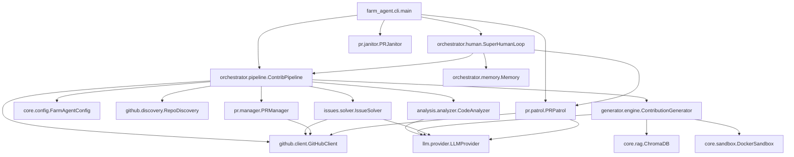

# 🗺️ PROJECT_MAP.md

> **Architecture Blueprint for Farm-Agent (v2.5.0)**
> This document reflects the raw reality of the active codebase.

## 1. System Overview & Tech Stack

Farm-Agent is a highly autonomous, multi-layered AI system capable of full-lifecycle open source contribution, from initial discovery to post-PR code revisions.

| Technology | Role |
| :--- | :--- |
| **Python 3.11+** | Core language, heavily utilizing `asyncio` for concurrent operations. |
| **Click & Rich** | Powers the robust Command-Line Interface (CLI) and terminal formatting. |
| **HTTPX** | Asynchronous HTTP client for communicating with GitHub and LLM APIs. |
| **SQLite (aiosqlite)** | Persistent, thread-safe (WAL mode) database for memory, quotas, and PR tracking. |
| **Minimax LLM** | Primary Large Language Model engine used for generation, analysis, and reasoning. |
| **Pydantic & PyYAML**| Robust configuration parsing, validation, and settings management (`config.yaml`). |
| **Docker (SDK)** | ephemeral "Polyglot Sandbox" containers to execute tests and validate code patches safely. |
| **ChromaDB** | Ephemeral, in-memory vector database for Retrieval-Augmented Generation (RAG) context. |
| **Pytest & Ruff** | Standardized testing framework and aggressive code formatting/linting. |

---

## 2. Directory Structure

```text
farm_agent/
├── cli/                 # Command-Line Interface entry points
│   ├── main.py          # Primary Click CLI application (`farm_agent hunt`, `superhuman`, etc.)
│   └── tui.py           # Text User Interface module
├── core/                # Core domain models, configuration, and infrastructure
│   ├── config.py        # Pydantic configuration definitions
│   ├── middleware.py    # Pipeline execution middlewares (Rate limits, DCO, Quality Gates)
│   ├── models.py        # Shared data structures (Contribution, Repository, Finding)
│   ├── rag.py           # ChromaDB integration for contextual code search
│   └── sandbox.py       # Docker-based Polyglot Sandbox for testing patches
├── github/              # Interfacing with the GitHub REST API
│   ├── client.py        # Main Async HTTPX client for GitHub API
│   ├── discovery.py     # Repository search and filtering logic
│   └── guidelines.py    # Parsers for CONTRIBUTING.md and PR templates
├── orchestrator/        # The brains of the operation connecting subsystems
│   ├── human.py         # SuperHumanLoop: 24/7 stochastic daily schedule simulation
│   ├── memory.py        # SQLite persistence layer mapping (aiosqlite)
│   └── pipeline.py      # ContribPipeline: Coordinates discovery -> analysis -> gen -> PR
├── analysis/            # Code scanning and issue identification
│   ├── analyzer.py      # Static code analysis orchestration
│   └── skills.py        # Progressive analysis skill definitions
├── generator/           # Patch generation and validation
│   ├── engine.py        # Uses LLM and RAG to generate code fixes
│   └── scorer.py        # Evaluates generated patches against quality metrics
├── issues/              # Issue-driven contribution logic
│   └── solver.py        # Analyzes and solves open GitHub issues
├── pr/                  # Pull Request lifecycle management
│   ├── manager.py       # Forks, branches, commits, and creates PRs
│   ├── patrol.py        # Monitors open PRs for feedback and auto-pushes fixes
│   └── janitor.py       # Sweeps and destroys garbage/low-quality PRs
├── llm/                 # Abstractions for Language Models
│   ├── provider.py      # Factory and interface for LLM clients (Minimax, Gemini, etc.)
│   └── router.py        # Task-based routing to different LLM models
├── notifications/       # Alerting system
│   └── notifier.py      # Telegram/Slack/Discord webhook integrations
└── tools/               # LLM Function Calling Tools
    └── protocol.py      # Tool registry for the LLM to interact with the environment
```

---

## 3. Core Module Dependency Graph



---

## 4. Core Execution Loops / Entry Points

### A. Main Pipeline (`hunt`, `target`, `run`)
1. **Discovery**: `RepoDiscovery` uses the GitHub Search API to find repositories matching criteria (stars, language).
2. **Analysis / Issue Solving**:
    - The pipeline attempts to find solvable issues using `IssueSolver`.
    - If no issues are solvable, it falls back to static code scanning via `CodeAnalyzer` to identify bugs, security flaws, or optimizations.
3. **Filtering**: Findings pass through strict Anti-Farming filters to drop trivial (e.g., typos) or documentation-only issues.
4. **Generation**: `ContributionGenerator` reads files, builds a `ChromaDB` index for context, and uses the LLM to generate a `FileChange` patch.
5. **Sandbox Validation**: The generated patch is applied to a local clone and executed inside an ephemeral Docker container (`DockerSandbox`). If tests/linters fail, the LLM attempts to self-correct.
6. **PR Creation**: `PRManager` forks the repo, pushes the branch, applies DCO sign-offs, and opens the Pull Request.

### B. Super Human Mode (`superhuman`)
An infinite, stochastic `while` loop designed to bypass behavioral detection:
- Wakes up and sets a random daily PR target (e.g., 4 to 10).
- Interleaves running the **Main Pipeline** (Hunting) and **PR Patrol**.
- Implements simulated human delays (e.g., "typing" time based on patch size, coffee breaks, mandatory 12 PM lunch).
- Once the daily quota is reached, it switches exclusively to monitoring mode (Patrol).

### C. PR Patrol (`patrol`)
A post-submission operational loop:
- Scans memory for all open PRs previously created by Farm-Agent.
- Checks GitHub for new review comments.
- Uses the LLM to classify feedback (`CODE_CHANGE`, `QUESTION`, `STYLE_FIX`).
- Automatically generates and pushes new commits to the branch to satisfy the maintainer's requests.

### D. PR Janitor (`janitor`)
A self-cleanup utility:
- Scans live open PRs under the agent's GitHub account.
- Asks the LLM to evaluate the PR. If deemed "garbage" (low impact, formatting-only, exploratory), it forcibly closes the PR and deletes the branch.

---

## 5. Database/State Schema

Farm-Agent uses an asynchronous SQLite database (`memory.db` with WAL mode) for state persistence and quota tracking.

| Table Name | Description | Key Columns |
| :--- | :--- | :--- |
| `run_log` | High-level audit log of execution runs. | `id`, `started_at`, `ended_at`, `repos_analyzed`, `prs_created` |
| `analyzed_repos` | Tracks repos that have been processed to avoid redundant scanning. | `full_name`, `language`, `analyzed_at`, `findings` |
| `submitted_prs` | Core table tracking active and historical Pull Requests. | `repo`, `pr_number`, `status` (open/merged/closed), `type`, `updated_at` |
| `findings_cache` | Caches identified issues to save LLM tokens across restarts. | `repo`, `type`, `severity`, `status` |
| `repo_preferences`| Stores behavioral traits of repositories (e.g., preferred contribution types).| `repo`, `preferred_types`, `merge_rate` |
| `blacklisted_repos`| Repositories where PRs are banned (e.g., due to toxic maintainers or AI policies). | `repo`, `reason`, `blacklisted_at` |
| `api_usage_log` | Tracks LLM and GitHub API requests for rate limiting. | `timestamp`, `provider`, `tokens`, `cost` |
| `task_schedule` | General purpose key-value store for throttling repeating background tasks. | `task_key`, `next_run` |
