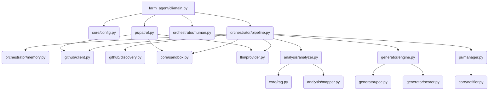

# PROJECT_MAP.md — Agent-Farm Ground Truth

**Generated:** 2026-06-02  
**Version:** v4.0.0 — Omniscient Context Engine  
**Entry Point:** `farm_agent/cli/main.py` → `cli()` (Click-based CLI)  
**Language:** Python 3.11+  
**Architecture Pattern:** DeerFlow (Registry-based agent architecture)

---

## 1. System Overview & Active Tech Stack

**What it does:** Autonomous AI agent system that discovers open-source GitHub repositories or scans targets for issues and vulnerabilities. It analyzes code via multi-phase LLM prompts, generates patches, validates them in isolated Docker sandboxes, runs a two-layer expert filter (Qwen → Gemini), and submits pull requests or private disclosures. It also runs a PR Patrol loop to auto-reply to comments, address code reviews, and self-correct CI failures.

| Component | Technology | Source |
|-----------|------------|--------|
| Language | Python 3.11+ | `pyproject.toml` |
| HTTP client | `httpx` (async) | `pyproject.toml` |
| CLI | `click>=8.1` + `rich>=13.0` | `main.py` |
| Primary LLM | `deepseek/deepseek-v3.2` via OpenRouter (Configurable) | `config.yaml` |
| Code Gen LLM | `deepseek/deepseek-v4-pro` via OpenRouter | `pipeline.py:395` |
| Layer 1 Appraiser | `qwen/qwen3.7-max` via OpenRouter | `pipeline.py:2790` |
| Layer 2 Supreme Auditor | `google/gemini-3.5-flash` via OpenRouter | `pipeline.py:2851` |
| Database | SQLite (`aiosqlite`) — WAL mode, fallback to DELETE | `memory.py:151` |
| Docker Sandbox | `docker>=7.1` — complete network + capability isolation | `sandbox.py:198` |
| Vector DB | `chromadb>=0.4` — RAG for file & documentation context | `core/rag.py` |
| Notifications | Telegram / Slack / Discord | `notifier.py` |

---

## 2. Directory Structure

```text
.                                       # Workspace Root (v4.0.0)
├── Dockerfile                          # Stage 1 builder (wheel creation) + Stage 2 lean runtime v4.0.0
├── docker-compose.yml                  # agent-farm service definition with volumes (data/, logs/, secret_findings/)
├── start.sh                            # Unix quick start wrapper script
├── start.bat                           # Windows quick start wrapper script
├── Makefile                            # Defines build, test, and lint targets
├── pyproject.toml                      # Hatchling build configuration & dependencies
│
├── farm_agent/                         # Package root (version = "4.0.0")
│   ├── cli/
│   │   └── main.py                     # Click CLI — command registrations
│   │
│   ├── core/
│   │   ├── config.py                   # Pydantic v2 config and YAML loading
│   │   ├── exceptions.py               # System exception types hierarchy
│   │   ├── logger.py                   # Rotating file logging system setup
│   │   ├── models.py                   # Core Pydantic data structures definitions
│   │   ├── notifier.py                 # Telegram/Slack/Discord notifications integration
│   │   ├── rag.py                      # ChromaDB vector DB context loaders (with semantic markdown header chunking)
│   │   └── sandbox.py                  # DockerSandbox engine with Polyglot Guillotine, PoC execution context mapping
│   │
│   ├── analysis/
│   │   ├── analyzer.py                 # CodeAnalyzer (parallelized security, quality, UX scanners) & BloodhoundAnalyzer
│   │   └── mapper.py                   # RepoMapper (AST/regex dependency graphing)
│   │
│   ├── generator/
│   │   ├── engine.py                   # ContributionGenerator (Patch and file correction)
│   │   ├── poc.py                      # PoCGenerator (PoC validation & LLM evaluation)
│   │   └── scorer.py                   # QAHardcoreScorer (Qwen-based QA grader)
│   │
│   ├── github/
│   │   ├── client.py                   # Async-retrying GitHub REST and GraphQL Client
│   │   ├── discovery.py                # Target network search and crawler discoverers
│   │   ├── guidelines.py               # Guidelines, PR templates, and subsystem doc discovery
│   │   └── security_gate.py            # Identifies private security disclosure files
│   │
│   ├── issues/
│   │   └── solver.py                   # IssueSolver (solves issues, multi-file deep planner)
│   │
│   ├── llm/
│   │   ├── provider.py                 # OpenRouter/Minimax integration handlers
│   │   └── router.py                   # Task router mapping
│   │
│   ├── orchestrator/
│   │   ├── memory.py                   # Persistence memory sqlite connection interface
│   │   ├── pipeline.py                 # Main Pipeline (Standard & Circular pipelines implementation)
│   │   └── human.py                    # SuperHumanLoop relentless daily scheduler
│   │
│   ├── pr/
│   │   ├── manager.py                  # Pull Request manager (forking, branches, commits)
│   │   ├── patrol.py                   # PR Patrol (reviews comments, fixes CI errors)
│   │   └── janitor.py                  # PR Janitor (sweeps and destroys garbage PRs)
│   │
│   ├── agents/
│   │   └── registry.py                 # Task agent configurations
│   │
│   └── tools/
│       └── protocol.py                 # CLI tool protocols
```

---

## 3. Core Module Dependency Graph

The following Mermaid diagram illustrates the dependency interactions between core modules when executing the primary execution pipeline (`farm_agent run`).



- **CLI (`cli/main.py`)**: Responsible for command dispatch. Instantiates the configuration, initializes the required execution loops (e.g., `FarmAgentPipeline` or `PRPatrol`), and handles high-level console logging.
- **Pipeline (`orchestrator/pipeline.py`)**: The central brain that orchestrates the primary logic flow. It coordinates fetching code via `GitHub`, discovering potential targets with `Discovery`, saving states in `Memory`, analyzing with `Analyzer`, patching with `Generator`, validating in the `Sandbox`, and creating pull requests with `PRManager`.
- **Analyzer (`analysis/analyzer.py`)**: Responsible for detecting flaws. Works closely with `RAG` to pull localized code context and `Mapper` to build the AST module dependency graph.
- **Generator (`generator/engine.py`)**: Responsible for writing fixes. Calls the `PoCGenerator` to evaluate if a bug exists dynamically, and the `QAHardcoreScorer` to evaluate the quality of its own fixes.

---

## 4. Core Execution Loops / Entry Points

### A. Core Execution Pipeline (`farm_agent run`, `farm_agent target`)

Located in `farm_agent/orchestrator/pipeline.py` (`_process_repo`).

1. **Initialization:** Clones the repository, sets up the workspace, and runs baseline tests in the Docker sandbox to establish a baseline state.
2. **Context Discovery:** Discovers repository guidelines, internal documentation, and extracts module dependencies via `RepoMapper` into the AST graph.
3. **Analysis & Filtering:** Analyzes the code via `CodeAnalyzer` and Semantic filters. It drops documentation modifications and filters based on configurable constraints.
4. **Vulnerability Verification (PoC Gate):** For security-related findings, it uses `PoCGenerator` to write a proof-of-concept. This script is run in the Docker sandbox to confirm the vulnerability dynamically before patching.
5. **Generation & Verification:** Generates patches using `ContributionGenerator`.
6. **Double-Pass Sandbox Validation (DEV-QA Loop):**
   - **Pass 1:** Efficacy check (ensures the generated PoC is mitigated).
   - **Pass 2:** Regression check (ensures the native test suite still passes).
7. **Expert Verification:** Runs through Layer 1 (Qwen Appraiser) and Layer 2 (Gemini Auditor) for code-quality checks.
8. **Submission:** Opens a Pull Request via `PRManager` (or saves to private secret findings if defined by repo policy).

### B. SuperHuman Loop (`farm_agent superhuman`)

Located in `farm_agent/orchestrator/human.py`.

A continuous, 24/7 background worker that simulates human-like breaks and delays. It coordinates:
1. **Target Hunting:** Continuously looks for repositories or processes circular targets from `target_repo.json`.
2. **Patrol Mode:** Periodically executes the `PRPatrol` loop to keep track of active pull requests.

### C. PR Patrol & CI Auto-Fix Loop (`farm_agent patrol`)

Located in `farm_agent/pr/patrol.py`.

1. **Feedback Collection:** Queries open and pending PRs for maintainer comments, PR reviews, and CI statuses.
2. **Classification:** Uses the LLM to classify feedback (CODE_CHANGE, QUESTION, CLA, CI_FAILURE, TRIVIAL).
3. **Reaction:**
   - **Code Changes:** Pushes new commits to the branch after resolving the feedback locally in the sandbox.
   - **Questions:** Uses LLM to answer maintainers' queries.
   - **CI Auto-Healing:** Re-pulls failing CI logs, identifies tracebacks, generates a fix, and runs it against the local sandbox before pushing the commit.

---

## 5. Database/State Schema

Located in `farm_agent/orchestrator/memory.py`. Driven by SQLite using WAL mode.

* **`analyzed_repos`**: Tracks repositories that have already gone through analysis (`full_name` PK, `language`, `stars`, `analyzed_at`, `findings`).
* **`submitted_prs`**: Tracks bot-created PRs, issues, and associated limits counters (`repo` + `pr_number` unique constraints).
* **`run_log`**: Log of overall runs metrics and durations.
* **`pr_outcomes`**: Stores merged/closed PR states and maintainer review remarks.
* **`repo_preferences`**: Learned project contribution preferences updated dynamically from outcomes.
* **`blacklisted_repos`**: Projects blacklisted due to hostile maintainer checks or failures.
* **`api_usage_log`**: Tracks LLM API usage (`idx_api_usage` composite index on provider, timestamp).
* **`task_schedule`**: Persistent schedule queue for tasks in the `SuperHumanLoop`.
* **`knowledge_base`**: Stores lessons, past critiques, self-learning lessons, and architectural context.
* **`target_repos`**: Deterministic circular target queue.
* **`repo_style_guides`**: Caches contributing templates, formatting, and structures.