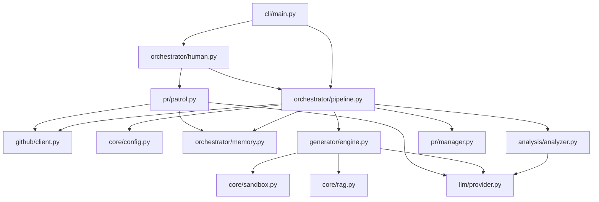

# 🗺️ PROJECT_MAP.md

> **Architecture Blueprint for Farm-Agent (v2.5.0)**
> This document provides a deep dive into the system architecture and current codebase structure.

## 1. System Overview & Tech Stack

Farm-Agent is a fully autonomous AI agent designed to discover, analyze, and contribute to open-source GitHub repositories without human intervention.

| Layer | Technology | Role |
| :--- | :--- | :--- |
| **Language** | Python 3.11+ | Core implementation using asynchronous programming (`asyncio`) |
| **CLI Framework** | `click` + `rich` | Robust command-line interface with rich, styled terminal outputs |
| **HTTP Client** | `httpx` | Asynchronous HTTP requests to the GitHub REST API and external LLM APIs |
| **Database/State**| SQLite (`aiosqlite`) | Persistent local memory and state tracking utilizing WAL mode |
| **LLM Interface** | Generic Protocol | Flexible LLM provider abstraction supporting Minimax, Gemini, OpenAI, etc. |
| **Execution** | `docker` | Secure, polyglot sandbox environment for running and validating generated patches |
| **Context Engine**| `chromadb` | Ephemeral, in-memory vector database for semantic codebase search and RAG |
| **Data Validation**| `pydantic` | Configuration schema and robust data model validation |

## 2. Directory Structure

```text
farm_agent/
├── __init__.py               # Package metadata and version definition
├── agents/                   # Agent registry and high-level component wrappers
├── analysis/                 # Code static analysis and LLM-powered scanning logic
├── cli/                      # Click-based CLI entry points and main application loop (`main.py`)
├── core/                     # Shared components (config, DB models, exceptions, retry logic, sandbox, RAG)
├── generator/                # Patch generation, refinement logic, and scoring systems
├── github/                   # Asynchronous GitHub API client and repository discovery mechanisms
├── issues/                   # Dedicated solver logic for fixing open GitHub issues
├── llm/                      # LLM provider implementations (Minimax, Gemini, OpenAI) and routing
├── notifications/            # External webhook integrations (Slack, Discord, Telegram)
├── orchestrator/             # Core pipelines (`pipeline.py`), `Memory`, and `SuperHumanLoop`
├── plugins/                  # Extensibility and custom contribution plugins
├── pr/                       # PR lifecycle management, maintainer patrol logic, and PR janitor
├── templates/                # Templating system for PR descriptions, commits, and responses
└── tools/                    # Tool protocol and function calling logic for the LLM
```

## 3. Core Module Dependency Graph



## 4. Core Execution Loops / Entry Points

Farm-Agent operates through several key entry points defined in `farm_agent/cli/main.py`:

- **Main Pipeline (`run`, `hunt`, `target`)**:
  1. **Discovery**: Queries the GitHub API to find high-quality, open-source repositories matching user configuration (e.g., language, stars).
  2. **Analysis**: Downloads the file tree, performs code scanning, and uses the LLM to identify real bugs or quality issues.
  3. **Generation**: Embeds the code into an ephemeral ChromaDB instance. The LLM generates precise patches using semantic search (`RAG`).
  4. **Validation**: Mounts the repository into an isolated Docker container and runs tests to ensure the patch is valid.
  5. **Submission**: Forks the repo, creates a branch, pushes the valid patch, and submits a Pull Request.

- **Issue Solver (`solve`)**: Focuses on explicitly resolving open GitHub issues within a specified repository, integrating issue context directly into the code generation engine.

- **Super Human Mode (`superhuman`)**: A continuous 24/7 background loop. It randomly sets daily PR quotas, simulates realistic circadian rhythms (sleep/wake cycles), incorporates typing delays, and automatically handles PR maintenance by interleaving pipeline runs with the PR Patrol.

- **PR Patrol (`patrol`)**: Specifically monitors open Pull Requests submitted by the agent, scanning for maintainer feedback. It uses the LLM to classify feedback and auto-generates responsive code fixes, answers questions, or signs CLAs dynamically.

- **Janitor (`janitor`)**: Periodically reviews PRs and proactively closes/abandons those classified as low value ("garbage") based on LLM evaluations.

## 5. Database/State Schema

State management is handled by SQLite (`aiosqlite`) acting as the persistent `Memory` layer. Key tables include:

- **`analyzed_repos`**: Tracks repositories that have already been scanned.
  - Columns: `id`, `full_name`, `analyzed_at`, `findings`
- **`submitted_prs`**: Maintains the state of all active and historical PRs.
  - Columns: `id`, `repo`, `pr_number`, `title`, `pr_url`, `status` (open/merged/closed), `type`, `created_at`, `updated_at`, `fork`, `ci_fix_attempts`, `discussion_replies`
- **`findings_cache`**: Caches identified issues to prevent duplicate processing on subsequent runs.
  - Columns: `id`, `repo`, `type`, `severity`, `title`, `status`, `created_at`
- **`run_log`**: Historical logs of pipeline executions.
  - Columns: `id`, `started_at`, `duration_sec`, `repos_analyzed`, `prs_created`, `errors`, `mode`
- **`pr_outcomes`**: Logs qualitative outcomes of PRs (e.g., maintainer reviews, merge reasons).
  - Columns: `id`, `repo`, `pr_number`, `outcome`, `maintainer_feedback`, `recorded_at`
- **`repo_preferences`**: Learned data regarding contribution success rates per repository.
  - Columns: `repo`, `preferred_types`, `merge_rate`, `last_updated`
- **`blacklisted_repos`**: Repositories excluded from future interactions.
  - Columns: `repo`, `reason`, `blacklisted_at`
