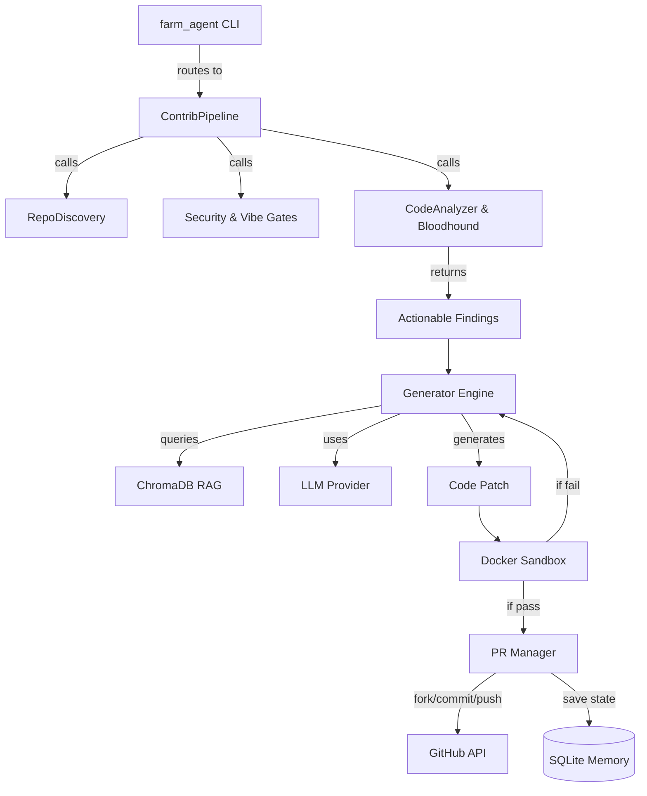

# Farm-Agent Project Map

This document serves as the architectural blueprint for Farm-Agent v3.0.0, reflecting the current state of the codebase.

## 1. System Overview & Tech Stack

Farm-Agent is a fully autonomous open-source contribution engine. It discovers repositories, scans for vulnerabilities, generates patches via LLM, validates patches in Docker sandboxes, and creates PRs or GitHub Issues to contribute back.

**Active Tech Stack:**

| Component | Technology | Exact Role |
|-----------|------------|------------|
| **Language** | Python 3.11+ | Core implementation logic, execution pipelines, and CLI. |
| **HTTP client** | `httpx` (async) | Manages all outbound asynchronous HTTP requests (GitHub APIs, LLM APIs). |
| **LLM Providers** | MiniMax, OpenRouter | Primary intelligence. MiniMax for code generation/reasoning; OpenRouter for Bloodhound Red Team White-Hat audits. |
| **Database** | SQLite (`aiosqlite`) | Ephemeral/Persistent state memory via WAL mode (`data/memory.db`). |
| **Docker** | Docker SDK (`docker>=7.1`) | Hosts the Polyglot Sandbox for isolated, safe code validation and testing prior to PR creation. |
| **Config** | Pydantic v2 + YAML | Strongly typed configuration schema parsing (`config.yaml`). |
| **CLI** | `click` + `rich` | Terminal user interface, command routing, and formatted output. |
| **Vector DB** | ChromaDB | Ephemeral RAM-based RAG indexing for cross-file context during patching. |
| **Scheduling**| `apscheduler` | Orchestrates recurring background daemon tasks in Super Human loop. |

---

## 2. Directory Structure

```ascii
farm_agent/
├── cli/
│   └── main.py              # Central Click CLI routing (run, target, hunt, patrol, etc.)
├── core/
│   ├── config.py            # Pydantic configuration schemas and loading
│   ├── exceptions.py        # System-specific error handling (GitHubAPIError, RateLimitError)
│   ├── logger.py            # Rolling log configuration
│   ├── memory.py            # SQLite memory database initialization & schema
│   ├── middleware.py        # DeerFlow pattern middleware for pipelines
│   ├── models.py            # Core data structures (Repository, Finding, Contribution)
│   ├── rag.py               # ChromaDB retrieval-augmented generation engine
│   ├── retry.py             # Resiliency wrappers (async_retry, llm_retry)
│   └── sandbox.py           # Docker execution logic ("Polyglot Guillotine")
├── generator/
│   ├── engine.py            # The LLM prompt builder & code generator
│   ├── reviewer.py          # LLM-based PR reviewer logic
│   └── scorer.py            # Hardcore QA scoring against PR patches
├── github/
│   ├── client.py            # Asynchronous REST/GraphQL interface to GitHub
│   ├── discovery.py         # Strategies for finding repos (Stars, Activity, DB)
│   ├── guidelines.py        # Parsers for CONTRIBUTING.md / PR templates
│   └── security_gate.py     # Detects private disclosure demands in SECURITY.md
├── analysis/
│   ├── analyzer.py          # Static code parser and heuristic evaluator
│   └── mapper.py            # File dependency and import graph mapping
├── llm/
│   ├── provider.py          # Multi-LLM facade for interacting with Minimax/OpenRouter
│   ├── models.py            # Tiered LLM definitions and capabilities
│   └── router.py            # Cost/Capability task routing
├── issues/
│   └── solver.py            # Specific pipeline for parsing and resolving existing GitHub issues
├── orchestrator/
│   ├── human.py             # Super Human Mode (24/7 autonomous loop)
│   ├── memory.py            # Pointer/alias to `core/memory.py` operations
│   └── pipeline.py          # The Core Execution Engine (ContribPipeline)
├── pr/
│   ├── manager.py           # Handles git fork, branch, commit, push, PR creation
│   └── patrol.py            # Monitors open PRs for feedback and issues fixes
├── agents/
│   └── registry.py          # DeerFlow agent definitions
├── templates/
│   └── registry.py          # Contribution and formatting templates
├── tools/
│   └── protocol.py          # DeerFlow tool system definitions
└── __init__.py              # Package version definition
```

---

## 3. Core Module Dependency Graph



---

## 4. Core Execution Loops / Entry Points

1. **CLI Trigger:** User invokes `farm_agent <command>` (e.g., `farm_agent run`).
2. **Configuration & Init:** `load_config()` builds the runtime parameters. System initializes `Memory` (SQLite) and API Clients (`GitHubClient`, `LLMProvider`).
3. **Repository Discovery:** `RepoDiscovery` identifies candidate repos based on language/stars/activity, bypassing blacklisted or previously completed repos.
4. **Pre-Flight Gates:**
   - Evaluates `SECURITY.md` (Security Disclosure Gate).
   - Evaluates `AI_POLICY.md` (AI Policy Block).
   - Assesses maintainer vibe.
5. **Analysis (`analyzer.py`):**
   - Conducts static code analysis.
   - Drops trivial findings (Anti-Farming filters block docs-only or formatting PRs).
6. **Code Generation (`engine.py`):**
   - Context injected via `ChromaDB`.
   - LLM produces patch blocks.
7. **Sandbox Validation (`sandbox.py`):**
   - Creates a temporary directory.
   - Runs `docker run` natively restricting network/memory limits.
   - Evaluates test or build commands. If errors occur, feeds standard output back to LLM for retry (max 3 times).
8. **PR Creation (`manager.py`):**
   - Forks repo -> commits change -> pushes to origin -> creates PR.
   - Records success/failure states back to `Memory`.

---

## 5. Database/State Schema

State management is strictly handled by `aiosqlite` connected to `memory.db` in `WAL` mode.

**Core Tables:**
- `analyzed_repos`: Tracks which repos have been scanned (`full_name`, `language`, `stars`, `analyzed_at`).
- `submitted_prs`: Master log of all agent-generated PRs (`repo`, `pr_number`, `type`, `status`, `ci_fix_attempts`).
- `findings_cache`: Temporary storage of detected code issues (`repo`, `severity`, `file_path`, `status`).
- `run_log`: Telemetry of pipeline execution statistics.
- `pr_outcomes`: Tracks PR merge or rejection rates for learned behavior.
- `repo_preferences`: Derived maintainer behavior rules.
- `blacklisted_repos`: Blocked repos (due to hostility or private-only policies).
- `api_usage_log`: Rate-limiting constraint tracking.
- `task_schedule`: Multi-process safe persistent job queueing.
- `knowledge_base`: QA lessons and failure context to prevent repeated mistakes.
- `target_repos`: Circular hunting list.
- `repo_style_guides`: Parsed constraints from `CONTRIBUTING.md`.