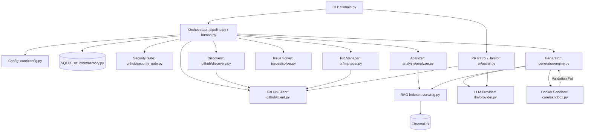

# 🗺️ Farm-Agent Project Blueprint

This blueprint serves as a deep-dive architectural guide for understanding the Farm-Agent codebase. It reflects the current structure, core components, and operational flow of the system.

---

## 1. System Overview & Tech Stack

Farm-Agent is a high-performance orchestration system for autonomous code generation and contribution. It coordinates LLMs, local code environments, and external APIs using the **DeerFlow** agent architecture pattern.

| Component / Layer | Technology | Role in Project |
| :--- | :--- | :--- |
| **Core Runtime** | Python 3.11+ | Main execution environment; leverages `asyncio` for heavy concurrent network/API operations. |
| **Build & Packaging** | Hatchling (`pyproject.toml`) | Build backend and project metadata management. |
| **CLI & UI** | Click, Rich | `click` handles command routing; `rich` provides beautiful terminal outputs, logging, and tables. |
| **Config & Validation**| Pydantic, PyYAML | Strict validation of `config.yaml` and `.env` settings via Pydantic `BaseModel` and `pydantic-settings`. |
| **State Persistence** | SQLite (`aiosqlite`) | Asynchronous, WAL-mode database for persistent state (e.g., `run_log`, `analyzed_repos`, `submitted_prs`). |
| **Context Retrieval** | ChromaDB | Ephemeral Vector Store used for Retrieval-Augmented Generation (RAG) during code generation. |
| **LLM Integration** | Minimax, OpenAI, Anthropic, Gemini, Ollama SDKs | Provides LLM inference via multiple providers; orchestrates tools and generates code diffs/analysis. |
| **GitHub Interaction** | HTTPX, GitPython | `httpx` for GitHub REST/GraphQL API interactions (with token rotation); `gitpython` for local repo management. |
| **Sandbox Execution** | Docker SDK | Provisions highly restricted, ephemeral polyglot containers (`DockerSandbox`) for testing code before PR submission. |
| **Job Scheduling** | APScheduler | (Optional) Used internally for scheduling repeating tasks. |

---

## 2. Directory Structure

Below is the annotated directory structure highlighting the role of each module.

```ascii
farm_agent/
├── cli/                   # Command Line Interface
│   └── main.py            # Rich CLI entry point (run, hunt, patrol, superhuman, solve, etc.)
├── core/                  # Core Utilities & Configurations
│   ├── config.py          # FarmAgentConfig, GitHubConfig, etc.
│   ├── exceptions.py      # Custom exceptions (GitHubAPIError, GenerationError, etc.)
│   ├── middleware.py      # DeerFlow middleware chain (RateLimit, DCO, QualityGate, etc.)
│   ├── memory.py          # SQLite persistence definitions (Memory class)
│   ├── models.py          # Pydantic schema models (Repository, Finding, Contribution, etc.)
│   ├── profiles.py        # Configuration profiles handling
│   ├── rag.py             # ChromaDB indexer for CodeChunk retrieval
│   └── sandbox.py         # DockerSandbox - Polyglot Guillotine for code validation
├── generator/             # Code Generation Engine
│   ├── engine.py          # ContributionGenerator (LLM code modification engine)
│   ├── reviewer.py        # ReviewerAgent
│   └── scorer.py          # QualityScorer / QAHardcoreScorer
├── github/                # GitHub API & Discovery
│   ├── client.py          # GitHubClient (handles rate limits, rotation, GraphQL/REST)
│   ├── discovery.py       # RepoDiscovery strategies
│   ├── guidelines.py      # Fetches CONTRIBUTING.md, RepoStyleGuide
│   └── security_gate.py   # SecurityDisclosureGate (private disclosure detection)
├── analysis/              # Static & LLM Code Analysis
│   ├── analyzer.py        # CodeAnalyzer / BloodhoundAnalyzer
│   └── mapper.py          # RepoMapper (AST extraction)
├── issues/                # GitHub Issue Solving
│   └── solver.py          # IssueSolver (classifies and resolves open issues)
├── llm/                   # LLM Provider & Routing Abstractions
│   ├── provider.py        # LLMProvider base class (MinimaxProvider, OpenRouterProvider)
│   ├── models.py          # ModelSpec, TaskType, ModelTier definitions
│   ├── router.py          # TaskRouter for multi-model assignments
│   └── agents.py          # Specialized Agent classes (AnalysisAgent, CodeGenAgent, etc.)
├── orchestrator/          # Main Execution Loops
│   ├── pipeline.py        # ContribPipeline (Core execution engine)
│   ├── memory.py          # Pointer/alias to core/memory.py
│   └── human.py           # SuperHumanLoop (24/7 organic scheduling)
├── pr/                    # Pull Request Management
│   ├── manager.py         # PRManager (fork, branch, commit, push, PR creation)
│   ├── patrol.py          # PRPatrol (handles review feedback and pushes auto-fixes)
│   └── janitor.py         # PRJanitor (sweeps garbage PRs via LLM evaluation)
├── notifications/         # Notification Systems
│   └── notifier.py        # Telegram/Slack/Discord webhook notifications
├── agents/                # DeerFlow Agent Architecture
│   └── registry.py        # SubAgent, AgentRegistry definitions
├── templates/             # Code Contribution Templates
│   └── registry.py        # TemplateRegistry
└── tools/                 # LLM Tools
    └── protocol.py        # Tool definitions (e.g., GitHubTool)
```

---

## 3. Core Module Dependency Graph

This diagram illustrates the primary data flow and interactions among Farm-Agent's core modules, driven by the CLI and orchestrated by the Pipeline.



---

## 4. Core Execution Loops / Entry Points

### A. The Standard Pipeline (`ContribPipeline`)
1. **Discovery**: `RepoDiscovery` finds high-value repositories via the GitHub API (or parses `target_repo.json`).
2. **Gate / Security Check**: The `SecurityDisclosureGate` scans for private disclosure phrases (`SECURITY.md`). If found, it saves findings and aborts the repo.
3. **Analysis / Issues**:
   - Either static code analysis is run (`CodeAnalyzer`) OR open issues are fetched (`IssueSolver`) based on the mode.
   - Files are mapped and analyzed for specific rulesets (Security, Quality, etc.).
4. **Generation**: `ContributionGenerator` receives the findings, uses `RepoIndexer` (ChromaDB) to fetch context, and prompts the LLM (`LLMProvider`) to generate code edits via diffs.
5. **Sandbox Validation (The Guillotine)**: `DockerSandbox` runs linters/tests inside an isolated container. A failure loops back to the generator for self-correction.
6. **PR Creation**: If successful, `PRManager` forks the repo, applies edits, commits (bypassing TOCTOU quotas), and opens the PR.

### B. Super Human Mode (`SuperHumanLoop`)
1. **Circadian Setup**: The loop randomly defines a daily quota for PRs and calculates sleeping/working hours.
2. **Task Interleaving**: Alternates between hunting for new targets (running `ContribPipeline`) and patrolling existing PRs (`PRPatrol`).
3. **Organic Delays**: Introduces stochastic delays (simulated lunch breaks, typing delays) to avoid rate limits and mimic human activity.
4. **Quota Cap**: Once the daily quota is met, it switches to purely "Patrol" mode (reviewing and responding to feedback) until the next "day".

### C. PR Patrol & Janitor
1. **Patrol**: `PRPatrol` fetches open PRs from `Memory`, queries the GitHub API for new maintainer comments, uses the LLM to process feedback, and pushes fixes directly to the branch.
2. **Janitor**: `PRJanitor` (run separately via CLI) scans open PRs, asks the LLM to classify them (e.g., `GARBAGE`, `DOCS_ONLY`), and forcibly closes trivial/low-quality PRs.

---

## 5. Database/State Schema

Farm-Agent uses an `aiosqlite` SQLite database (`memory.db` by default) utilizing WAL mode for robust persistence.

### Core Tables:
- **`run_log`**: Records every full execution run, duration, and high-level summary stats.
- **`analyzed_repos`**: Tracks repositories that have been analyzed, storing the repo URL, last analysis time, and findings count to prevent redundant processing.
- **`submitted_prs`**: The canonical record of all Pull Requests opened by the agent. Includes repo, PR number, title, status (`open`, `merged`, `closed`), and type. This is crucial for the "Alumni Sync" and VIP roster calculations.
- **`findings_cache`**: Caches specific code analysis findings (e.g., vulnerabilities, refactoring suggestions) discovered during a run.
- **`repo_preferences`**: Stores repository-specific configuration overrides or learned behaviors.
- **`blacklisted_repos`**: Repositories flagged by the Maintainer Vibe Check (e.g., hostile responses) or Security Gate, ensuring the agent never interacts with them again.
- **`api_usage_log`**: Detailed tracking of token usage and API calls per provider, used for quota management and multi-model cost analysis.
- **`task_schedule`**: Multiprocess coordination table replacing in-RAM locks for asynchronous job execution tracking.
- **`knowledge_base`**: Stores learned RAG entries, QA lessons, and audit history. Regularly purged by the `gc` (Garbage Collection) command.
- **`target_repos`**: Explicit queue of target repositories, used extensively by `hunt-circular` to rotate targets evenly based on `scanned_at` timestamps.
- **`repo_style_guides`**: Extracted code style guidelines (from `CONTRIBUTING.md` or PR templates) cached per repository to guide LLM code generation.