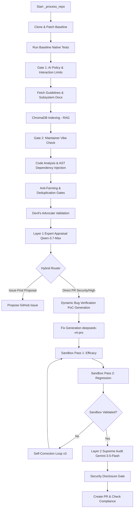

# PROJECT_MAP.md — Agent-Farm Ground Truth

**Generated:** 2026-06-02  
**Version:** v4.0.0 — Omniscient Context Engine  
**Entry Point:** `farm_agent/cli/main.py` → `cli()` (Click-based CLI)  
**Language:** Python 3.11+  
**Evidence basis:** Direct code inspection. No assumptions. All line numbers are verified.

---

## 1. System Overview & Active Tech Stack

**What it does:** Autonomous AI agent system that discovers open-source GitHub repositories or scans targets for issues and vulnerabilities. It analyzes code via multi-phase LLM prompts, generates patches, validates them in isolated Docker sandboxes, runs a two-layer expert filter (Qwen → Gemini), and submits pull requests or private disclosures. It also runs a PR Patrol loop to auto-reply to comments, address code reviews, and self-correct CI failures.

Version 4.0.0 introduces the **Omniscient Context Engine**, which recursively discovers repository documentation, chunks it semantically by markdown headers, ingests it into ChromaDB, and maps local module/function dependency linkages to provide deep subsystem context to LLM agents. Furthermore, version 4.0.0 incorporates **Dynamic Bug Verification** (generating and executing Proof-of-Concept exploits in an isolated container sandbox, evaluated via LLM) and **Blast Radius & Regression Auditing** (using baseline test suite runs and downstream dependent analysis to guarantee zero regressions).

| Component | Technology | Configuration Source |
|-----------|------------|--------|
| Build System | `hatchling` | `pyproject.toml` |
| CLI Framework | `click>=8.1`, `rich>=13.0` | `pyproject.toml` |
| HTTP Client | `httpx` (async) | `pyproject.toml` |
| Config & Validation | `pydantic>=2.5`, `pydantic-settings>=2.1`, `pyyaml>=6.0` | `pyproject.toml` |
| Database / State | `aiosqlite>=0.19` (SQLite) | `pyproject.toml` |
| Container Orchestration | `docker>=7.1` | `requirements.txt` |
| RAG / Vector Search | `chromadb>=0.4` | `pyproject.toml` |
| Primary LLM | `deepseek/deepseek-v4-flash` via OpenRouter | Pipeline Default / `config.yaml` |
| Code Gen LLM | `deepseek/deepseek-v4-pro` via OpenRouter | Generator Overrides |
| Layer 1 Appraiser | `qwen/qwen3.7-max` via OpenRouter | Hardcoded Pipeline Fallback |
| Layer 2 Supreme Auditor | `google/gemini-3.5-flash` via OpenRouter | Hardcoded Pipeline Fallback |
| Background Jobs | `apscheduler>=3.10` | `pyproject.toml` |

---

## 2. Directory Structure

```text
.
├── Dockerfile                  # Builds `farm_agent:latest`
├── docker-compose.yml          # Agent daemon with `internet_access` & `sandbox_isolated` networks
├── Makefile                    # Developer tasks (`make install`, `make test`, `make lint`)
├── pyproject.toml              # Build config and dependency definitions
├── requirements.txt            # Prod locks (forces docker>=7.1)
├── start.bat                   # 1-Click Docker Quick-Start (Windows)
├── start.sh                    # 1-Click Docker Quick-Start (Unix)
└── farm_agent/                 # Core Python Package Root
    ├── __init__.py
    ├── agents/                 # Agent registry configuration
    ├── analysis/               # Code analyzers (Bloodhound, quality scanners) and AST mappers
    ├── cli/                    # CLI definitions (`main.py` entrypoint)
    ├── core/                   # Shared configurations, RAG engines, sandbox, logging, quotas
    ├── generator/              # Patch engines, PoC validation logic, and QA hardcore scorers
    ├── github/                 # GitHub REST/GraphQL clients, Discovery loops, and Security Gates
    ├── issues/                 # Solvers for processing GitHub issues directly
    ├── llm/                    # Providers for OpenRouter, Google, OpenAI, Anthropic, and router mapping
    ├── notifications/          # Messaging gateways (Telegram, Slack, Discord)
    ├── orchestrator/           # The core execution loops (`pipeline.py`, `human.py`, `memory.py`)
    ├── plugins/                # Plugin definitions
    ├── pr/                     # Managers for GitHub PRs, Patrol feedback loops, and Janitor
    ├── templates/              # Markdown PR templates
    └── tools/                  # LLM protocol definitions
```

---

## 3. Core Execution Pipelines (`farm_agent/orchestrator/pipeline.py`)

### 3A. Standard Pipeline Flow (`_process_repo()`)



---

## 4. CLI Commands (`farm_agent/cli/main.py`)

| Command | Description |
|---------|-------------|
| `farm_agent run` | Standard run: discover, analyze, generate fixes, run sandbox, check gates, submit PRs. |
| `farm_agent target <url>` | Process a single target repository. |
| `farm_agent hunt` | Run multi-round search and analysis (analysis, issues, or both). |
| `farm_agent hunt-circular` | Deterministic round-robin target loop from `target_repo.json`. |
| `farm_agent patrol` | Check open PRs for maintainer review comments, reply to questions, and auto-fix CI failures. |
| `farm_agent superhuman` | 24/7 relentless loop cycling through circular target hunt and patrol operations. |
| `farm_agent solve <url>` | Proactively search for solvable issues in a repo, construct deep fixes, and generate PRs. |
| `farm_agent analyze <url>` | Perform code analysis pass only; do not generate contributions or open issues. |
| `farm_agent janitor` | Sweeps all open PRs and closes/deletes low-quality/garbage contributions. |
| `farm_agent gc --days 90` | Purge knowledge base entries older than N days. |
| `farm_agent cleanup` | Purge local temporary files and cleanup stale forks. |
| `farm_agent reset-db` | Recreate database tables and reset memory database. |
| `farm_agent vips` | Monitor and synchronize VIP repository radar list. |
| `farm_agent config` | Output the current loaded runtime settings. |
| `farm_agent status` | Show target queue statuses. |
| `farm_agent stats` | Show current runtime and OpenRouter API usage statistics. |
| `farm_agent models` | List the active LLM routing mappings. |
| `farm_agent profile <name>`| Run the pipeline pre-loaded with specific presets. |

---

## 5. Database Schema & Persistence (`farm_agent/orchestrator/memory.py`)

The SQLite database file resides in `data/memory.db` and operates in **WAL (Write-Ahead Logging)** mode.

| Table | Description |
|-------|-------------|
| `analyzed_repos` | Tracks repositories that have already gone through analysis to avoid repeat scanning. |
| `submitted_prs` | Tracks bot-created PRs, issues, and associated limits counters (CI retries, replies). |
| `findings_cache` | Temporary cache of detected code findings. |
| `run_log` | Log of overall runs metrics and durations. |
| `pr_outcomes` | Stores merged/closed PR states and maintainer review remarks. |
| `repo_preferences` | Learned project contribution preferences updated dynamically from outcomes. |
| `blacklisted_repos` | Projects blacklisted due to hostile maintainer checks or pipeline failures. |
| `api_usage_log` | Tracks LLM API usage for quota management. |
| `task_schedule` | Persistent schedule queue for tasks in the `SuperHumanLoop`. |
| `knowledge_base` | Stores lessons, past QA critiques, self-learning lessons, and architectural context. |
| `target_repos` | Deterministic circular target queue for Super Human operations. |
| `repo_style_guides`| Caches contributing templates, formatting, and structural guidelines. |
