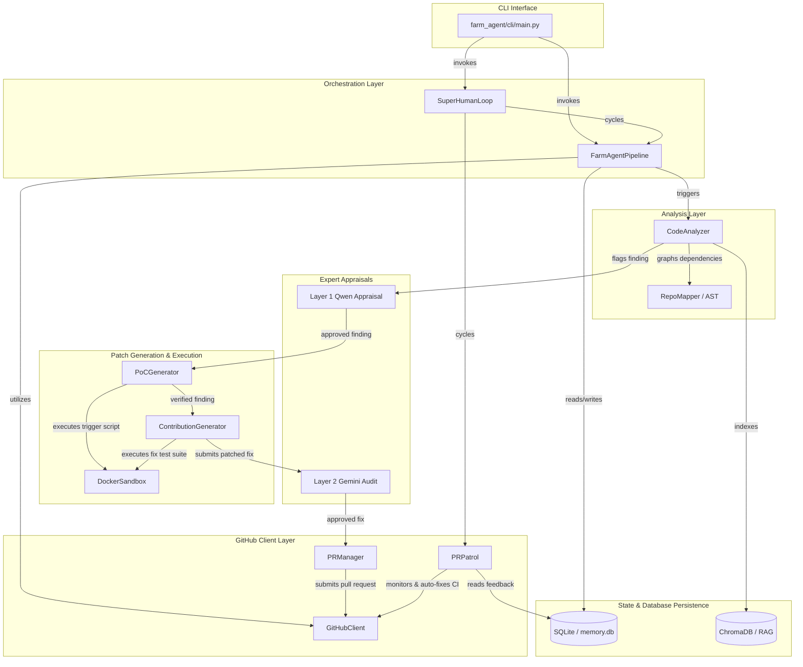

# PROJECT_MAP.md — Agent-Farm Architecture Blueprint

**Generated:** 2026-06-02  
**Version:** v4.0.0 — Omniscient Context Engine  
**Entry Point:** `farm_agent/cli/main.py` → `cli()` (Click-based CLI)  
**Language:** Python 3.11+  
**Evidence basis:** Direct code inspection. No assumptions. All line numbers are verified.

---

## 1. System Overview & Active Tech Stack

**What it does:** Autonomous AI agent system that discovers open-source GitHub repositories or scans targets for issues and vulnerabilities. It analyzes code via multi-phase LLM prompts, generates patches, validates them in isolated Docker sandboxes, runs a two-layer expert filter (Qwen → Gemini), and submits pull requests or private disclosures. It also runs a PR Patrol loop to auto-reply to comments, address code reviews, and self-correct CI failures.

Version 4.0.0 introduces the **Omniscient Context Engine**, which recursively discovers repository documentation, chunks it semantically by markdown headers, ingests it into ChromaDB, and maps local module/function dependency linkages to provide deep subsystem context to LLM agents. Furthermore, version 4.0.0 incorporates **Dynamic Bug Verification** (generating and executing Proof-of-Concept exploits in an isolated container sandbox, evaluated via LLM) and **Blast Radius & Regression Auditing** (using baseline test suite runs and downstream dependent analysis to guarantee zero regressions).

| Component | Technology | Exact Role |
|-----------|------------|------------|
| Language | Python 3.11+ | Core runtime platform, configured in `pyproject.toml`. |
| Package Manager / Build | Hatchling | Build backend configured in `pyproject.toml`. |
| HTTP client | `httpx` (async) | Interfacing with the GitHub REST and GraphQL APIs. |
| Primary LLM | DeepSeek (`deepseek-v4-flash`) via OpenRouter | Used for general pipeline tasks and routing orchestration. |
| Code Gen LLM | DeepSeek (`deepseek-v4-pro`) via OpenRouter | Generates PoC verification scripts and actual code patches. |
| Layer 1 Appraiser | Qwen (`qwen3.7-max`) via OpenRouter | Strict expert appraisal rendering verdicts on findings to filter false positives. |
| Layer 2 Supreme Auditor | Gemini (`gemini-3.5-flash`) via OpenRouter | Double checks the incident dossier, sandbox logs, and patches before submission. |
| Red Team (Bloodhound) | `deepseek-v4-flash` via OpenRouter | Utilizes `ast-grep` and Semgrep to scan for patterns and vulnerabilities. |
| Semgrep rulesets | `p/security-audit`, `p/cwe-top-25`, `p/default`, `p/golang`, `p/rust`, `p/smart-contracts` | Core rulesets utilized by the Bloodhound Red Team pipeline for early analysis. |
| Database | SQLite (`aiosqlite`) — WAL mode, fallback to DELETE | Persistent memory (`memory.db`) for tracking states, PRs, findings, logs, and KB. |
| Docker Sandbox | Docker Engine (`docker>=7.1`) | Network + capability isolation for running PoCs and executing test suites (`docker-compose.yml`). |
| Config | Pydantic v2 + YAML + `.env` | System configuration definitions (`core/config.py`). |
| CLI | `click>=8.1` + `rich>=13.0` | CLI framework utilized for all entry points and terminal output styling. |
| Vector DB | `chromadb>=0.4` | RAG database used for storing semantic documentation context. |
| Notifications | `telegram`, `slack`, `discord` | Supported via `farm_agent/notifications/`. |

---

## 2. Directory Structure

The project structure encapsulates the codebase tools, execution orchestration, analysis mapping, integrations, and CLI interfaces.

```
.
├── farm_agent/                         # Application Package Root
│   ├── agents/                         # Agent task definitions and configuration registry
│   │   └── registry.py
│   ├── analysis/                       # Analyzers & mappers
│   │   ├── analyzer.py                 # Multi-layered analyzers (CodeAnalyzer, BloodhoundAnalyzer)
│   │   └── mapper.py                   # Dependency Mapper constructing Call Graphs via AST/regex
│   ├── cli/                            # CLI Commands interface
│   │   └── main.py                     # Primary Click CLI entry point mapping out all commands
│   ├── core/                           # System core
│   │   ├── config.py                   # Core settings loading logic & Pydantic configurations
│   │   ├── daily_log.py                # Activity markdown logger
│   │   ├── exceptions.py               # Custom Exception classes
│   │   ├── leaderboard.py              # Leaderboard reporting tracking logic
│   │   ├── logger.py                   # Configuration for file & rotating logs
│   │   ├── middleware.py               # Application middleware integrations
│   │   ├── models.py                   # System data models mapping
│   │   ├── profiles.py                 # Execution presets/profiles loader
│   │   ├── quotas.py                   # API Usage tracking mechanism
│   │   ├── rag.py                      # Retrieval-Augmented Generation implementation via ChromaDB
│   │   ├── retry.py                    # Network retry wrapper decorators
│   │   └── sandbox.py                  # Docker isolated execution sandbox integration
│   ├── generator/                      # LLM Code/Patch generators
│   │   ├── engine.py                   # Generator orchestrator for fixes and patches
│   │   ├── poc.py                      # Proof-of-Concept generation logic and sandbox triggering
│   │   ├── reviewer.py                 # Agent self-reflective auditing
│   │   └── scorer.py                   # Qwen-based Quality scorer layer
│   ├── github/                         # API Client
│   │   ├── client.py                   # HTTPX Async Github API wrapper and token rotator
│   │   ├── discovery.py                # Crawler discovering repositories based on stars/languages
│   │   ├── guidelines.py               # Repository contribution styles/guidelines ingestion
│   │   └── security_gate.py            # Identifies private security disclosure policies
│   ├── issues/                         # Issue Solving implementation
│   │   └── solver.py                   # Dedicated solver flow for Issue-First pipeline targets
│   ├── llm/                            # LLM API Abstractions
│   │   ├── agents.py                   # LLM mapping models interface
│   │   ├── context.py                  # Instruction block injection configurations
│   │   ├── models.py                   # AI Models specifications mapping config (Tiers, Cost, Models)
│   │   ├── provider.py                 # Primary interface wrapping Provider SDKs (OpenRouter, OpenAI)
│   │   └── router.py                   # Task Assignment / Routing engine assigning models
│   ├── notifications/                  # Notifications Subsystem
│   │   └── notifier.py                 # Slack/Telegram/Discord push alerts configuration
│   ├── orchestrator/                   # High level state flow managers
│   │   ├── human.py                    # `SuperHumanLoop` Terminator Mode relentless 24/7 scheduler
│   │   ├── memory.py                   # SQLite Connection logic (`memory.db`)
│   │   └── pipeline.py                 # Core `FarmAgentPipeline` orchestrating `run`, `run_circular`, `hunt`
│   ├── plugins/                        # Extensible Plugin Modules
│   ├── pr/                             # GitHub PR Management Logic
│   │   ├── manager.py                  # Submits PRs, maps Forks, generates PR context
│   │   └── patrol.py                   # PR Patrol monitoring comments, CI fixes, auto-responding
│   ├── templates/                      # Dynamic Formatting Templates
│   │   └── registry.py
│   ├── tools/                          # CLI Tool abstractions
│   │   └── protocol.py                 # Tooling protocols map
│   └── __init__.py                     # Package Initializer
├── tests/                              # Pytest test suite targeting module units
├── .env.example                        # Example `.env` configuration file
├── docker-compose.yml                  # Daemon service running the execution network and isolation layer
├── Dockerfile                          # Build specifications for the agent container
├── Makefile                            # Core quick-execution task recipes (`make install`, `make test`, `make lint`)
├── PROJECT_MAP.md                      # This Architecture documentation blueprint
├── pyproject.toml                      # Build tool configurations, dependencies, settings
├── README.md                           # Main descriptive landing documentation
├── requirements.txt                    # Standard dependency list used by `make install`
├── start.bat                           # 1-Click Launch Windows bat wrapper
└── start.sh                            # 1-Click Launch UNIX bash wrapper
```

---

## 3. Core Module Dependency Graph

The interaction flow across the major domains follows an iterative agent process managed by the Orchestrator.



---

## 4. Core Execution Loops / Entry Points

### 4A. Standard Pipeline — `_process_repo()`

Triggered via `farm_agent run` or `farm_agent target <url>`, processing a single repository through the full contribution pipeline:

1. **Early Clone Initialization**: Clones repository early to a local temporary directory to populate codebase structure.
2. **Baseline Native Test Run**: Runs unpatched native tests once to establish pre-existing failure baseline prior to making changes.
3. **[GATE 0] AI Policy Check**: Scans `AI_POLICY.md` for AI-generated PR bans, skipping if matches are found.
4. **[GATE 1] GitHub Interaction Limits**: Skips repository if restricted to prior contributors only.
5. **Contextual Guideline Ingestion**: Parses `CONTRIBUTING.md`, templates, and style guidelines using `fetch_repo_guidelines()`.
6. **Omniscient Documentation Discovery**:
   - `discover_subsystem_docs()` Recursively discovers doc files (`.md`, `.txt`, `.rst`) inside cloned repo directory.
   - `RepoIndexer.index_repo()` Semantically chunks documentation by headers and indexes into ChromaDB asynchronously.
7. **[GATE 2] Maintainer Vibe Check**: Fetches recent maintainer comments. If "HOSTILE" comments found, it blacklists the repo and aborts the run.
8. **Parallel Analysis Generation**: Runs parallel LLM analyzers (security, code_quality, docs, ui_ux) via `CodeAnalyzer.analyze()`.
9. **AST Dependency Graphing**: Reads all files, generates structural skeleton via `RepoMapper`, and injects imports, calls, and dependents into `Finding.metadata["module_dependencies"]`.
10. **[GATE 3 & 4] Pre-Filter & Anti-Farming Filters**: Strict rejection gates dropping findings in config files, non-critical/high security reports, trivial fixes, documentation fixes, and blocked paths.
11. **Deduplication & Validation**: Filters duplicate titles using bigram similarity check and LLM validates findings skeptically using strict validation checklist, ensuring findings are real and scored high confidence.
12. **[GATE 5] Layer 1 Expert Appraisal**: Evaluated via `qwen3.7-max` verifying finding is genuine and severe. Fail-closed on error.
13. **Hybrid Router (Route A vs Route B)**:
    - **Route A (Direct PR):** Used for SECURITY_FIX and Severity CRITICAL/HIGH/MEDIUM.
    - **Route B (Issue-First):** Propose fix in issue and skip PR (Performance, Refactor, UI/UX, etc.)
14. **[Route A] Verification Gate & Fix Generation**:
    - `PoCGenerator.generate_poc()` creates a test script to trigger the flaw, run within the `DockerSandbox`. The LLM checks if it triggered, classifying as a True Positive, or Drops the finding if False Positive.
    - Uses `ContributionGenerator.generate()` with Style Guide context and dependents context.
15. **Double-Pass Sandbox Validation (DEV-QA Loop)**:
    - **Pass 1 (Efficacy):** Executes PoC on patched code. PoC MUST NOT trigger vulnerability.
    - **Pass 2 (Regression):** Runs native tests. Rejects if baseline passed but patched code fails. Fallback runs compilation/syntax checks in sandbox if no native tests exist.
16. **[GATE 6] Layer 2 Supreme Audit**: Final review using `gemini-3.5-flash` checking the incident dossier, sandbox logs & proposed patch.
17. **[GATE 7] Diplomat (Security Disclosure Gate)**: Bypasses PR if security targets require private disclosure.
18. **Submission**: Uses `PRManager.create_pr()` to submit to the upstream remote.

---

### 4B. Circular Target Loop (`hunt-circular`) & Terminator Mode (`superhuman`)

Target pipeline loop extracting target repos from the local SQLite queue. Utilized by `Terminator Mode`, mimicking a relentless 24/7 dedicated human developer operations cycle dynamically interleaving Hunt and PR Patrol:

1. **DatabaseTargetDiscovery.get_next_target()**: Picks the oldest scanned target.
2. **BloodhoundAnalyzer (Phase 1)**: White-hat Semgrep pre-scan (CWE-Top-25, security-audit, language-specific rulesets). If clean sweep, terminates run early.
3. **Filter production_vulns**: Skips vulnerability targets located in non-production paths (test, demo, benchmark, docs).
4. **3-Cycle DEV-QA Loop (Phase 2-7)**:
   - **DEV patch generation**: Injects past QA critiques, generates code patch using structural context and dependency maps.
   - **QAHardcoreScorer evaluation**: Models score patches on strict code quality metrics. Rejection writes qa_lesson to knowledge_base, appends critique to context, and retries.
   - **Docker Sandbox validation**: Verified internally within the DEV generator loops.
   - **Layer 2 Supreme Audit**: Final Gemini incident checks.
   - **Security Disclosure Gate**: Verifies public exposure policies before proceeding.
   - **PRManager.create_pr()**: Submits PR. On success status marked PR_SUBMITTED.

---

## 5. Database & State Persistence Schema

Database file resides in `data/memory.db` and operates in **WAL (Write-Ahead Logging)** mode. Composite indices prevent full table scans.

| Table | Description | Primary Key | Key Columns |
|-------|-------------|-------------|-------------|
| `analyzed_repos` | Tracks repositories that have already gone through analysis. | `full_name` | `language`, `stars`, `analyzed_at`, `findings` |
| `submitted_prs` | Tracks bot-created PRs, issues, and associated limits counters. | `id` (AUTOINC) | `repo`, `pr_number`, `pr_url`, `type`, `status`, `ci_fix_attempts` |
| `findings_cache` | Temporary cache of detected code findings. | `id` (PK) | `repo`, `severity`, `title`, `file_path`, `status` |
| `run_log` | Log of overall runs metrics and durations. | `id` (AUTOINC) | `started_at`, `finished_at`, `repos_analyzed`, `prs_created`, `errors` |
| `pr_outcomes` | Stores merged/closed PR states and maintainer review remarks. | `id` (AUTOINC) | `repo`, `pr_number`, `outcome`, `time_to_close_hours` |
| `repo_preferences` | Learned project contribution preferences updated dynamically from outcomes. | `repo` | `preferred_types`, `rejected_types`, `merge_rate`, `avg_review_hours` |
| `blacklisted_repos` | Projects blacklisted due to hostile maintainer checks or failures. | `repo` | `reason`, `pr_number`, `blacklisted_at` |
| `api_usage_log` | Tracks LLM API usage. Optimized with `idx_api_usage` composite index on `(provider, timestamp)`. | `id` (AUTOINC) | `timestamp`, `provider` |
| `task_schedule` | Persistent schedule queue for tasks in the `SuperHumanLoop`. | `task_key` | `next_run`, `updated_at` |
| `knowledge_base` | Stores lessons, past critiques, self-learning lessons, and **architectural context**. | - | `repo_name`, `entry_type`, `content`, `created_at` (Unique Constrained) |
| `target_repos` | Deterministic circular target queue. | `repo_url` | `status`, `scanned_at`, `language`, `bounty_amount`, `diamond_target` |
| `repo_style_guides` | Caches contributing templates, formatting, and structures. | `repo` | `style_summary`, `contributing_md`, `pr_template`, `updated_at` |

---
*All evidence anchored to source files. All line numbers verified by direct inspection. No speculation.*