# 🗺️ Project Map & Architecture

This document provides a deep-dive architectural guide to the **Farm-Agent** codebase (v4.0.0). It maps the active technologies, directory structure, module dependencies, core execution loops, and database schema to help new developers navigate the system.

---

## 1. System Overview & Tech Stack

The Farm-Agent is built to be a resilient, autonomous AI system capable of discovering, analyzing, and patching issues in open-source repositories.

| Category | Technology | Role in System |
| :--- | :--- | :--- |
| **Core Language** | Python 3.11+ | Primary backend logic and CLI orchestration. |
| **Build & Packaging** | Hatchling | Modern PEP 621 compliant build backend. |
| **Configuration** | Pydantic v2 & PyYAML | Strongly-typed settings validation (`config.yaml` / `.env`). |
| **CLI Framework** | Click & Rich | Command-line interface and terminal formatting/tables. |
| **Asynchronous I/O** | `asyncio`, `httpx`, `aiosqlite` | Concurrent GitHub API requests and non-blocking DB operations. |
| **Database** | SQLite (WAL mode) | Persistent state management (`analyzed_repos`, `submitted_prs`, etc.). |
| **Vector Search (RAG)**| ChromaDB | Local knowledge base indexing for internal repository documentation. |
| **Containerization** | Docker | Isolated sandbox execution for dynamic PoC validation (`DockerSandbox`). |
| **LLM Orchestration** | OpenRouter (DeepSeek, Qwen) | Routing to various AI models (e.g., Qwen for filtering, DeepSeek for patching). |
| **Job Scheduling** | APScheduler | Task queuing in the `SuperHumanLoop`. |

---

## 2. Directory Structure

This structure represents the active modules, excluding disabled or trivial files.

```text
.
├── Dockerfile                          # Stage 1 builder + Stage 2 lean runtime
├── docker-compose.yml                  # agent-farm service definition
├── start.sh                            # Unix quick start wrapper script
├── start.bat                           # Windows quick start wrapper script
│
├── farm_agent/                         # Package root (v4.0.0)
│   ├── __init__.py
│   │
│   ├── cli/
│   │   └── main.py                     # Click CLI — command registrations
│   │
│   ├── core/
│   │   ├── config.py                   # Pydantic v2 config loading
│   │   ├── daily_log.py                # Formats daily markdown logs
│   │   ├── exceptions.py               # Exception types hierarchy
│   │   ├── leaderboard.py              # Leaderboard stat collections
│   │   ├── logger.py                   # Rotating file logging system
│   │   ├── middleware.py               # Context middleware chain
│   │   ├── models.py                   # Core Pydantic data structures
│   │   ├── notifier.py                 # Telegram notifications
│   │   ├── profiles.py                 # Run configurations
│   │   ├── quotas.py                   # OpenRouter usage quota controllers
│   │   ├── rag.py                      # ChromaDB vector DB context loaders
│   │   ├── retry.py                    # Retry decorators for GitHub/LLM
│   │   └── sandbox.py                  # DockerSandbox engine (PoC execution)
│   │
│   ├── analysis/
│   │   ├── analyzer.py                 # CodeAnalyzer (BloodhoundAnalyzer)
│   │   └── mapper.py                   # RepoMapper (AST/regex dependency graphing)
│   │
│   ├── generator/
│   │   ├── engine.py                   # ContributionGenerator (Patch creation)
│   │   ├── poc.py                      # PoCGenerator (Validation & LLM eval)
│   │   ├── reviewer.py                 # ReviewerAgent (Blast Radius checks)
│   │   └── scorer.py                   # QAHardcoreScorer (QA grader)
│   │
│   ├── github/
│   │   ├── client.py                   # Async GitHub REST and GraphQL Client
│   │   ├── discovery.py                # Target network search
│   │   ├── guidelines.py               # PR templates, subsystem doc discovery
│   │   └── security_gate.py            # Identifies private security disclosure files
│   │
│   ├── issues/
│   │   └── solver.py                   # IssueSolver (multi-file deep planner)
│   │
│   ├── llm/
│   │   ├── agents.py                   # LLM agent prompts
│   │   ├── context.py                  # Generator system instruction builders
│   │   ├── models.py                   # Model registry definitions
│   │   ├── provider.py                 # OpenRouter integration handlers
│   │   └── router.py                   # Task router mapping
│   │
│   ├── notifications/
│   │   └── notifier.py                 # Notification handling
│   │
│   ├── orchestrator/
│   │   ├── human.py                    # SuperHumanLoop relentless daily scheduler
│   │   ├── memory.py                   # SQLite persistent memory interface
│   │   └── pipeline.py                 # Core execution loop (Discovery -> Analysis -> Sandbox)
│   │
│   ├── plugins/
│   │
│   ├── pr/
│   │   ├── manager.py                  # Pull Request manager (forks, branches)
│   │   └── patrol.py                   # PR Patrol (reviews comments, fixes CI errors)
│   │
│   ├── templates/
│   │   ├── builtin/
│   │   └── registry.py                 # Template registry
│   │
│   └── tools/
│       └── protocol.py                 # CLI tool protocols
```

---

## 3. Core Module Dependency Graph

The Farm-Agent system architecture operates through the `FarmAgentPipeline`, which acts as the central hub.

```mermaid
graph TD
    %% Core Orchestration
    Orchestrator[farm_agent.orchestrator.pipeline.FarmAgentPipeline]

    %% Input / Source
    Discovery[farm_agent.github.discovery.RepoDiscovery]
    GitHub[farm_agent.github.client.GitHubClient]

    %% Subsystems
    Analysis[farm_agent.analysis.analyzer.CodeAnalyzer]
    Mapper[farm_agent.analysis.mapper.RepoMapper]
    RAG[farm_agent.core.rag]
    Generator[farm_agent.generator.engine.ContributionGenerator]
    Sandbox[farm_agent.core.sandbox.DockerSandbox]
    PRManager[farm_agent.pr.manager.PRManager]
    Memory[farm_agent.orchestrator.memory.Memory]

    %% Relationships
    Orchestrator -->|Discovers targets| Discovery
    Orchestrator -->|Fetches code/issues| GitHub
    Orchestrator -->|Analyzes codebase| Analysis
    Orchestrator -->|Creates mapping| Mapper
    Orchestrator -->|Reads docs| RAG
    Orchestrator -->|Generates patch| Generator
    Orchestrator -->|Validates PoC/Tests| Sandbox
    Orchestrator -->|Submits contribution| PRManager
    Orchestrator -->|Logs state/metrics| Memory

    %% Internal Interactions
    Generator -.->|Uses AI| Sandbox
    Analysis -.->|Uses AI| RAG
```



---

## 4. Core Execution Loops / Entry Points

The fundamental cycle (the "DeerFlow" pattern) follows a strict sequence:

1. **Discovery (`farm_agent.github.discovery`)**: The agent crawls GitHub or takes a target URL to identify valid projects.
2. **Gate (`farm_agent.github.security_gate`)**: Scans for private disclosure phrases and halts public PRs if found, aborting the pipeline.
3. **Analysis (`farm_agent.analysis.analyzer`)**: Runs static analysis and AST-based dependency mapping (`RepoMapper`) to locate vulnerabilities or open issues.
4. **Engine (`farm_agent.generator.engine` & `farm_agent.generator.poc`)**: Before writing a fix, a PoC script is generated to trigger the vulnerability. Layer 1 Appraisal (Qwen) filters out false positives.
5. **Sandbox (`farm_agent.core.sandbox`)**: The patch is applied and validated via a double-pass check in an isolated Docker container: Pass 1 verifies the bug is fixed, Pass 2 runs the regression test suite.
6. **PR / Submission (`farm_agent.pr.manager`)**: The validated patch is pushed to a fork, and a Pull Request is submitted. Subsequent runs track the PR using `PRPatrol`.

---

## 5. Database/State Schema

The local memory utilizes an SQLite database (`data/memory.db`) in Write-Ahead Logging (WAL) mode, initialized via `farm_agent/orchestrator/memory.py`.

Key tables include:

* **`analyzed_repos`**: Tracks target repositories (`full_name`, `language`, `stars`, `findings`, etc.).
* **`submitted_prs`**: Logs created pull requests (`repo`, `pr_number`, `pr_url`, `status`, `type`).
* **`findings_cache`**: Caches potential vulnerabilities to avoid re-analysis (`repo`, `type`, `severity`, `title`).
* **`run_log`**: Captures system metrics per run (`started_at`, `repos_analyzed`, `prs_created`, `errors`).
* **`pr_outcomes`**: Records final states of PRs (merged, closed, time to close).
* **`repo_preferences`**: Adapts behavior based on maintainer feedback (`preferred_types`, `rejected_types`, `merge_rate`).
* **`api_usage_log`**: Records LLM token and API usage.
* **`knowledge_base`**: Stores learned lessons, past critiques, and architectural context.
* **`blacklisted_repos`**: Keeps track of hostile or failed projects to skip in future runs.
