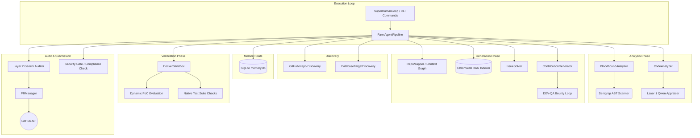

# Agent-Farm Architecture Blueprint

This document serves as a deep-dive architectural guide for developers, outlining the raw reality of the active codebase.

## 1. System Overview & Tech Stack

| Component | Technology | Description/Role |
| :--- | :--- | :--- |
| **Core Language** | Python 3.11+ | The entire `farm_agent` package and its automation pipeline. |
| **Orchestration** | asyncio | Core asynchronous orchestration framework utilized for parallel repository processing. |
| **Database** | SQLite (aiosqlite) | Local persistent state (`memory.db`) used for tracking PR history, analyzed repos, learning knowledge bases, and API usage quotas. |
| **LLM Provider** | Minimax / OpenRouter | The primary reasoning engines (via `google-genai`, `openai`, `anthropic` clients). OpenRouter is specifically leveraged for Qwen/Gemini auditing logic. |
| **Sandbox Environment** | Docker (>= 7.1) | Execution environment utilized for isolated code compilation, tests, and PoC (Proof-of-Concept) validation before pushing code. |
| **Vulnerability Scanning** | Semgrep / AST | Underpins the `BloodhoundAnalyzer` to pre-scan code repositories for security flaws. |
| **Vector DB** | ChromaDB | Used within the `RepoIndexer` for the Omniscient Context Engine to index and retrieve subsystem documentation via RAG. |
| **Build System** | Hatchling | Modern Python build backend specified in `pyproject.toml`. |
| **CLI Framework** | Click + Rich | Powers the `farm_agent` CLI, rendering complex status panels and progress tables in terminal outputs. |

## 2. Directory Structure

```text
.
├── farm_agent/                   # Main Python package
│   ├── agents/                   # Agent registry and definitions
│   ├── analysis/                 # Static analysis modules (CodeAnalyzer, BloodhoundAnalyzer, RepoMapper)
│   ├── cli/                      # Command-Line Interface (main.py containing commands like run, hunt, superhuman)
│   ├── core/                     # Core system utilities (config, middleware, exceptions, RAG RepoIndexer, DockerSandbox)
│   ├── generator/                # ContributionGenerator and QAHardcoreScorer for code generation
│   ├── github/                   # GitHub API clients, repo discovery logic, security disclosure gate
│   ├── issues/                   # IssueSolver for tackling reported GitHub issues
│   ├── llm/                      # LLM Provider integrations and Multi-model routing
│   ├── notifications/            # Multi-channel notification dispatchers (Telegram, Slack, Discord)
│   ├── orchestrator/             # Core pipelines (FarmAgentPipeline, SuperHumanLoop, SQLite Memory system)
│   ├── plugins/                  # Extensibility components
│   ├── pr/                       # PR Manager and PR Patrol (auto-healing logic)
│   ├── templates/                # Contribution templates
│   └── tools/                    # Tool definitions and Default tools registry
├── scripts/                      # Shell/batch utility scripts
├── secret_findings/              # Output directory for intercepted private vulnerability disclosures
├── tests/                        # Unit testing suite (pytest)
├── docker-compose.yml            # Docker definition for launching the agent daemon
├── Dockerfile                    # Container instructions for the agent environment
├── Makefile                      # Standardized targets for dev install, tests, linting, and building
├── pyproject.toml                # Build configuration via Hatchling and tool configs (e.g. Ruff)
├── README.md                     # High-level overview and instructions
├── start.bat                     # Windows quick-start execution script
└── start.sh                      # Unix quick-start execution script
```

## 3. Core Module Dependency Graph



## 4. Core Execution Loops / Entry Points

### Terminator Mode (`farm_agent superhuman`)
- An unyielding, fully autonomous execution loop replacing the legacy delayed 'Super Human Mode'.
- **Flow:** Continuously interleaves aggressive repository hunting, issue processing, and PR Patrol logic without artificial sleep delays, pulling primary targets via the Circular Target Loop.

### Circular Target Loop
- Operating out of `farm_agent/orchestrator/pipeline.py` (via `run_circular`), it deterministically processes targets seeded into the SQLite `target_repos` table.
- **Flow:** Atomically claims the target with the oldest `scanned_at` timestamp. Dispatches the `BloodhoundAnalyzer` to find vulnerabilities. Proceeds through the DEV-QA loop only if actionable, production-grade flaws are discovered.

### DEV-QA Bounty Loop
- Handled internally by the `ContributionGenerator` and `QAHardcoreScorer`.
- **Flow:** The Dev model generates patches and tests (integrating previous QA feedback context). The QA model rigorously scores the diff. If the patch scores below the passing threshold, the QA critiques are recorded into the database and fed back to the Dev model for up to 3 cycles.

### PR Patrol
- Executed via `farm_agent patrol` or invoked by the Terminator loop.
- **Flow:** Monitors previously opened PRs. Automatically handles maintainer review feedback, responds to questions, performs style fixes, attempts to resolve CI failures, and manages CLA signatures.

## 5. Database/State Schema

Agent-Farm leverages an `aiosqlite` backend (`memory.db`) to ensure long-term learning and state durability, avoiding duplicate operations. Core tables defined in `farm_agent/orchestrator/memory.py`:

- **`analyzed_repos`**: Tracks repositories that have already been examined to prevent redundant LLM analysis calls.
- **`submitted_prs`**: Maintains the history of submitted pull requests, mapping the target repo to the PR number, URL, status, type, and counts of CI fix attempts.
- **`findings_cache`**: Caches structural issue discoveries before generation.
- **`run_log`**: Logs start/end timestamps and basic statistics of pipeline execution runs.
- **`pr_outcomes`**: Logs whether past PRs were merged or rejected, recording the feedback and closing timeline to fuel intelligent agent adaptation.
- **`repo_preferences`**: A materialized view derived from `pr_outcomes` summarizing preferred and rejected contribution types, overall merge rate, and average review times per repo.
- **`blacklisted_repos`**: A static deny list preventing the agent from analyzing known hostile, restricted, or excluded repositories.
- **`api_usage_log`**: An event log tracking LLM API token invocations used for real-time sliding window quota calculations to prevent hitting provider rate limits.
- **`knowledge_base`**: Stores experiential data (e.g., QA lessons, Layer 1 & 2 rejection reasons) for specific repositories, enabling the pipeline to proactively learn from its mistakes on subsequent attempts.
- **`target_repos`**: Defines targets for the Circular Target Loop, tracking completion status, bounty amounts, and last scanned timestamps for crash-safe round-robin processing.
- **`repo_style_guides`**: Caches summarized contribution guidelines and style requirements extracted from target repos to reduce token consumption on repeated interactions.
