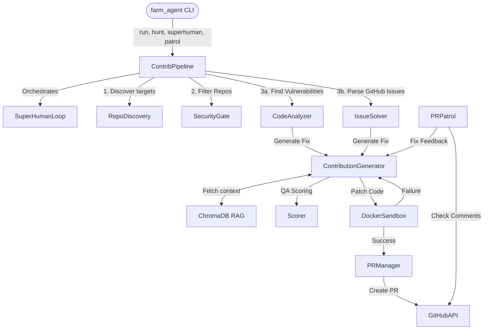

# 🗺️ PROJECT_MAP.md (Architecture Blueprint)

## 1. System Overview & Tech Stack

| Technology / Component | Role in Farm-Agent |
| --- | --- |
| **Python (3.11+)** | Core language for the agent and orchestrator. |
| **Hatchling** | Build backend and project metadata manager (`pyproject.toml`). |
| **Click & Rich** | CLI framework (`farm_agent/cli/main.py`) for commands and terminal UI. |
| **Pydantic** | Configuration management (`core/config.py`) and strict data models (`core/models.py`). |
| **SQLite (aiosqlite)** | Persistent state tracking for quotas, PRs, and targets (`memory.db` via `orchestrator/memory.py`). |
| **Minimax LLM** | Primary language model provider for issue solving and code generation. |
| **OpenRouter LLM** | Optional secondary provider for White-Hat auditing (Bloodhound Red Team). |
| **ChromaDB** | Local, in-memory Retrieval-Augmented Generation (RAG) vector store (`core/rag.py`). |
| **Docker (docker-py)** | Isolated Polyglot Sandbox environment to test patches before PR submission (`core/sandbox.py`). |
| **GitHub REST / GraphQL** | System integration for PR creation, commenting, issue fetching, and repository discovery (`github/client.py`). |
| **ast-grep / Semgrep** | External code scanning tools integrated for Bloodhound Red Team pipeline. |

---

## 2. Directory Structure

```text
farm_agent/
├── cli/
│   └── main.py              # CLI entrypoints (run, target, hunt, patrol, superhuman, solve, etc.)
├── core/
│   ├── config.py            # Pydantic configuration definitions
│   ├── exceptions.py        # Custom exceptions
│   ├── memory.py            # Main SQLite DB interactor (tracks state, limits, quotas)
│   ├── middleware.py        # Quota and pipeline middleware hooks
│   ├── models.py            # Core data models (Repository, Finding, Contribution)
│   ├── rag.py               # ChromaDB implementation for code context vectorization
│   ├── retry.py             # Resiliency logic and async decorators
│   └── sandbox.py           # Docker isolation layer for code execution validation
├── github/
│   ├── client.py            # GitHub API wrapper with token rotation and rate limiting logic
│   ├── discovery.py         # Locating target repositories based on constraints
│   ├── guidelines.py        # Fetching CONTRIBUTING.md and AI policies
│   └── security_gate.py     # Codebase scanning to avoid protected/private locations
├── analysis/
│   ├── analyzer.py          # Primary analyzer coordinator
│   └── bloodhound.py        # Advanced vulnerability discovery (ast-grep/Semgrep)
├── generator/
│   ├── engine.py            # Central engine to prompt LLMs and formulate code patches
│   ├── reviewer.py          # Self-review mechanisms for patches
│   └── scorer.py            # Final QA scoring against style guides and constraints
├── issues/
│   └── solver.py            # Fetches, classifies, and filters solvable GitHub issues
├── llm/
│   ├── provider.py          # LLM interface (Minimax, OpenRouter, etc.)
│   ├── router.py            # Task-to-Model router assignments
│   └── models.py            # Static mappings of models and their capabilities
├── orchestrator/
│   ├── pipeline.py          # Core workflow execution (ContribPipeline: Discovery -> Gate -> Analysis -> Engine -> Sandbox -> PR)
│   ├── human.py             # SuperHumanLoop: Continuous 24/7 daemon combining hunt and patrol
│   └── memory.py            # Alias mapping back to core/memory.py
├── pr/
│   ├── manager.py           # Handles branching, committing, and PR submission
│   ├── patrol.py            # Scans existing PRs and replies to maintainer feedback
│   └── janitor.py           # Discards and cleans up low-quality PRs
└── tools/
    └── protocol.py          # System tool definitions
```

---

## 3. Core Module Dependency Graph



---

## 4. Core Execution Loops / Entry Points

The `ContribPipeline` orchestrates the system through a strict progression of states.

1. **Discovery Phase:** The pipeline queries the GitHub API or reads a target list (e.g., `target_repo.json`) to find viable projects, applying star-count filters and validating exclusions (`EXCLUDED_LANGUAGES`).
2. **Security Gate Phase:** It fetches `.md` guidelines (like `SECURITY.md`, `CONTRIBUTING.md`) to verify if AI-generated contributions are allowed, instantly terminating operations on a repo if it discovers "private disclosure" protocols or "hostile" environment terms.
3. **Analysis Phase:** Depending on the execution mode, it either uses `CodeAnalyzer` (including Bloodhound Semgrep/ast-grep) to find implicit bugs or the `IssueSolver` to pull specifically labeled GitHub Issues (complexity 1-5).
4. **Engine Phase:** The `ContributionGenerator` formulates a solution using a ChromaDB RAG layer to find cross-file code references. The proposed patch goes through `QualityScorer` to strip out debugging statements or bad patterns.
5. **Sandbox Phase (P0-FIX):** The patch is applied inside the offline `DockerSandbox`. The container runs tests/linters specific to the detected language. If the container exits with a non-zero code, the output is fed back into the Engine phase for self-correction (up to 3 tries).
6. **PR Phase:** The `PRManager` initiates a fork (if not already forked), pushes a new branch, commits the sandbox-verified code, and opens a Pull Request on the target repo.
7. **Patrol/Human Loop:** Alternatively, `SuperHumanLoop` continuously rotates target hunting with `PRPatrol`, addressing reviewer feedback and signing CLAs.

---

## 5. Database/State Schema (`memory.db`)

State is managed by an SQLite database with WAL enabled (`aiosqlite`).

- **`analyzed_repos`:** Logs targeted repositories to prevent redundant analysis.
- **`submitted_prs`:** Tracks PR history, states (`open`, `merged`, `closed`), and serves the Alumni Sync feature to target "friendly" repos.
- **`run_log` / `pr_outcomes`:** Statistical tracking of agent success rates and merge percentages (`Leaderboard` usage).
- **`findings_cache`:** Temporarily holds identified vulnerabilities or issues between execution cycles.
- **`repo_preferences` / `blacklisted_repos`:** Tracks maintainer vibes and style guides to influence the LLM's future outputs.
- **`api_usage_log`:** Detailed logging to ensure secondary rate limits are respected.
- **`task_schedule`:** Multi-process coordination table to manage recurring quota resets and cleanup tasks.
- **`knowledge_base`:** QA lessons, audit history, and feedback reflections (can be purged via `farm_agent gc`).