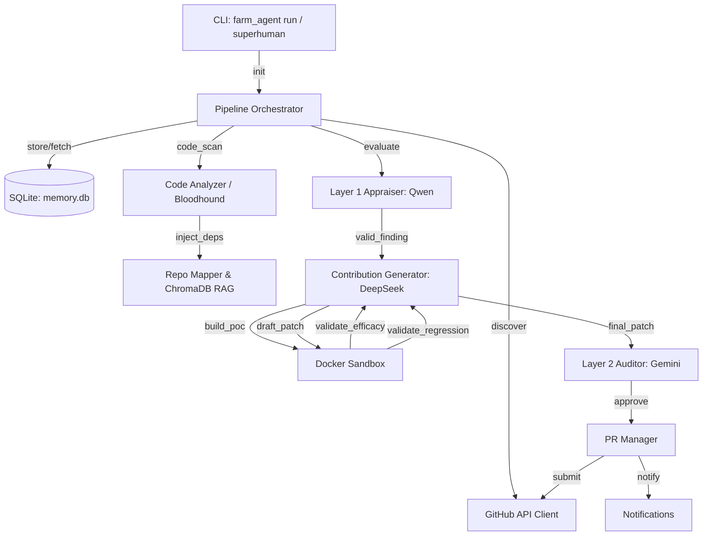

# PROJECT_MAP.md — Agent-Farm Architecture Blueprint

**Generated:** 2026-06-02  
**Version:** v4.0.0 — Omniscient Context Engine  
**Entry Point:** `farm_agent/cli/main.py` → `cli()` (Click-based CLI)  
**Language:** Python 3.11+  

---

## 1. System Overview & Active Tech Stack

Agent-Farm is an autonomous AI agent system designed to crawl GitHub for high-value targets, pinpoint security vulnerabilities, and submit precise, validated fixes via PRs or private disclosures. Operating with zero tolerance for trivial/spam contributions through its Anti-Farming Filter, the system incorporates the Omniscient Context Engine (RAG-based documentation mappings), Dynamic Bug Verification (sandbox PoC execution), and Blast Radius Auditing to guarantee high-quality results.

| Component | Technology / Detail | Role |
|-----------|---------------------|------|
| **Language** | Python >= 3.11 | Core runtime environment |
| **HTTP Client** | `httpx` (async) | Async communication with GitHub API and LLM providers |
| **Primary Code LLM** | `deepseek/deepseek-v4-pro` (OpenRouter) | Drives complex `ContributionGenerator` logic |
| **Layer 1 Appraiser** | `qwen/qwen3.7-max` (OpenRouter) | Validates findings and eliminates false positives |
| **Layer 2 Auditor** | `google/gemini-3.5-flash` (OpenRouter) | Final supreme audit of the incident dossier and patch |
| **Database** | SQLite (`aiosqlite`) | Handles all persistent system state in WAL mode |
| **Sandbox Execution** | `docker>=7.1` | Isolated execution environment for PoC verification and tests |
| **Configuration** | Pydantic v2 + `.env` + YAML | Schema-validated runtime configuration management |
| **Vector Database** | `chromadb>=0.4` | RAG storage for chunked internal repository documentation |
| **Static Analyzers** | Semgrep rulesets (Bloodhound) | Red Team baseline scans targeting CWE-Top-25 and Audits |
| **CLI Framework** | `click` + `rich` | Terminal UI and command structure management |

---

## 2. Directory Structure

This structure highlights the most critical, active modules powering the v4.0.0 pipeline. Trivial build files and disabled extensions have been omitted.

```text
.
├── Dockerfile                  # Lean multi-stage Docker build for the pipeline
├── docker-compose.yml          # Definitions for agent-farm service and isolated networks
├── start.sh                    # Unix 1-Click launcher
├── start.bat                   # Windows 1-Click launcher
├── farm_agent                  # Core Application Module
│   ├── cli
│   │   └── main.py             # Main Click CLI commands (run, superhuman, hunt, patrol, etc.)
│   ├── core
│   │   ├── config.py           # Pydantic configuration parser
│   │   ├── logger.py           # Logging setup and file rotation
│   │   ├── models.py           # Pydantic schemas for core state objects (Contribution, RepoContext, etc.)
│   │   ├── rag.py              # ChromaDB vector database ingest logic
│   │   └── sandbox.py          # DockerSandbox environment, Polyglot Guillotine, PoC execution
│   ├── analysis
│   │   ├── analyzer.py         # CodeAnalyzer and BloodhoundAnalyzer implementation
│   │   └── mapper.py           # RepoMapper for building AST-based call linkage graphs
│   ├── generator
│   │   ├── engine.py           # The primary patch-drafting engine (ContributionGenerator)
│   │   ├── poc.py              # Generates and evaluates the vulnerability Proof-of-Concept
│   │   └── scorer.py           # Uses Layer 1 (Qwen) models for grading DEV-QA cycles
│   ├── github
│   │   ├── client.py           # Async HTTP calls to GitHub API
│   │   ├── discovery.py        # Logic to find targets or draw from internal queues
│   │   └── guidelines.py       # Extract rules from CONTRIBUTING.md and repo templates
│   ├── issues
│   │   └── solver.py           # Logic for Issue-First processing and deep-planning
│   ├── llm
│   │   ├── provider.py         # OpenRouter and other LLM interfaces
│   │   └── router.py           # Dynamic routing mapping for models
│   ├── notifications
│   │   └── notifier.py         # Telegram, Slack, and Discord integrations
│   ├── orchestrator
│   │   ├── human.py            # SuperHumanLoop (Terminator Mode) controller
│   │   ├── memory.py           # SQLite connection, CRUD methods, and database state management
│   │   └── pipeline.py         # Core execution engine integrating all sub-modules
│   ├── plugins                 # Submodule for future extensibility
│   ├── pr
│   │   ├── manager.py          # PR generation, branch forking, and Git mechanics
│   │   └── patrol.py           # Continuous feedback monitoring and auto-fix loop
│   └── templates               # Pre-formatted templates and guides
└── scripts                     # Auxiliary workflow and testing scripts
```

---

## 3. Core Module Dependency Graph

The following Mermaid graph outlines the primary interaction flows from when a target is detected to final PR submission.



---

## 4. Core Execution Loops / Entry Points

### Main Pipeline Execution (`FarmAgentPipeline`)
Triggered via `farm_agent run` or `farm_agent target <url>`.
1. **Target Discovery & Prep:** Retrieves repository, clones it temporarily, and runs baseline tests natively in Docker.
2. **Context Enrichment:** Generates AST mappings, fetches subsystem RAG docs into ChromaDB, and performs maintainer vibe analysis.
3. **Filtering & Gatekeeping:** The `BloodhoundAnalyzer` flags vulnerabilities. The **Anti-Farming Filter** forcefully rejects stylistic, documentation, or generic fixes. Findings are deduplicated and validated via the Layer 1 Appraiser (`Qwen`).
4. **Patch Strategy:** Determines if the issue should trigger the Issue-First protocol (for lower severity structural changes) or direct Patch generation (Security fixes).
5. **The DEV-QA Cycle:**
   - **PoC Validation:** Generates a Proof-of-Concept to verify the bug natively within the Sandbox.
   - **Drafting:** `deepseek-v4-pro` generates a patch.
   - **Validation:** Patch is applied to the Docker Sandbox. The system re-runs the PoC (to ensure vulnerability is closed) and baseline tests (to ensure zero regression).
   - **Correction:** If tests fail, stderr traces are passed back to the LLM to rewrite the patch (up to 3 times).
6. **Final Audit & Output:** The Layer 2 Auditor (`Gemini`) approves the final dossier. A PR is submitted via the GitHub Client, or routed to a secret finding file if Private Disclosure is required.

### Terminator Mode / Superhuman Loop (`SuperHumanLoop`)
Triggered via `farm_agent superhuman`.
- Runs completely autonomously 24/7.
- Continuously loops through the `run_circular` target queue from the database.
- Interleaves execution with `PRPatrol`, dynamically reviewing maintainer comments on open PRs and auto-healing any CI failures detected.

---

## 5. Database/State Schema (`memory.db`)

The Agent-Farm persistent memory is heavily engineered around a SQLite database in WAL mode to handle parallel tasks efficiently. Core tables include:

- **`analyzed_repos`**: Keeps track of repos processed to avoid repetitive cycles. (Fields: `full_name`, `language`, `stars`, `analyzed_at`, `findings`).
- **`target_repos`**: Used by the circular target loop as a queue. (Fields: `repo_url`, `status`, `scanned_at`, `bounty_amount`).
- **`submitted_prs`**: Logs PRs successfully generated, used by PR Patrol to auto-manage updates. (Fields: `repo`, `pr_number`, `pr_url`, `status`, `ci_fix_attempts`).
- **`api_usage_log`**: Utilized by the adaptive concurrency manager to prevent provider rate-limit exhaustion. Includes sliding window tracking logic.
- **`knowledge_base`**: Stores architectural context and QA lessons generated when patches fail QA cycles, so the LLM doesn't repeat historical mistakes on subsequent cycles.
- **`repo_preferences`**: A feedback loop schema storing favored and rejected PR types by the repository based on merged or closed status, dynamically shaping future targeting.