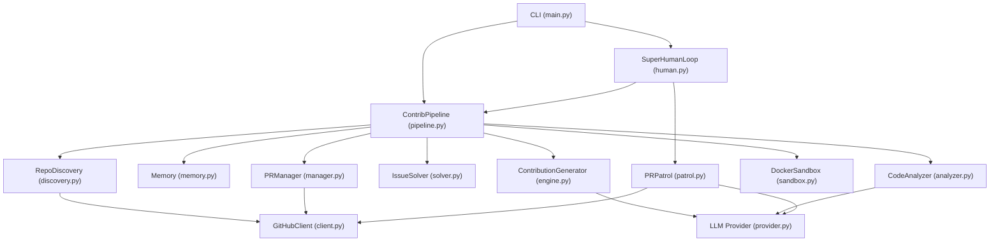

# Farm-Agent Project Blueprint

This document serves as the deep-dive architectural guide for the Farm-Agent project. It reflects the exact structure, data flow, and components active in the codebase today.

## 1. System Overview & Tech Stack

| Technology | Exact Role in Project |
| :--- | :--- |
| **Python (3.11+)** | Core programming language for all agent logic, CLI, and orchestration. |
| **Click** | Framework used for the rich command-line interface (`farm_agent/cli/main.py`). |
| **Docker (7.1+)** | Ephemeral, polyglot sandbox environment for patch validation (`farm_agent/core/sandbox.py`). |
| **aiosqlite / SQLite** | Persistent WAL-mode database for memory, history, quota, and state tracking (`farm_agent/orchestrator/memory.py`). |
| **Minimax LLM** | Default large language model for generation, routing, and finding validation. |
| **ChromaDB** | Ephemeral RAM-only Local Retrieval-Augmented Generation (RAG) engine for cross-file context. |
| **HTTPX** | Asynchronous HTTP client used for robust GitHub API interactions (`farm_agent/github/client.py`). |
| **Pydantic** | Strong typing and configuration validation via `config.yaml` (`farm_agent/core/config.py`). |
| **Hatchling** | Python build backend (`pyproject.toml`). |
| **Pytest** | Test framework, executed locally or within CI. |

## 2. Directory Structure

Below is an ASCII tree covering the core modules of the `farm_agent/` directory:

```text
Farm-Agent/
├── farm_agent/
│   ├── agents/            # Agent registry implementations.
│   │   ├── registry.py
│   ├── analysis/          # Analyzers for code quality, security, and UI/UX.
│   │   ├── analyzer.py
│   ├── cli/               # Entrypoints and user interface.
│   │   ├── main.py        # Core Click CLI definitions (run, target, solve, superhuman).
│   ├── core/              # Core settings, exceptions, schemas, sandboxing, memory.
│   │   ├── config.py      # Pydantic configuration schemas.
│   │   ├── exceptions.py  # Custom exceptions (e.g., GitHubAPIError, RateLimitError).
│   │   ├── models.py      # Core data objects (Contribution, RepoContext, PRResult, etc.).
│   │   ├── sandbox.py     # Docker sandbox manager for validating patches.
│   ├── generator/         # LLM-based engine for synthesizing fixes.
│   │   ├── engine.py      # `ContributionGenerator` generating fixes / addressing errors.
│   ├── github/            # GitHub interactions and API wrapping.
│   │   ├── client.py      # Asynchronous wrapper over GitHub REST API.
│   │   ├── discovery.py   # Logic to discover repos based on dynamic criteria.
│   ├── issues/            # Issue-solving logic.
│   │   ├── solver.py      # IssueSolver to parse, analyze, and map issues to code solutions.
│   ├── llm/               # LLM integration, abstract provider routing.
│   │   ├── provider.py    # `create_llm_provider` routing logic.
│   ├── notifications/     # Event-driven alerts (Telegram, Discord, Slack).
│   │   ├── notifier.py
│   ├── orchestrator/      # The primary engine tying all subsystems together.
│   │   ├── pipeline.py    # `ContribPipeline` handles discovery -> analyze -> generate -> PR.
│   │   ├── human.py       # `SuperHumanLoop` implements the stochastic, 24/7 daemon persona.
│   │   ├── memory.py      # Persistent SQLite logic (`Memory` class).
│   ├── pr/                # Pull Request management and interaction.
│   │   ├── manager.py     # Submits PRs, checks compliance.
│   │   ├── patrol.py      # Monitors open PRs for feedback and auto-resolves comments.
│   │   ├── janitor.py     # Sweeps and destroys garbage PRs based on LLM evaluation.
│   ├── tools/             # Actionable functions made available to agents.
│   │   ├── protocol.py
├── tests/                 # Unit test directory.
├── pyproject.toml         # Build definition & dependency mapping.
├── docker-compose.yml     # Composes the 'worker-daemon' environment.
├── Makefile               # Utilities for installation, formatting, and tests.
└── README.md
```

## 3. Core Module Dependency Graph



## 4. Core Execution Loops / Entry Points

Farm-Agent primarily runs via its Click CLI (`farm_agent/cli/main.py`). The most comprehensive loops are **Hunt Mode** and **Super Human Mode**.

### A. Hunt Mode Flow (`ContribPipeline.hunt`)
1. **Discovery / Filtering:** Uses `RepoDiscovery` to search GitHub based on criteria (stars, language) and limits. It queries `Memory` to ensure it only targets valid, non-duplicated targets.
2. **Analysis / Issue Solving:**
   - **Issues First:** It delegates to `IssueSolver` to solve existing issues. If successful, creates PRs.
   - **Static Analysis Fallback:** If no issues are viable, it passes the repository to `CodeAnalyzer` to find organic bugs or performance hits.
3. **Filtering & Anti-Farming:** Evaluates findings, drops "trivial" or "docs-only" issues, and protects crucial metadata files from generation.
4. **Code Generation:** `ContributionGenerator` uses the configured `LLM Provider` to propose diffs/patches.
5. **Sandbox Validation (Guillotine):** The agent clones the repo, applies the patch, and executes the target's tests within an ephemeral Docker container. Failure invokes self-correction loops.
6. **PR Submission:** If successful, `PRManager` securely submits the change, signs off on CLAs, and the system records the result in `Memory`.

### B. Super Human Daemon Loop (`SuperHumanLoop.run_daily_routine`)
1. **Daily Targets:** On a new day, standardizes a random daily quota of PRs (e.g., 4 to 10 PRs).
2. **Stochastic Actions:** Throws a dice to select whether to run **Hunt** (generate new fixes) or **Patrol** (monitor open PRs).
3. **PR Patrol (`PRPatrol.patrol`):** Reads comments on open PRs, synthesizes a fix using context from `Memory` and `ChromaDB` RAG, and pushes follow-up commits automatically.
4. **Human Emulation:** Between steps, the system inserts randomized "stress breaks", "typing delays", and "lunch breaks" to behave like a natural human contributor.
5. **Quota Limiter:** Once the daily quota is reached, switches entirely into passive `Patrol` mode.

## 5. Database / State Schema

Farm-Agent utilizes `aiosqlite` with WAL mode. The database (`memory.db` by default) defines the following primary tables (`farm_agent/orchestrator/memory.py`):

- **`analyzed_repos`**: Tracks repositories that have already been evaluated to prevent duplicate labor.
- **`submitted_prs`**: Records all created pull requests, their statuses, branch details, auto-fix attempts, and discussion limits. Includes history synced via the Familiar Grounds algorithm.
- **`run_log`**: Records top-level metrics for CLI output (repos analyzed, PRs generated, total runs).
- **`pr_outcomes` / `repo_preferences`**: Maintains feedback loops on merge rates. Repositories with high acceptance probabilities dynamically train the agent's behavior strategy.
- **`api_usage_log`**: Ensures rigid quota bounding (e.g., Minimax provider limits) across execution cycles.
- **`blacklisted_repos`**: Maintains a permanent blocklist of repositories that are explicitly hostile, inactive, or unsuited for the system.