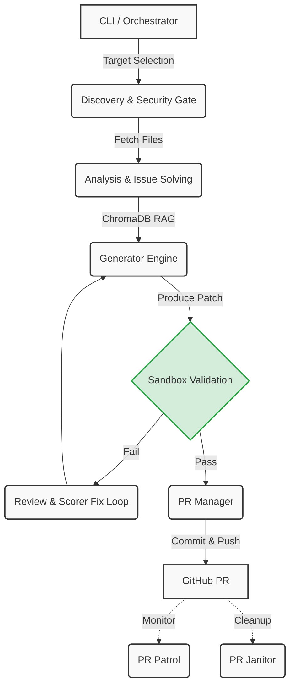

# 🗺️ Farm-Agent Project Map

This document serves as the canonical architectural blueprint for Farm-Agent v3.0+. It is designed to help new contributors understand the system's structure, dependencies, and core execution flows.

---

## 1. System Overview & Tech Stack

| Component | Technology | Description |
|-----------|------------|-------------|
| **Language** | Python 3.11+ | The core agent logic is written in modern Python, leveraging asynchronous I/O (`asyncio`). |
| **Build Backend** | Hatchling | Handles package building as defined in `pyproject.toml`. |
| **CLI Framework** | Click & Rich | Provides a highly interactive and styled terminal interface. |
| **Configuration** | Pydantic & PyYAML | Strongly-typed, validated configuration driven by `config.yaml` or `.env` variables. |
| **LLM Orchestration** | Provider Agnostic | Uses Minimax ABAB models by default. OpenRouter is utilized as a Red Team model fallback. Supports OpenAI, Gemini, Anthropic, and local Ollama instances. |
| **GitHub Interaction** | GitHub REST API & GraphQL | Uses `httpx` for async API communication with secondary token rotation for rate limits. Local git operations via `GitPython`. |
| **Database (Memory)** | SQLite (via `aiosqlite`) | Maintains persistent state (e.g., analyzed repos, submitted PRs, telemetry) using WAL mode for performance. |
| **Vector DB (RAG)** | ChromaDB | Provides an ephemeral, RAM-only Retrieval-Augmented Generation (RAG) engine for context lookups across files. |
| **Code Validation** | Docker Engine API | The "Polyglot Sandbox" uses `docker` (SDK 7.1+) to isolate and validate code executions across multiple languages. |
| **Formatting/Linting** | Ruff | Enforces strict code formatting (100-character line limits) and extensive static analysis rules. |

---

## 2. Directory Structure

Below is the layout of the project, highlighting the role of each major module:

```text
farm_agent/
├── agents/             # Agent registries and system configurations
│   └── registry.py
├── analysis/           # Codebase scanning and intelligence gathering
│   ├── analyzer.py     # Orchestrates multiple analyzers in parallel
│   └── mapper.py       # Generates token-efficient repo skeleton maps
├── cli/                # Command-Line Interface definitions
│   └── main.py         # The primary entry point for all subcommands (run, hunt, patrol, etc.)
├── core/               # Shared utilities, models, and low-level logic
│   ├── config.py       # Configuration loading and Pydantic models
│   ├── exceptions.py   # Custom exceptions
│   ├── leaderboard.py  # Tracks PR success rates
│   ├── logger.py       # Logging initialization
│   ├── middleware.py   # Middleware chain patterns
│   ├── models.py       # Shared Pydantic data models (ImpactLevel, Vulnerability, etc.)
│   ├── notifier.py     # Webhook integrations (Telegram, Slack, Discord)
│   ├── rag.py          # ChromaDB ephemeral Vector Store wrapper
│   └── sandbox.py      # Docker execution environment ("Polyglot Guillotine")
├── generator/          # Patch/Fix creation logic
│   ├── engine.py       # Drives code generation and ensures AI Gag Orders
│   ├── reviewer.py     # Conducts internal code reviews
│   └── scorer.py       # Calculates a QA score and checks for debug code leaks
├── github/             # Interaction with GitHub platform
│   ├── client.py       # API wrapper handling retries and rate limit logic
│   ├── discovery.py    # Search and selection of candidate repositories
│   ├── guidelines.py   # Parses CONTRIBUTING.md and repo conventions
│   └── security_gate.py# Scans for security constraints / private disclosure directives
├── issues/             # Logic targeting GitHub Issues
│   └── solver.py       # Analyzes issues for complexity and viability
├── llm/                # Abstracting Large Language Model interactions
│   ├── agents.py       # Base conversational agents
│   ├── context.py      # Windowing and prompt structuring
│   ├── models.py       # Model capability metadata
│   ├── provider.py     # LLM provider factory
│   └── router.py       # Task routing to optimal models
├── notifications/      # Notification dispatch system
│   └── notifier.py
├── orchestrator/       # The brain of Farm-Agent
│   ├── human.py        # Super Human Mode (24/7 autonomous loop)
│   ├── memory.py       # SQLite database operations and schemas
│   └── pipeline.py     # The core ContribPipeline orchestrating end-to-end contribution
├── plugins/            # Extensibility hooks
├── pr/                 # Pull Request management
│   ├── manager.py      # Handles forks, branches, commits, and PR creations
│   └── patrol.py       # Responds to PR reviews, fixes code iteratively, signs CLAs
├── templates/          # Prompt and logic templates
└── tools/              # Tools exposed to agents
    └── protocol.py
```

---

## 3. Core Module Dependency Graph

The execution flow of a typical Farm-Agent operation is highly linear and pipeline-driven.



### Key Stages

1. **Discovery:** `RepoDiscovery` and `DatabaseTargetDiscovery` select viable GitHub repos based on configuration (stars, languages, activity).
2. **Gate:** The `security_gate` and `pipeline` ensure no sensitive files or rules (like private disclosure limits or forbidden meta-files) are violated. `_check_ai_policy` concurrently looks up AI specific constraints.
3. **Analysis:** The `CodeAnalyzer` and `Bloodhound Red Team` pipeline scan for bugs and vulnerabilities. `IssueSolver` analyzes GitHub issues.
4. **Engine:** The `ContributionGenerator` writes fixes using context from `ChromaDB` (via `rag.py`).
5. **Sandbox:** Crucially, the `DockerSandbox` safely executes code tests in an isolated environment. Patches must pass here or face rejection.
6. **PR:** `PRManager` takes the passing patch, forks the repo, commits, and creates the pull request.

---

## 4. Core Execution Loops

### The Super Human Loop (Terminator Mode)
In `farm_agent/orchestrator/human.py`, the `SuperHumanLoop` runs a relentless 24/7 daemon. It operates in a tight, deterministic loop, drawing from the `target_repo.json` inputs.
- **Hunt-Circular:** Pulls targets via circular rotation ensuring crash-safety and continuous scanning.
- **Patrol:** Alternates with PR Patrols to check existing PRs and reply/fix issues raised by maintainers.
- **Rate Limit & Quota Tracking:** Will enter cooldowns (e.g., `LLM_QUOTA_COOLDOWN`) or shift into purely patrol mode once daily PR creation quotas are reached.

### The Pipeline (`ContribPipeline`)
The `pipeline.py` orchestrates the fundamental steps. Key behaviors include:
- Utilizing `asyncio.gather` for rapid, concurrent repository screening and file fetching.
- Implementing an Anti-Farming Filter that strictly blocks documentation PRs, "low impact" findings, and trivial changes.

---

## 5. Database Schema & State Management

State is managed by an `aiosqlite` backend (`farm_agent/orchestrator/memory.py`). Key tables include:

- **`analyzed_repos`**: Tracks repositories that have been evaluated to avoid redundant API calls. Stores repository metadata and finding counts.
- **`submitted_prs`**: Records PR lifecycle data (PR URL, status, type, repository). This table is the source of truth for the PR Patrol and VIP Alumni syncs.
- **`run_log`**: Session-level metrics (start/end times, PRs created, errors) for analytics and dashboarding.
- **`pr_outcomes`**: Logs maintainer feedback and ultimate resolution of the PR (merged/closed) to calculate success rates.
- **`findings_cache`**: Caches discovered issues (type, severity, file_path) before they are converted into PRs.
- **`knowledge_base`**: Stores general context and QA lessons for the RAG system. Stale entries are periodically purged via Garbage Collection.
- **`blacklisted_repos`**: Repositories marked as hostile or explicitly forbidden by configuration/rules.
