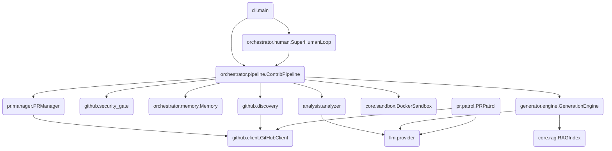

# PROJECT_MAP.md — Farm-Agent Ground Truth

**Generated:** 2026-04-15
**Version:** v3.2.0 (from git tag at commit `0b96a08`)
**Entry Point:** `farm_agent/cli/main.py` → `cli()` (Click-based CLI)
**Language:** Python 3.11+

---

## 1. System Overview & Current State

**What the system actually does:**

Farm-Agent is an autonomous AI agent that discovers open-source GitHub repositories matching criteria (language, star range, activity), scans their code for issues (security vulnerabilities, code quality bugs, performance problems, etc.), generates patches via LLM, validates patches in Docker sandboxes, and creates PRs or GitHub Issues to contribute back.

**Active Tech Stack:**

| Component | Technology | Evidence |
|-----------|------------|----------|
| Language | Python 3.11+ | `requires-python = ">=3.11"` in `pyproject.toml` |
| HTTP client | `httpx` (async) | `httpx>=0.27,<1.0` |
| LLM Providers | MiniMax, OpenRouter (via `google-genai` + `openai` + `anthropic`) | `config.py:55-68` |
| Database | SQLite via `aiosqlite` | `memory.py` — WAL mode, `data/memory.db` default |
| Docker | `docker>=7.1,<8.0` | `pyproject.toml`, `sandbox.py` |
| Scheduling | `apscheduler>=3.10,<4.0` | `pyproject.toml` |
| Config | Pydantic v2 + YAML | `config.py` — all config in `FarmAgentConfig` |
| CLI | `click>=8.1,<9.0` + `rich>=13.0,<14.0` | `main.py` |
| Vector DB | `chromadb>=0.4,<1.0` | `pyproject.toml` |
| Git Python | `gitpython>=3.1,<4.0` | `pyproject.toml` |

## 2. Directory Structure

```text
farm_agent/
├── agents/             # Agents orchestrating specific contribution types
│   └── registry.py     # Agent registration and management
├── analysis/           # Codebase analysis modules
│   ├── analyzer.py     # CodeAnalyzer and BloodhoundAnalyzer implementations
│   └── mapper.py       # Codebase mapping and context extraction
├── cli/                # Command-Line Interface
│   └── main.py         # Entry point for the `farm_agent` command
├── core/               # Core utility modules
│   ├── config.py       # Configuration loading and Pydantic models
│   ├── exceptions.py   # Custom errors
│   ├── logger.py       # Logging utilities
│   ├── models.py       # Shared data models (Findings, Contributions, etc.)
│   ├── rag.py          # Local RAG implementation with ChromaDB
│   └── sandbox.py      # Docker execution sandbox environment
├── generator/          # Patch generation logic
│   ├── engine.py       # LLM generation engine for fixes and features
│   ├── reviewer.py     # Reviews generated code
│   └── scorer.py       # Scores generation confidence
├── github/             # GitHub interactions
│   ├── client.py       # Wrapper around GitHub REST API
│   ├── discovery.py    # Search and discovery of repositories
│   └── security_gate.py# Security Disclosure Gate scanning
├── issues/             # Target issues specific tasks
│   └── solver.py       # IssueSolver for issue complexity estimation and analysis
├── llm/                # LLM abstractions
│   ├── context.py      # Context and prompt formatting
│   ├── models.py       # Definitions for available models and tasks
│   ├── provider.py     # Base provider and specific LLM implementations
│   └── router.py       # Routes tasks to appropriate LLM models
├── notifications/      # Webhook notifications
│   └── notifier.py     # Discord, Slack, and Telegram notifications
├── orchestrator/       # High-level pipeline management
│   ├── human.py        # Super Human Mode (simulated delays, organic scheduling)
│   ├── memory.py       # Persistent state management using SQLite
│   └── pipeline.py     # Main `ContribPipeline` orchestrating the execution loop
├── pr/                 # Pull Request management
│   ├── manager.py      # Creation and formatting of PRs
│   └── patrol.py       # `PRPatrol` monitoring and responding to comments
├── templates/          # Prompt templates
│   └── registry.py     # Registry for system prompts
└── tools/              # Tool integrations
    └── protocol.py     # Tool usage definitions
```

## 3. Core Module Dependency Graph



## 4. Core Execution Loops / Entry Points

### Primary CLI Commands (from `main.py`)

| Command | Description |
|---------|-------------|
| `farm_agent run` | Auto-discover repos → analyze → generate → PR |
| `farm_agent target <url>` | Target a specific repo |
| `farm_agent hunt` | Aggressive multi-round discovery + contribution |
| `farm_agent hunt-circular` | Round-robin from `target_repo.json` |
| `farm_agent patrol` | Check open PRs for review feedback, auto-respond |
| `farm_agent superhuman` | 24/7 organic loop mimicking human developer |
| `farm_agent janitor` | Close garbage PRs (exploratory, low-impact) |
| `farm_agent solve <url>` | Solve open issues in a specific repo |
| `farm_agent analyze <url>` | Analyze only, no PR creation |
| `farm_agent status` | Show PR status filter |
| `farm_agent stats` | Show overall Farm-Agent statistics |
| `farm_agent system-status` | Show memory, PRs, rate limits |

### Pipeline Data Flow (The Standard Execution Flow)

The primary execution loop follows these steps:
**Discovery -> Gate -> Analysis -> Engine -> Sandbox -> PR**

1.  **Discovery:** Searches GitHub based on config criteria (languages, stars, activity) using `github/discovery.py`.
2.  **Gate:** Repositories pass through the `SecurityDisclosureGate` (`github/security_gate.py`) to prevent operations on sensitive or bounty projects. Checks against `Memory` to avoid duplicate work.
3.  **Analysis:** Clones the repo and runs `analysis/analyzer.py` (including `CodeAnalyzer` and `BloodhoundAnalyzer`) to identify targets or `IssueSolver` for existing GitHub issues. Includes anti-farming gates to drop trivial/low-impact findings.
4.  **Engine:** The `GenerationEngine` (`generator/engine.py`) uses LLMs to draft patches. It builds context utilizing local RAG (`core/rag.py`).
5.  **Sandbox:** The drafted patch is deployed into an ephemeral Docker container (`core/sandbox.py`) to execute language-specific tests and verify the code compiles/runs safely.
6.  **PR:** If the sandbox validates the patch, `PRManager` (`pr/manager.py`) commits the code and pushes a Pull Request using `GitHubClient`. `Memory` records the success.

**Super Human Mode:**
A dedicated daemon (`SuperHumanLoop`) continuously runs the pipeline with simulated breaks, organic coding delays, and varied quotas to mimic human working patterns, driven by `apscheduler`.

**PR Patrol:**
`PRPatrol` monitors active PRs that the agent created. It responds to reviews, fixes CI failures, and interacts with maintainers autonomously.

## 5. Database/State Schema

State persistence is managed via an SQLite database (WAL mode) configured in `orchestrator/memory.py`.

**Core Tables:**
- `analyzed_repos`: Stores repositories processed (columns: `full_name`, `language`, `stars`, `analyzed_at`, `findings`, `metadata`).
- `submitted_prs`: Logs successful Pull Requests (columns: `id`, `repo`, `pr_number`, `pr_url`, `title`, `type`, `status`, `branch`, `fork`, `created_at`, `updated_at`, `ci_fix_attempts`, `discussion_replies`).
- `findings_cache`: Caches results of code scans (columns: `id`, `repo`, `type`, `severity`, `file_path`, `title`, `description`, `found_at`).
- `run_log`: High-level execution logs.
- `pr_outcomes`: Tracks granular metadata for merged or closed PRs.
- `api_usage_log`: Logs token usage for budgeting.
- `knowledge_base`: Persists successfully applied fix patterns.
- `task_schedule`: Schedules tasks for `SuperHumanMode`.
- `target_repos` and `blacklisted_repos`: Whitelists and blacklists respectively.
- `repo_preferences` and `repo_style_guides`: Mappings for styling guidelines discovered in individual repos.
