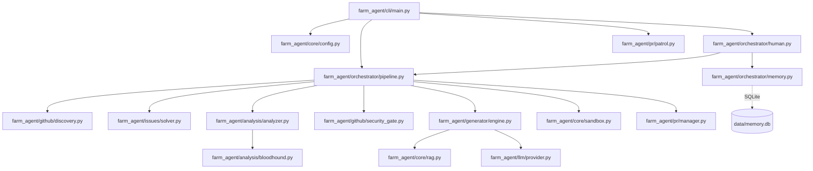

# PROJECT_MAP.md — Farm-Agent Architectural Blueprint

**Version:** v3.0.0
**Entry Point:** `farm_agent/cli/main.py` -> `cli()` (Click-based CLI)
**Language:** Python 3.11+

---

## 1. System Overview & Tech Stack

Farm-Agent is an autonomous system that discovers open-source GitHub repositories, scans code for bugs or security issues, generates patches via an LLM, validates these patches within isolated Docker sandboxes, and submits pull requests. It employs strategies such as Issue-First, Super Human Mode delays, PR Patrol, and Bloodhound Red Team auditing.

**Active Tech Stack:**

| Component | Technology | Role |
|-----------|------------|------|
| Language | Python >= 3.11 | Core logic |
| Build System| Hatchling | Package build backend (`pyproject.toml`) |
| HTTP client | `httpx` (async) | Interacting with GitHub API and LLM providers |
| LLM Providers | MiniMax, Gemini, OpenAI, Anthropic, Ollama, OpenRouter | Patch generation and text evaluation |
| Database | SQLite via `aiosqlite` | Persistent memory and state tracking (`data/memory.db`) |
| Docker | `docker>=7.1,<8.0` | Polyglot Sandbox for validation of generated code |
| Scheduling | `apscheduler>=3.10,<4.0` | Job scheduling |
| Config | Pydantic Settings, PyYAML | Loading configurations from YAML and env variables |
| CLI | `click>=8.1,<9.0`, `rich>=13.0,<14.0` | Command line interface and styling |
| Git | `gitpython>=3.1,<4.0` | Local repository manipulation |
| Vector DB | `chromadb>=0.4,<1.0` | Local RAG indexing for precise context retrieval |

---

## 2. Directory Structure

```text
farm_agent/
├── __init__.py
├── analysis/               # Code analyzers (Bloodhound/Semgrep, etc.)
│   ├── analyzer.py
│   └── bloodhound.py
├── cli/                    # CLI Entry Points
│   └── main.py             # Click CLI commands
├── core/                   # Core Utilities
│   ├── config.py           # Configuration management
│   ├── exceptions.py       # Custom exceptions
│   ├── leaderboard.py      # Stats and ranking
│   ├── logger.py           # Logging setup
│   ├── middleware.py       # Execution middlewares
│   ├── models.py           # Pydantic data models
│   ├── profiles.py         # Custom YAML profiles logic
│   ├── quotas.py           # API Quota tracking
│   ├── rag.py              # ChromaDB Retrieval-Augmented Generation
│   ├── retry.py            # Retry decorators and caches
│   └── sandbox.py          # Docker execution sandbox
├── generator/              # Code Patch Generation
│   ├── engine.py           # LLM patch generation logic
│   ├── reviewer.py         # Patch review logic
│   └── scorer.py           # Evaluation scorer
├── github/                 # GitHub Integrations
│   ├── client.py           # API client (REST/GraphQL)
│   ├── discovery.py        # Repository discovery
│   ├── guidelines.py       # Guidelines parsing
│   └── security_gate.py    # Security Disclosure Gate logic
├── issues/                 # Issue processing
│   └── solver.py           # Issue-First Pipeline solver
├── llm/                    # LLM Provider Management
│   ├── agents.py           # Agent interfaces
│   ├── models.py           # Model definitions
│   ├── provider.py         # Provider clients
│   └── router.py           # Task to model routing
├── notifications/          # Notifications
│   └── notifier.py         # Slack, Discord, Telegram integrations
├── orchestrator/           # Orchestration Logic (DeerFlow Architecture)
│   ├── human.py            # Super Human Mode (delays, routines)
│   ├── memory.py           # SQLite database persistence
│   └── pipeline.py         # Core contribution pipeline execution
├── plugins/                # Plugin system
│   └── base.py
├── pr/                     # Pull Request Management
│   ├── janitor.py          # Janitor logic (disabled feature)
│   ├── manager.py          # PR creation logic
│   └── patrol.py           # PR Patrol (feedback replies, fixes)
└── templates/              # Prompt templates
    └── registry.py
```

---

## 3. Core Module Dependency Graph



---

## 4. Core Execution Loops / Entry Points

The pipeline orchestrates via a sequential flow:
**Discovery -> Gate -> Analysis -> Engine -> Sandbox -> PR**

1. **Discovery:**
   - Command `run` uses `RepoDiscovery.discover()` to find repos on GitHub based on language, stars, and activity constraints.
   - Command `hunt-circular` uses the database (seeded by `target_repo.json`) to pick the next target.
2. **Gate (Filtering & Security):**
   - The system drops unviable repos.
   - Drops repos modifying protected files (e.g., `package.json`, `.github/*`).
   - The **Security Gate** scans meta files (like `SECURITY.md`) for private disclosure policies; if found, it blocks public PR creation and logs findings locally.
3. **Analysis:**
   - Runs static checks via `CodeAnalyzer.analyze()`.
   - `BloodhoundAnalyzer.run_bloodhound()` executes Semgrep pre-scans to find code vulnerabilities.
   - Alternatively, `IssueSolver` identifies and classifies solvable open GitHub issues (Issue-First approach).
4. **Engine (Generation):**
   - Uses an LLM to generate code changes inside `ContributionGenerator.generate()`.
   - Checks are made against the "Anti-Farming Filter" to strip trivial formatting or unapproved wording.
5. **Sandbox (Validation):**
   - `DockerSandbox.run_in_sandbox()` executes the patched code inside an isolated Docker container with zero network access and tight resource limits. If tests fail, it triggers a self-correction loop.
6. **PR (Contribution):**
   - After passing tests, `PRManager.create_pr()` forks, branches, pushes changes, and creates the PR. `memory.py` records the status.

---

## 5. Database/State Schema

State is stored in SQLite (default: `data/memory.db`) managed by `farm_agent/orchestrator/memory.py`. Key tables include:

- **analyzed_repos**: Tracks repositories that have been analyzed (language, stars, findings).
- **submitted_prs**: Records PRs created by Farm-Agent (`repo`, `pr_number`, `pr_url`, `status`, `ci_fix_attempts`, `discussion_replies`).
- **findings_cache**: Caches vulnerabilities and issues discovered.
- **run_log**: Keeps historical records of runs (repos analyzed, PRs created, errors).
- **pr_outcomes**: Tracks final PR states (merged, closed) to build an outcome history.
- **repo_preferences**: Aggregates PR outcomes to learn repo-specific accepted/rejected contribution types.
- **blacklisted_repos**: Repositories flagged for permanent skipping.
- **api_usage_log**: Tracks sliding-window quotas for LLM requests (e.g., `minimax` and `openrouter`).
- **task_schedule**: Manages persistent scheduled tasks (like quota cleanup).
- **knowledge_base**: Stores QA lessons to improve future patch generation and avoid past mistakes.
- **target_repos**: Manages targets for the circular target loop (`hunt-circular`).
- **repo_style_guides**: Caches parsing of CONTRIBUTING and PR template markdown files.