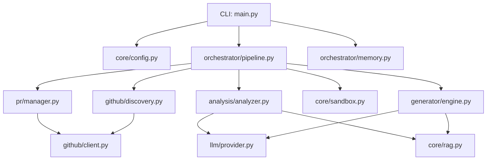

# PROJECT_MAP.md — Farm-Agent Ground Truth

**Entry Point:** `farm_agent/cli/main.py` → `cli()` (Click-based CLI)
**Language:** Python 3.11+

---

## 1. System Overview & Tech Stack

**What the system actually does:**

Farm-Agent is an autonomous AI agent that discovers open-source GitHub repositories matching criteria (language, star range, activity), scans their code for issues (security vulnerabilities, code quality bugs, performance problems, etc.), generates patches via LLM, validates patches in Docker sandboxes, and creates PRs or GitHub Issues to contribute back.

**Active Tech Stack:**

| Component | Technology | Evidence |
|-----------|------------|----------|
| Language | Python 3.11+ | `requires-python = ">=3.11"` in `pyproject.toml` |
| HTTP client | `httpx` (async) | `httpx>=0.27,<1.0` in `pyproject.toml` |
| LLM Providers | MiniMax, OpenRouter (Anthropic/OpenAI/Google), Ollama | `pyproject.toml`, `config.py` |
| Database | SQLite via `aiosqlite` | `memory.py` — WAL mode, `data/memory.db` default |
| Docker | `docker>=7.1,<8.0` | `pyproject.toml`, `sandbox.py` |
| Scheduling | `apscheduler>=3.10,<4.0` | `pyproject.toml` |
| Config | Pydantic v2 + YAML | `config.py` |
| CLI | `click>=8.1,<9.0` + `rich>=13.0,<14.0` | `main.py` |
| Vector DB | `chromadb>=0.4,<1.0` | `pyproject.toml`, `rag.py` |
| Git | `gitpython>=3.1,<4.0` | `pyproject.toml` |

---

## 2. Directory Structure

```text
farm_agent/
├── cli/
│   └── main.py          # Click CLI, all commands (run, hunt, patrol, solve, superhuman, etc.)
├── core/
│   ├── config.py        # Pydantic config system, FarmAgentConfig
│   ├── exceptions.py    # Custom system exceptions (GitHubAPIError, LLMRateLimitError)
│   ├── middleware.py    # Middleware chain (DeerFlow pattern)
│   ├── models.py        # Pydantic data structures
│   ├── memory.py        # Shared classes (imported by orchestrator)
│   ├── logger.py        # Daily rolling file logger setup
│   ├── notifier.py      # Notifications
│   ├── profiles.py      # Contribution profiles
│   ├── quotas.py        # Quota tracking
│   ├── leaderboard.py   # PR stats and rankings
│   ├── rag.py           # ChromaDB RAG engine
│   ├── retry.py         # Retry decorators and caches
│   └── sandbox.py       # DockerSandbox — Polyglot Guillotine
├── generator/
│   ├── engine.py        # Code generation logic
│   ├── reviewer.py      # Automated review of patches
│   └── scorer.py        # QA evaluation of patches
├── github/
│   ├── client.py        # GitHub API REST/GraphQL client
│   ├── discovery.py     # Repository targeting and discovery
│   ├── guidelines.py    # CONTRIBUTING.md / PR template parsing
│   └── security_gate.py # Private disclosure detection logic
├── analysis/
│   ├── analyzer.py      # Static code analysis orchestration
│   └── bloodhound.py    # Bloodhound Red Team (Semgrep scanning)
├── llm/
│   ├── provider.py      # LLM API abstractions
│   ├── models.py        # Model definitions
│   └── router.py        # Task routing definitions
├── issues/
│   └── solver.py        # Issue-first solver, fetching and classifying GitHub issues
├── orchestrator/
│   ├── pipeline.py      # ContribPipeline — Main Orchestrator and logic loops
│   ├── memory.py        # SQLite Database schema definitions and operations
│   └── human.py         # SuperHumanLoop (organic delay simulations)
├── pr/
│   ├── manager.py       # Forking, branching, committing, and PR creation
│   └── patrol.py        # Monitoring open PRs and auto-responding
├── templates/
│   └── registry.py      # Template management
└── tools/
    └── protocol.py      # DeerFlow tool system integrations
```

---

## 3. Core Module Dependency Graph



---

## 4. Core Execution Loops / Entry Points

### Main Execution (`farm_agent run` / `ContribPipeline.run()`)
1. **Discovery:** Queries GitHub or DatabaseTargetDiscovery for a target repository.
2. **Analysis / Issue Fetching:**
   - Either fetches existing open issues (`issues/solver.py`), prioritizing maintainer needs (Issue-First Pipeline).
   - Or uses static code analysis (`analysis/analyzer.py`, `analysis/bloodhound.py`).
3. **Filtering & Gates:**
   - Security Gate checks for private disclosure rules (`security_gate.py`).
   - Anti-Farming Gate filters out low/trivial impact changes and blocks generic doc updates.
4. **Generation:** `generator/engine.py` requests code patches from the LLM based on findings/issues.
5. **Validation:** `core/sandbox.py` tests the patch locally using a Docker container (polyglot validation). Supports self-correction.
6. **PR Creation:** `pr/manager.py` forks the repo, applies the patch, commits, and pushes the Pull Request.
7. **Recording:** `orchestrator/memory.py` logs the outcome and quota usage to SQLite.

### Super Human Loop (`farm_agent superhuman`)
- 24/7 daemon utilizing a stochastic schedule.
- Simulates human coding delays, random PR quotas, and daily breaks.

### PR Patrol (`farm_agent patrol`)
- Continuously polls active Pull Requests.
- Reads maintainer feedback and CI failure logs.
- Attempts to auto-heal by generating and pushing new commits.

---

## 5. Database/State Schema

Located in `farm_agent/orchestrator/memory.py`, persistent state is stored in an SQLite Database utilizing WAL journal mode.

**Core Tables:**
- `analyzed_repos`: Tracks scanned repos and run metadata.
- `submitted_prs`: Logs every generated PR, tracking current status (open, closed, merged), CI fixes, and discussion threads.
- `findings_cache`: Caches analysis results to prevent redundant processing.
- `run_log`: Historical log of pipeline runs.
- `pr_outcomes`: Tracks learning outcomes and merge rates.
- `api_usage_log`: Logs quota tracking for rate limits (e.g., Minimax Overdrive).
- `task_schedule`: Coordinates persistent background tasks (e.g., quota cleanups).
- `target_repos`: Queue table for `hunt-circular` mode.

*Changes to PR status, API limits, and repository style guides (from `.github/CONTRIBUTING.md`) are persisted across executions.*
