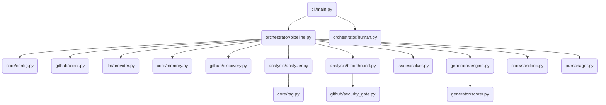

# PROJECT_MAP.md — Farm-Agent Ground Truth

**Generated:** 2026-04-15
**Version:** v3.0.0
**Entry Point:** `farm_agent/cli/main.py` → `cli()` (Click-based CLI)
**Language:** Python 3.11+

---

## 1. System Overview & Current State

**What the system actually does:**

Farm-Agent is an autonomous AI agent that discovers open-source GitHub repositories matching criteria (language, star range, activity), scans their code for issues (security vulnerabilities, code quality bugs, performance problems, etc.), generates patches via LLM, validates patches in Docker sandboxes, and creates PRs or GitHub Issues to contribute back.

**Active Tech Stack:**

| Component | Technology | Evidence |
|-----------|------------|----------|
| Language | Python 3.11+ | `requires-python = ">=3.11"` in `pyproject.toml` |
| HTTP client | `httpx` (async) | `httpx>=0.27,<1.0` |
| LLM Providers | MiniMax, OpenRouter (via `google-genai` + `openai` + `anthropic`) | `config.py:55-68` |
| Database | SQLite via `aiosqlite` | `memory.py` — WAL mode, `data/memory.db` default |
| Docker | `docker>=7.1,<8.0` | `pyproject.toml`, `sandbox.py` |
| Scheduling | `apscheduler>=3.10,<4.0` | `pyproject.toml` |
| Config | Pydantic v2 + YAML | `config.py` — all config in `FarmAgentConfig` |
| CLI | `click>=8.1,<9.0` + `rich>=13.0,<14.0` | `main.py` |
| Vector DB | `chromadb>=0.4,<1.0` | `pyproject.toml` |
| Git Python | `gitpython>=3.1,<4.0` | `pyproject.toml` |

---

## 2. Directory Structure

```text
farm_agent/
├── agents/
│   └── registry.py      # DeerFlow agent system
├── analysis/
│   ├── analyzer.py      # CodeAnalyzer.analyze() — static code analysis
│   ├── bloodhound.py    # BloodhoundAnalyzer — Semgrep pre-scan for vulnerability discovery
│   └── mapper.py        # Abstract mapper for code structures
├── cli/
│   └── main.py          # Click CLI, all commands (run, hunt, patrol, etc.)
├── core/
│   ├── config.py        # Pydantic config system, load_config(), FarmAgentConfig
│   ├── daily_log.py     # Component to manage logging per day
│   ├── exceptions.py    # GitHubAPIError, LLMRateLimitError, ConfigError, RateLimitError
│   ├── leaderboard.py   # PR stats and repo rankings
│   ├── logger.py        # Daily rolling file logger setup
│   ├── middleware.py    # Middleware chain for quota/quality enforcement
│   ├── models.py        # Pydantic models: Repository, Finding, Contribution, etc.
│   ├── memory.py        # SQLite-backed Memory class
│   ├── notifier.py      # TelegramNotifier
│   ├── profiles.py      # Contribution profiles
│   ├── quotas.py        # Quota tracking
│   ├── rag.py           # RAG pipeline for knowledge retrieval
│   ├── retry.py         # Async retry decorators
│   └── sandbox.py       # DockerSandbox — Polyglot execution sandbox
├── generator/
│   ├── engine.py        # ContributionGenerator.generate()
│   ├── reviewer.py      # ContributionReviewer
│   └── scorer.py        # QAHardcoreScorer — QA evaluation
├── github/
│   ├── client.py        # GitHubClient — API interactions
│   ├── discovery.py     # RepoDiscovery + DatabaseTargetDiscovery
│   ├── guidelines.py    # fetch_repo_guidelines()
│   └── security_gate.py # Security Disclosure Gate
├── issues/
│   └── solver.py        # IssueSolver — fetch + classify + solve GitHub issues
├── llm/
│   ├── agents.py        # LLM agent definitions
│   ├── models.py        # ALL_MODELS catalog, TaskType enum
│   ├── provider.py      # create_llm_provider()
│   └── router.py        # TaskRouter — default model assignments
├── notifications/
│   └── notifier.py      # Slack/Discord/Telegram webhooks
├── orchestrator/
│   ├── human.py         # SuperHumanLoop — 24/7 continuous operation loop
│   ├── memory.py        # Points to core/memory.py logic
│   └── pipeline.py      # ContribPipeline — main orchestrator
├── plugins/
│   └── base.py          # Plugin interfaces
├── pr/
│   ├── janitor.py.DISABLED # Disabled PR cleanup code
│   ├── manager.py       # PRManager.create_pr() — handles PR logic
│   └── patrol.py        # PRPatrol — check PRs for feedback
├── templates/
│   └── registry.py      # TemplateRegistry
├── tools/
│   └── protocol.py      # create_default_tools()
└── __init__.py          # Version = "3.0.0"

tests/                   # Pytest test suite
```

---

## 3. Core Module Dependency Graph



---

## 4. Core Execution Pipeline & Data Flow

### Primary CLI Commands (from `main.py`)

| Command | Description |
|---------|-------------|
| `farm_agent run` | Auto-discover repos → analyze → generate → PR |
| `farm_agent target <url>` | Target a specific repo |
| `farm_agent hunt` | Aggressive multi-round discovery + contribution |
| `farm_agent hunt-circular` | Round-robin from `target_repo.json` |
| `farm_agent patrol` | Check open PRs for review feedback, auto-respond |
| `farm_agent superhuman` | 24/7 continuous operation loop (Super Human Mode) |
| `farm_agent janitor` | Close garbage PRs (exploratory, low-impact) |
| `farm_agent solve <url>` | Solve open issues in a specific repo |
| `farm_agent analyze <url>` | Analyze only, no PR creation |

### Pipeline Data Flow (for `run` command)

```text
CLI.run()
  → load_config()
  → ContribPipeline.run()
      → RepoDiscovery.discover()      → list[Repository]
      → asyncio.Semaphore(max_conc=3, capped at 5 for Minimax)
          → _process_repo()
              1. _check_ai_policy()   → skip if AI-banned repo
              2. check_interaction_limits() → skip if contributor-only
              3. fetch_repo_guidelines() → CommitFormat, PR template
              4. run_security_gate()  → abort if private disclosure requested
              5. check_maintainer_vibe() → abort if HOSTILE
              6. CodeAnalyzer.analyze() → list[Finding]
              7. Pre-filter: skip non-code files, protected meta files
              8. Anti-Farming gate: drop LOW/TRIVIAL impact, banned types
              9. Duplicate filter: check local memory + GitHub API
              10. _validate_findings() → LLM re-checks each finding
              11. Limit to 2 findings per repo
              12. For each validated finding:
                  - Route A (SECURITY_FIX or CRITICAL/HIGH): direct PR
                  - Route B (everything else): Issue-First protocol
              13. For Route A:
                  → ContributionGenerator.generate()
                  → DockerSandbox.run_in_sandbox() (max 3 retries, self-correction)
                  → PRManager.create_pr()
                  → record_pr() to SQLite
                  → check_compliance_and_fix()
                  → _check_ci_and_close_if_failed()
```

### Circular Target Loop

```text
run_circular():
  → DatabaseTargetDiscovery.get_next_target() — picks oldest scanned_at
  → BloodhoundAnalyzer.run_bloodhound() — Semgrep pre-scan
  → if no bugs: mark COMPLETED_NO_VULN, return
  → filter production_vulns (skip LOW_PRIORITY_CONTEXT)
  → run_security_gate() → abort if private disclosure
  → DEV-QA Cycle Loop (max 3):
      → ContributionGenerator.generate_from_dossier()
      → QAHardcoreScorer.evaluate() — if approved, break
      → else record QA lessons, inject into failure_context
  → if QA passed: PRManager.create_pr()
  → mark status: PR_SUBMITTED / COMPLETED_TOO_COMPLEX
```

---

## 5. Database Schema & State

**SQLite DB at:** `data/memory.db` (default, configurable via `storage.db_path`)

**WAL Journal Mode** — falls back to DELETE on Docker volume filesystems.

**Schema (from `memory.py`):**

| Table | Primary Columns | Purpose |
|-------|-----------------|---------|
| `analyzed_repos` | `full_name` (PK), `language`, `stars`, `analyzed_at`, `findings`, `metadata` | Track which repos have been scanned |
| `submitted_prs` | `id`, `repo`, `pr_number` (UNIQUE), `pr_url`, `title`, `type`, `status`, `branch`, `fork`, `created_at`, `updated_at`, `ci_fix_attempts`, `discussion_replies` | All PRs submitted by the agent |
| `findings_cache` | `id`, `repo`, `type`, `severity`, `title`, `file_path`, `status`, `created_at` | Cached analysis findings |
| `run_log` | `id`, `started_at`, `finished_at`, `repos_analyzed`, `prs_created`, `findings`, `errors`, `metadata` | Historical pipeline runs |
| `pr_outcomes` | `id`, `repo`, `pr_number` (UNIQUE), `pr_url`, `pr_type`, `outcome`, `feedback`, `time_to_close_hours`, `recorded_at` | Outcome tracking for learning |
| `repo_preferences` | `repo` (PK), `preferred_types`, `rejected_types`, `merge_rate`, `avg_review_hours`, `notes`, `updated_at` | Per-repo learned preferences |
| `blacklisted_repos` | `repo` (PK), `reason`, `pr_number`, `blacklisted_at` | Permanently blocked repos |
| `api_usage_log` | `id`, `timestamp` (Unix epoch), `provider` | LLM API usage for quota tracking |
| `task_schedule` | `task_key` (PK), `next_run`, `updated_at` | Persistent task scheduling |
| `knowledge_base` | `repo_name`, `entry_type`, `content`, `created_at` (UNIQUE) | QA lessons, audit history |
| `target_repos` | `repo_url` (PK), `status`, `scanned_at` (Unix ts), `language`, `bounty_amount`, `diamond_target` | Circular loop targets |
| `repo_style_guides` | `repo` (PK), `style_summary`, `contributing_md`, `pr_template`, `created_at`, `updated_at` | Cached CONTRIBUTING.md parses |

---

## 6. Critical Guardrails, Limits & Business Rules

### 6.1 Thresholds & Limits

| Limit | Value | Source |
|-------|-------|--------|
| `max_repos_per_run` | 5 | `config.py:20` |
| `max_prs_per_day` | 10 | `config.py:21` |
| `min_daily_prs` | 4 | `config.py:22` |
| `max_daily_prs` | 10 | `config.py:23` |
| `rate_limit_buffer` | 3 (stop when GitHub API remaining < 3) | `config.py:24` |
| `max_concurrent_repos` | 3 (capped to 5 for Minimax) | `config.py:180`, `pipeline.py:229-233` |
| `timeout_per_repo_sec` | 300 | `config.py:181` |
| `max_ci_retries` | 3 | `config.py:183` |
| `max_discussion_replies` | 3 | `config.py:184` |
| `max_patch_retries` | 2 | `config.py:185` |
| `max_review_retries` | 2 | `config.py:186` |
| `max_files_per_pr` | 10 | `config.py:136` |
| `run_tests_before_pr` | True | `config.py:137` |
| `max_file_size_kb` | 500 | `config.py:92` |
| `max_snippet_chars` | 15000 (OpenRouter) | `config.py:68` |
| `red_team_daily_limit` | 1000 (OpenRouter calls/day) | `config.py:114` |
| `sandbox_validation_enabled` | **hardcoded True** — can never be bypassed | `config.py:188` |
| `max_prs_per_day` (hard cap in `pipeline.py:351-360`) | Checked before pipeline run | `pipeline.py:354` |
| LLM Quota: 5-hour window | 950 requests (95% of 1000 limit) | `memory.py:943` |
| LLM Quota: 7-day window | 9500 requests (95% of 10000 limit) | `memory.py:953` |

### 6.2 Validation Rules (Active Guards)

**AI Policy Block:**
- Scans `AI_POLICY.md`, `.github/AI_POLICY.md` for ban keywords ("do not accept ai", "no ai-generated", etc.) — [Source: `pipeline.py:2314-2375`]
- If banned, repo is skipped.

**Interaction Limits Block:**
- `github.check_interaction_limits()` — skips repos restricting to prior contributors only. [Source: `pipeline.py:1024-1031`]

**Security Disclosure Gate:**
- Scans `SECURITY.md`, `SECURITY.md`, `.github/SECURITY.md`, `docs/SECURITY.md` for private disclosure phrases (60+ phrases including "email us at", "private disclosure", "hackerone", etc.)
- If found: saves findings to `secret_findings/{repo}.json`, sends Telegram notification, aborts pipeline for that repo. [Source: `security_gate.py:78-307`]

**Maintainer Vibe Check:**
- Fetches recent maintainer comments via GitHub API
- If vibe contains "HOSTILE": repo is blacklisted and skipped. [Source: `pipeline.py:1064-1098`]

**Protected Meta Files — NEVER modify:**
- `CONTRIBUTING.md`, `CODE_OF_CONDUCT.md`, `LICENSE*`, `SECURITY.md`, `.github/CODEOWNERS`, `.all-contributorsrc`
- All `tsconfig*.json`, `.eslintrc*`, `.prettierrc*`, `webpack.config.*`, `vite.config.*`, `babel.config.*`
- `package.json`, `package-lock.json`, `yarn.lock`, `pnpm-lock.yaml`
- `.github/workflows/*.yml`, `.env*` files
- [Source: `pipeline.py:51-119`]

**File Extension Guards:**
- Skip extensions: `.md`, `.txt`, `.rst`, `.yml`, `.yaml`, `.toml`, `.cfg`, `.ini`, `.json` — [Source: `pipeline.py:123-133`]

**Anti-Farming Filter Gates:**
1. **Impact level gate:** `LOW` and `TRIVIAL` findings are ALWAYS dropped — [Source: `pipeline.py:1251-1264`]
2. **Docs ban gate:** `README_FIX` and `DOCS_IMPROVE` types are BANNED — [Source: `pipeline.py:1266-1279`]
3. **File extension guillotine:** `.md`, `.txt`, `.rst` files are BLOCKED regardless of type — [Source: `pipeline.py:1281-1307`]
4. **Keyword blacklist gate:** 50+ farming keywords (docstring, docs, format, spelling, test, typo, etc.) block findings — [Source: `pipeline.py:1309-1340`]

**Duplicate Detection:**
- Title similarity via bigram overlap (80% threshold) — [Source: `pipeline.py:136-186`]
- Checks both local SQLite memory AND GitHub API for existing PRs
- Also tracks targeted file paths from PR bodies

**Sandbox Guillotine (P0-FIX):**
- `sandbox_validation_enabled` is hardcoded `True` in config — can NEVER be disabled
- Docker container security: `network_mode="none"`, `mem_limit="512m"`, `nano_cpus=500_000_000`, `cap_drop=["ALL"]`, `pids_limit=128`
- Hard 60-second `asyncio.wait_for` timeout at THREE levels: OS-level `timeout --signal=KILL`, asyncio-level `wait_for`, poll-level kill loop
- If sandbox unavailable (Docker not running): PR creation is BLOCKED
- Max 3 sandbox validation attempts with self-correction between retries
- [Source: `sandbox.py:198-707`]

**TOCTOU Quota Defense:**
- Inside `human_typing_lock`, re-check `get_today_pr_count()` before PR creation to prevent concurrent overruns — [Source: `pipeline.py:1648-1658`]

### 6.3 Fallback/Error Handling

| Scenario | Behavior |
|----------|----------|
| No config file found | Use all defaults (token from env or `gh auth token`) |
| GitHub token missing | CLI exits with error |
| LLM API key missing | CLI exits with error |
| Daily PR quota exhausted | Pipeline returns early, no PRs created |
| Docker unavailable | Sandbox returns error dict, PR creation BLOCKED |
| LLM quota breach (5h/7d) | `LLMRateLimitError` raised, caught by caller for cooldown |
| GitHub API error | `async_retry` decorator: 3 retries, base 2s, max 60s, ±25% jitter |
| LLM error | `llm_retry`: 3 retries, base 3s, max 60s |
| Rate limit error (429) | `rate_limit_retry`: 5 retries, base 10s, max 120s |
| Sandbox timeout | Exit code 137, stderr = "Sandbox execution timed out after 60s" |