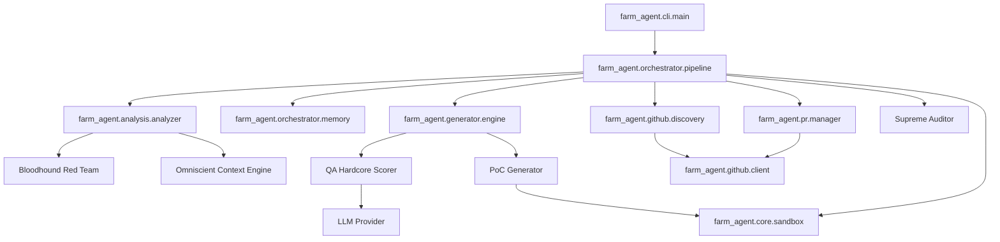

# Agent-Farm Project Architecture Map

This document serves as a deep-dive architectural guide to the `Agent-Farm` system, delineating the codebase layout, module dependencies, core execution loops, and data structures.

## 1. System Overview & Tech Stack

| Component | Technology | Role |
| :--- | :--- | :--- |
| **Core Framework** | Python 3.11+ | The main runtime environment driving pipeline operations. |
| **Orchestration** | asyncio | Drives high-concurrency tasks throughout the pipeline, enabling parallel repo processing and API requests. |
| **LLM Inference** | OpenRouter (DeepSeek, Qwen, Gemini) | Powers code analysis, patch generation, and multi-layered QA/Auditing (using models like `deepseek-v4-pro`, `qwen3.7-max`, and `gemini-3.5-flash`). |
| **Database** | SQLite & `aiosqlite` | Maintains state, stores memory, records findings, and tracks run logs (via `memory.db`). |
| **Vector DB (RAG)** | ChromaDB | Used by the Omniscient Context Engine to store and retrieve indexed repository subsystem documentation. |
| **Sandboxing** | Docker (>= 7.1) | Isolated testbed (`DockerSandbox`) for executing dynamic bug verification (PoC) and blast radius tests. |
| **Code Parsing** | `ast-grep` / Semgrep | Backbone of the Bloodhound Red Team module for static vulnerability detection. |
| **CLI & UI** | Click & Rich | Provides a highly interactive and aesthetically pleasing Command Line Interface. |
| **Validation** | Pydantic & PyYAML | Enforces schema validation and configuration management. |
| **Containerization** | Docker Compose | Used to configure multi-network isolation for secure sandbox executions. |
| **Build System** | Hatchling | Package build backend as specified in `pyproject.toml`. |

## 2. Directory Structure

```text
.
├── farm_agent/                   # Core Python application package
│   ├── agents/                   # DeerFlow agent definitions and registry
│   ├── analysis/                 # Code scanning: Bloodhound, CodeAnalyzer, RepoMapper
│   ├── cli/                      # Command Line Interface (using Click/Rich)
│   │   └── main.py               # Main CLI entry point
│   ├── core/                     # Core configurations, state schema, and sandbox
│   │   ├── config.py             # System configuration definitions
│   │   ├── middleware.py         # DeerFlow middleware chain for pipeline
│   │   ├── models.py             # Dataclasses and Pydantic schemas
│   │   ├── rag.py                # RAG logic (ChromaDB RepoIndexer)
│   │   └── sandbox.py            # DockerSandbox execution implementation
│   ├── generator/                # AI Patch generation logic
│   │   ├── engine.py             # ContributionGenerator implementation
│   │   ├── poc.py                # PoC generation and dynamic validation
│   │   └── scorer.py             # Hardcore QA scoring loop
│   ├── github/                   # GitHub API clients and abstractions
│   │   ├── client.py             # Primary GitHub interaction logic
│   │   ├── discovery.py          # Repository discovery logic
│   │   ├── guidelines.py         # Subsystem docs extraction & guidelines
│   │   └── security_gate.py      # Security disclosure decision gating
│   ├── issues/                   # Issue-First Pipeline implementation
│   │   └── solver.py             # Automated GitHub issue solver
│   ├── llm/                      # LLM Providers (OpenRouter, Gemini, Qwen, Minimax)
│   ├── notifications/            # Multi-channel push notification hooks
│   ├── orchestrator/             # Pipeline control flow
│   │   ├── human.py              # SuperHumanLoop / Terminator Mode
│   │   ├── memory.py             # SQLite persistence layer
│   │   └── pipeline.py           # The heart of Agent-Farm: FarmAgentPipeline
│   ├── plugins/                  # Extensibility interfaces (submodules)
│   ├── pr/                       # Pull Request management
│   │   ├── manager.py            # Creating and refining PRs
│   │   └── patrol.py             # PR Patrol: handles maintainer feedback
│   ├── templates/                # Template registry for contributions
│   └── tools/                    # Tool protocols and implementations
├── scripts/                      # Build, deploy, or maintenance scripts
├── tests/                        # Unit and integration test suite (`pytest`)
├── docker-compose.yml            # Multi-network sandbox configuration
├── Dockerfile                    # Application Docker definition
├── Makefile                      # Make targets for dev, test, and build tasks
├── pyproject.toml                # Project configurations (Hatchling backend)
├── requirements.txt              # Standard Python dependencies
├── start.bat                     # Windows startup script
└── start.sh                      # Linux/macOS startup script
```

## 3. Core Module Dependency Graph



## 4. Core Execution Loops / Entry Points

The fundamental orchestrator of the system resides in `farm_agent.orchestrator.pipeline.FarmAgentPipeline`. It manages different operational loops:

1. **Standard Pipeline Loop (`farm_agent run` / `farm_agent target`):**
   - **Discovery:** Utilizes `RepoDiscovery` to fetch repositories matching exact criteria (stars, language).
   - **Reconnaissance:** Runs `BloodhoundAnalyzer` to identify vulnerabilities quickly via AST/Semgrep before executing costly LLM operations.
   - **Context Processing:** Ingests documentation and maps module dependencies (`RepoMapper` / ChromaDB RAG).
   - **3-Cycle DEV-QA Bounty Loop:** Generates patches. The QA engine scrutinizes the patch; if it fails, lessons are recorded into `Memory` and generation retries (up to 3 times).
   - **Sandbox Validation (Dynamic Bug Verification):** Patches and PoCs are tested in an isolated Docker container (`DockerSandbox`). Pre/post patching blast radius is analyzed to prevent regressions.
   - **Submission:** Upon clearing the Layer 2 Supreme Auditor (Gemini), `PRManager` interacts with the GitHub API to submit the PR.

2. **Terminator Mode / Circular Target Loop (`farm_agent superhuman` / `farm_agent hunt-circular`):**
   - Executes a continuous, zero-delay iterative loop (`SuperHumanLoop`), iterating entirely over targets pre-loaded in `target_repo.json` within SQLite.
   - Constantly switches between identifying new issues and processing `PR Patrol` (handling maintainer feedback).

3. **Issue-First Pipeline (`farm_agent solve`):**
   - Analyzes open GitHub issues on a target repository instead of passively scanning.
   - Operates a deep multi-file change solver (`IssueSolver`) to coordinate robust structural patches before initiating the generation/validation loops.

## 5. Database/State Schema

The SQLite persistence layer (`memory.db`) tracks the complete operational state.
- **`run_log`**: Records top-level executions (run ID, duration, total PRs).
- **`analyzed_repos`**: Keeps track of repos scanned to prevent duplicate work (utilizing cooldowns).
- **`submitted_prs`**: Crucial schema managing submitted PRs, tracking the repository, PR number, title, status (`open`, `merged`, `closed`), and type. This drives the *Alumni Sync / VIP Roster*.
- **`findings_cache`**: Caches detailed analysis insights temporarily.
- **`repo_preferences`**: Maintains guidelines, styling heuristics, and AI policy evaluations.
- **`blacklisted_repos`**: Tracks repositories that exhibit hostile/toxic maintainer vibes or explicit AI-ban policies, avoiding future wasted cycles.
- **`knowledge_base`**: Stores systemic lessons (QA critiques, Layer 1 & 2 audit rejections) dynamically improving subsequent DEV iterations.
- **`target_repos`**: Used heavily by the `hunt-circular` command to cycle targets sequentially.