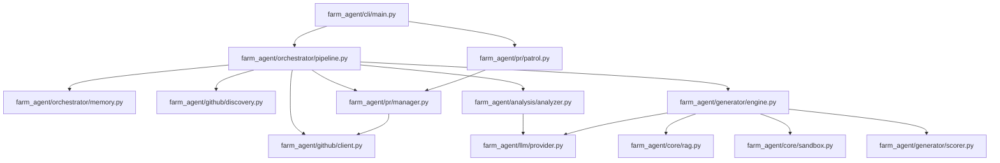

# Project Map & Architecture Blueprint

This document provides a deep architectural overview of the Farm-Agent project, reflecting the current state of the codebase.

## 1. System Overview & Tech Stack

Farm-Agent is built on a modern Python async architecture, leveraging AI and Docker to build an autonomous open-source contribution engine.

| Technology | Component | Role |
| :--- | :--- | :--- |
| **Python 3.11+** | Core Language | The primary runtime environment, using modern `asyncio` for high concurrency. |
| **Docker** | Execution Environment | `docker` SDK provides the **Polyglot Sandbox** for isolated, language-agnostic code compilation and testing. |
| **ChromaDB** | Vector Database | Ephemeral RAG system used by the LLM for deep codebase context and file-aware patches. |
| **SQLite (aiosqlite)** | Relational Database | Persistent memory for caching repository states, tracking PRs, quotas, and schedules. |
| **Minimax / OpenRouter**| AI / LLM Engine | Provides the intelligence for analyzing code (Bloodhound/White-Hat), generating fixes, and responding to comments. |
| **Click & Rich** | CLI & UI | Powers the robust `farm_agent` terminal command interface and visually appealing console output. |
| **Pydantic** | Configuration / Models | Strict data validation for configurations and API payloads. |
| **Httpx / GitHub REST** | External Integration | Communicates with the GitHub API, executing PRs, and navigating token pools to manage rate limits. |

## 2. Directory Structure

Below is the structured ASCII representation of the project's source code, highlighting the roles of major modules.

```text
farm_agent
├── __init__.py                # Package initialization, version definition
├── agents/                    # DeerFlow agent definitions
│   ├── __init__.py
│   └── registry.py            # Agent system registry
├── analysis/                  # Static Code Analysis & Bloodhound Red Team
│   ├── __init__.py
│   ├── analyzer.py            # CodeAnalyzer static analysis orchestration
│   └── mapper.py              # AST mapping and code parsing logic
├── cli/                       # Terminal interface entry points
│   ├── __init__.py
│   └── main.py                # Core CLI command definitions (run, target, hunt, superhuman, etc.)
├── core/                      # Shared core utilities and business logic
│   ├── __init__.py
│   ├── config.py              # Pydantic-based configuration (FarmAgentConfig)
│   ├── daily_log.py           # Logging logic specific to daily PR limits
│   ├── exceptions.py          # Custom exceptions (GitHubAPIError, GenerationError, etc.)
│   ├── leaderboard.py         # Metrics for repository contributions
│   ├── logger.py              # Application logging setup
│   ├── middleware.py          # Pre/post PR execution middleware
│   ├── models.py              # Pydantic data models used across the app
│   ├── notifier.py            # Notifications to external chat services (Slack, Telegram)
│   ├── profiles.py            # Agent behavioral configuration profiles
│   ├── quotas.py              # PR rate limit tracking logic
│   ├── rag.py                 # ChromaDB Retrieval-Augmented Generation implementation
│   ├── retry.py               # Robust retry and backoff logic
│   └── sandbox.py             # Docker container lifecycle and testing logic (Polyglot Sandbox)
├── generator/                 # AI Code Patch Generation & Quality Control
│   ├── __init__.py
│   ├── engine.py              # The primary code modification logic orchestrator
│   ├── reviewer.py            # Internal patch review system
│   └── scorer.py              # QualityScorer enforcing "Anti-Farming" constraints
├── github/                    # GitHub API Integration
│   ├── __init__.py
│   ├── client.py              # HTTPX wrapper for the GitHub REST & GraphQL APIs
│   ├── discovery.py           # Automated discovery of eligible repositories
│   ├── guidelines.py          # Extraction of CONTRIBUTING.md for context
│   └── security_gate.py       # Blocks PRs targeting confidential disclosure logic
├── issues/                    # GitHub Issue Solving Logic
│   ├── __init__.py
│   └── solver.py              # IssueSolver to read, estimate, and solve specific GitHub issues
├── llm/                       # LLM Provider Abstractions
│   ├── __init__.py
│   ├── agents.py              # Specialized sub-agents definitions
│   ├── context.py             # Context window logic for LLM prompts
│   ├── models.py              # Available model schemas and pricing
│   ├── provider.py            # Wrapper interfaces for Minimax, OpenRouter, etc.
│   └── router.py              # Task routing across various models
├── notifications/             # External integration alerts
│   ├── __init__.py
│   └── notifier.py            # Cross-platform message routing
├── orchestrator/              # Master Pipeline Execution Flows
│   ├── __init__.py
│   ├── human.py               # The SuperHuman loop logic
│   ├── memory.py              # SQLite persistent database interactions
│   └── pipeline.py            # ContribPipeline - The primary execution state machine
├── plugins/                   # Extensibility system
│   └── __init__.py
├── pr/                        # Pull Request Lifecycle Management
│   ├── __init__.py
│   ├── janitor.py.DISABLED    # Disabled garbage collection command
│   ├── manager.py             # PR lifecycle (fork, branch, commit, submit)
│   └── patrol.py              # Monitors open PRs for comments and replies
├── templates/                 # Pre-defined LLM prompt structures
│   ├── __init__.py
│   ├── builtin/
│   └── registry.py            # Prompt registry loader
└── tools/                     # Utility tooling for agents
    ├── __init__.py
    └── protocol.py            # Tool protocol definitions
```

## 3. Core Module Dependency Graph



## 4. Core Execution Loops / Entry Points

The pipeline executes through a relentless, autonomous loop designed for maximum throughput. It ignores previous "human-delay" concepts, operating directly against API rate limits.

1. **Discovery Phase:** The `discovery.py` module queries the GitHub API (rotating through `GITHUB_SECONDARY_TOKENS`) to find candidate repositories matching configuration criteria.
2. **Gate / Vetting Phase:** `pipeline.py` filters repositories against the Anti-Farming Filter (dropping trivial/docs fixes) and passes through the Security Disclosure Gate (avoiding `SECURITY.md` protocols).
3. **Analysis Phase:** `analyzer.py` triggers the Bloodhound Red Team pipeline (leveraging Semgrep and ast-grep), sending relevant snippets to the OpenRouter/Minimax LLM for "White-Hat" contextual vulnerability and quality assessments.
4. **Engineering Phase:** `engine.py` constructs a RAG-backed vector index of the repo for context. It utilizes the LLM to write exact source code modifications in response to discovered analysis findings.
5. **Sandbox Validation Phase:** The generated code is injected into the Polyglot Sandbox (`sandbox.py`). The ephemeral Docker container runs unit tests, linters, and compilation checks. If this fails, the loop triggers DEV-QA self-correction.
6. **PR Lifecycle Phase:** If the sandbox validates the patch, `manager.py` manages a Git fork, creates a fresh branch, applies patches, commits changes, and opens a Pull Request on GitHub. The loop then repeats for the next target.

## 5. Database/State Schema

The application uses an SQLite database (`data/memory.db`) managed via `aiosqlite` in `farm_agent/orchestrator/memory.py` to persist system state. The core schema includes:

- `analyzed_repos`: Tracks repositories that have already been evaluated, preventing duplicate work.
- `submitted_prs`: Logs successful PRs created by the agent, tying them back to specific findings.
- `findings_cache`: Caches results from the Bloodhound analyzer to survive application restarts.
- `run_log`: High-level operational logging for pipeline runs.
- `pr_outcomes`: Tracks the ultimate success (merged, closed, etc.) of submitted PRs for analytics.
- `repo_preferences`: Stores specific override settings or flags for targeted repositories.
- `blacklisted_repos`: Tracks repositories the agent is forbidden from touching (e.g. hostiles).
- `api_usage_log`: Granular tracking of LLM and GitHub API consumption.
- `task_schedule`: Schedules multi-process execution actions for the agent loop.
- `knowledge_base`: Cached metadata for general learning capabilities.
- `target_repos`: Manual/direct targets stored for circular targeting or priority hunting.
- `repo_style_guides`: Extracted documentation from `CONTRIBUTING.md` used for formatting enforcement.
