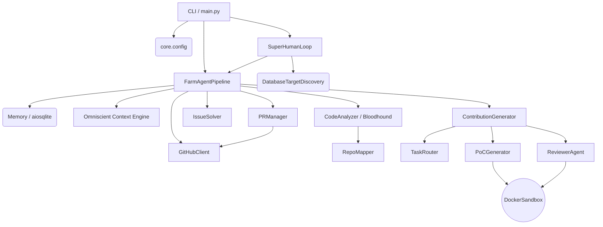

# Agent-Farm Architecture Blueprint

This document provides a deep-dive architectural guide to the Agent-Farm system, mapping the actual implementation logic, core modules, and state schema.

---

## 1. System Overview & Tech Stack

Agent-Farm leverages a robust, asynchronous Python stack with a focus on type safety, containerized validation, and AI orchestration.

| Technology | Role & Purpose |
| :--- | :--- |
| **Python (>=3.11)** | Core application language, utilizing `asyncio` for concurrent operations. |
| **Hatchling** | Build backend and project package manager (`pyproject.toml`). |
| **Pydantic (v2)** | Strict schema validation, configuration management, and robust data modeling. |
| **Docker (>=7.1)** | Provides isolated sandbox environments (`DockerSandbox`) for dynamic bug verification and PoC validation. |
| **aiosqlite** | Asynchronous database driver for high-performance, WAL-mode SQLite state persistence. |
| **OpenRouter / DeepSeek** | Primary multi-model routing provider for high-tier intelligence tasks (e.g., DeepSeek models). |
| **Qwen / Gemini** | Target models for Layer 1 Appraisal and Layer 2 Supreme Audit phases. |
| **ChromaDB** | Vector database for the RAG-powered Omniscient Context Engine to store semantic chunks. |
| **Click & Rich** | Powers the comprehensive CLI commands and provides stylized terminal outputs/tables. |
| **Ruff** | Strict linting and formatting enforcer. |
| **ast-grep / Semgrep** | Security rules engines driving the Red Team Bloodhound vulnerability scans. |

---

## 2. Directory Structure

The project structure is organized modularly to isolate specific concerns from orchestration to individual LLM tasks.

```
.
├── Dockerfile                  # Stage 1 builder (wheel creation) + Stage 2 lean runtime
├── docker-compose.yml          # service definition with dual networks (internet_access, sandbox_isolated)
├── pyproject.toml              # Project dependencies, Hatchling config, Ruff formatting rules
├── start.sh / start.bat        # 1-Click wrapper scripts to handle .env and launch Docker Desktop
└── farm_agent                  # Package Root
    ├── __init__.py
    ├── cli                     # Click CLI — command registrations (run, target, superhuman, models, etc.)
    │   └── main.py
    ├── core                    # System primitives, configurations, databases, sandboxes
    │   ├── config.py           # Pydantic settings loading and validation
    │   ├── logger.py           # Application logging and daily markdown logs
    │   ├── middleware.py       # Context middleware chains
    │   ├── models.py           # Domain data models (Contribution, PRResult, etc.)
    │   ├── notifier.py         # Webhook implementations (Telegram, Slack, Discord)
    │   ├── quotas.py           # Quota controllers for LLM rate limiting
    │   ├── rag.py              # ChromaDB vector DB context loaders (Semantic H1/H2 chunking)
    │   └── sandbox.py          # DockerSandbox engine for Polyglot execution
    ├── analysis                # Target code ingestion and processing
    │   ├── analyzer.py         # CodeAnalyzer and BloodhoundAnalyzer (ast-grep, Semgrep)
    │   └── mapper.py           # RepoMapper for AST/regex dependency graphing
    ├── generator               # LLM interaction layers for producing results
    │   ├── engine.py           # ContributionGenerator (Patch and file correction)
    │   ├── poc.py              # PoCGenerator (Validation & evaluation of exploits)
    │   ├── reviewer.py         # ReviewerAgent (Self-reflective Blast Radius checks)
    │   └── scorer.py           # QAHardcoreScorer (Qwen-based QA grading)
    ├── github                  # GitHub interaction and discovery logic
    │   ├── client.py           # Async-retrying GitHub REST and GraphQL Client
    │   ├── discovery.py        # DatabaseTargetDiscovery for the circular target loop
    │   ├── guidelines.py       # PR templates, subsystem doc discovery
    │   └── security_gate.py    # Private security disclosure target evaluation
    ├── issues                  # Solvers for explicit open issues
    │   └── solver.py           # IssueSolver logic
    ├── llm                     # Abstract API routing for multiple providers
    │   ├── agents.py           # Prompt and model instruction builders
    │   ├── models.py           # Model registry and capability mappings
    │   ├── provider.py         # OpenRouter integration and API handlers
    │   └── router.py           # TaskRouter mapping models by task type
    ├── orchestrator            # Macro pipelines governing the agent workflows
    │   ├── human.py            # SuperHumanLoop (Terminator Mode) execution scheduler
    │   ├── memory.py           # Persistent SQLite database state manager
    │   └── pipeline.py         # Standard FarmAgentPipeline handling end-to-end workflows
    ├── pr                      # Post-contribution patrol and management
    │   ├── manager.py          # Forking, branching, committing logic
    │   └── patrol.py           # PR Patrol (Reviews comments, fixes CI errors automatically)
    ├── templates               # Built-in configuration templates
    └── tools                   # Internal agent execution protocols
        └── protocol.py
```

---

## 3. Core Module Dependency Graph



---

## 4. Core Execution Loops / Entry Points

Agent-Farm revolves around distinct operational pipelines:

### 4.1. Terminator Mode (`SuperHumanLoop`)
Activated via `farm_agent superhuman`. This is the relentless, continuous execution system:
1. **Target Selection**: Pulls targets from `target_repos` using `DatabaseTargetDiscovery`.
2. **Analysis Pipeline**: Passes target repository to `FarmAgentPipeline`.
3. **Execution**: No artificial delays; executes as fast as rate limits and quotas permit.
4. **Rescheduling**: Completed or failed targets are rotated to the back of the circular target loop.

### 4.2. Standard Contribution Pipeline (`FarmAgentPipeline`)
The core orchestrator (`orchestrator/pipeline.py`) executes for single repositories:
1. **Bootstrap**: Identifies repositories and verifies API token permissions.
2. **Deep Recon**: Uses `RepoMapper` to AST-parse dependencies and `rag.py` to ingest markdown into ChromaDB.
3. **Red Team Bloodhound Analysis**: Runs AST-grep/Semgrep scans.
4. **Appraisal & Generation**: The LLM routes generation tasks to `ContributionGenerator` or `IssueSolver`.
5. **Self-Reflection & PoC**: Validates the payload using `ReviewerAgent` and executes isolated unit tests in `DockerSandbox`.
6. **Delivery**: Forwards the patch to `PRManager` to fork, commit, branch, and submit the Pull Request.

### 4.3. PR Patrol (`pr/patrol.py`)
Post-submission CI management:
1. Re-evaluates submitted PRs.
2. Parses GitHub Action raw logs for CI failures.
3. Maps isolated compiler tracebacks back to source files using LLMs.
4. Auto-commits directly to the PR branch to resolve failing CI pipelines.

---

## 5. Database & State Schema

Persistence is managed by `aiosqlite` connected to `data/memory.db`, operating in **WAL (Write-Ahead Logging)** mode. The schema maps tightly to operational features:

*   **`analyzed_repos`**: Tracks repositories that have already been audited.
*   **`submitted_prs`**: Maintains state of PRs, URLs, statuses, and types. Includes CI fix attempt counts.
*   **`findings_cache`**: Temporary ledger for identified bugs or optimization prospects before PR creation.
*   **`run_log`**: Records metrics of agent sessions (durations, successful PR counts, errors).
*   **`pr_outcomes`**: Captures PR lifecycles (merged/closed states), calculating maintainer review times.
*   **`repo_preferences`**: Analyzes `pr_outcomes` to dynamically reject certain contribution types if repeatedly blocked by maintainers.
*   **`blacklisted_repos`**: Explicit blocklist to bypass hostile environments or heavily misconfigured repositories.
*   **`api_usage_log`**: Granular tracking for OpenRouter API limits and quota policies.
*   **`target_repos`**: Primary deterministic queue driving the `DatabaseTargetDiscovery` circular loop.
*   **`repo_style_guides`**: Cached formatting guides derived from `CONTRIBUTING.md` discovery files.
