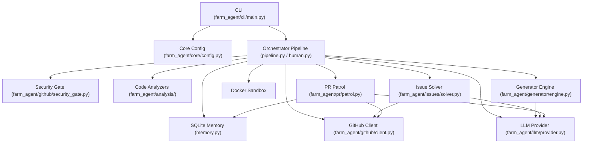

# Farm-Agent Project Blueprint

This document serves as the canonical architectural guide for the Farm-Agent codebase. It outlines the technologies used, the directory structure, how the various modules connect with each other, execution loops, and the database schema.

## 1. System Overview & Tech Stack

| Component | Technology | Role |
| :--- | :--- | :--- |
| **Language** | Python >= 3.11 | Core application logic and orchestration. |
| **Build Backend** | Hatchling | Used in `pyproject.toml` to package the app. |
| **CLI Framework** | Click & Rich | Handles the rich terminal UI and CLI arguments (`farm_agent/cli/main.py`). |
| **Data Validation** | Pydantic (v2) | Configuration parsing and environment loading (`farm_agent/core/config.py`). |
| **LLM Inference** | Minimax, OpenAI, Anthropic, Gemini, Ollama, OpenRouter | Generates fixes, writes code, reviews PRs. |
| **Database** | SQLite + `aiosqlite` | Persistent memory to track repo states, metrics, and learned lessons (`farm_agent/orchestrator/memory.py`). |
| **Version Control** | GitPython | Used for cloning repos and managing local branches. |
| **Sandbox Execution** | Docker | Polyglot execution environment for running tests before PR creation. |
| **RAG/Vector DB** | ChromaDB | Used for local RAG indexing (`farm_agent/core/rag.py`). |
| **Networking** | HTTPX | Used for communication with GitHub API and LLMs. |

## 2. Directory Structure

```text
Farm-Agent/
├── farm_agent/               # Main Application Source Code
│   ├── agents/               # Individual sub-agents
│   ├── analysis/             # Static Analysis tools (Bloodhound, Sentinel Radar)
│   ├── cli/                  # Command Line Interface (main.py)
│   ├── core/                 # Shared core modules (config, logger, profiles, rag)
│   ├── generator/            # Code generation engine (LLM Prompting)
│   ├── github/               # GitHub API client and Security Gates
│   ├── issues/               # Issue-first solver module
│   ├── llm/                  # Providers and Task Router
│   ├── notifications/        # Telegram/Slack/Discord integrations
│   ├── orchestrator/         # Main pipelines (Pipeline, Memory, Super Human Loop)
│   ├── plugins/              # Extensible plugins
│   ├── pr/                   # PR generation, patrol, and janitor functions
│   ├── templates/            # Contribution templates
│   └── tools/                # Sub-tools
├── tests/                    # Unit and integration tests
├── scripts/                  # Helper scripts
├── Dockerfile                # Docker image for the execution sandbox
├── docker-compose.yml        # Orchestration definition for the engine
├── pyproject.toml            # Python package definition (Hatchling)
├── requirements.txt          # Development dependencies
├── config.example.yaml       # Configuration template
└── .env.example              # Environment variables template
```

## 3. Core Module Dependency Graph



## 4. Core Execution Loops

The system follows a primary pipeline executed via standard CLI commands (e.g. `run`, `hunt`, `target`) or via the `superhuman` loop:

1. **Discovery / Target Generation:** Identifies GitHub repositories based on configured parameters or reads from a list (e.g. `target_repo.json` in the Circular Target Loop).
2. **Gate Checking:** Scans for meta files to avoid targeting private/disclosure repositories and ignores projects lacking explicit OSS context.
3. **Deep Analysis:** The repository is analyzed using tools like `ast-grep` and `semgrep`. Code structures are parsed.
4. **Issue Solving / Code Generation:** The issue solver determines solvable tasks and ranks their complexity, or the generator produces novel improvements (e.g. tests or security fixes).
5. **Sandbox Validation:** (Optional) Code is validated inside an isolated Docker environment to verify there are no test regressions.
6. **PR Creation & Patrol:** A Pull Request is created. The `PRPatrol` component then monitors the PR, responds to comments, re-signs CLAs, and fixes code styling if requested by maintainers.

## 5. Database Schema (Persistent State)

The SQLite database (`memory.db`) is initialized and managed by `farm_agent/orchestrator/memory.py`.
Key tables include:

- `analyzed_repos`: Tracks which repositories have already been parsed.
- `submitted_prs`: Logs Pull Requests the agent has opened, including stats for `ci_fix_attempts` and `discussion_replies`.
- `findings_cache`: Caches results from deep static analysis.
- `run_log`: Historical data of each orchestrator execution run.
- `pr_outcomes`: Tracks whether PRs were merged, closed, or rejected to train future logic.
- `repo_preferences`: A learned view of what types of PRs a specific repository merges vs rejects.
- `blacklisted_repos`: Repos to never target again.
- `api_usage_log`: Logs LLM requests to throttle and respect rate limits.
- `knowledge_base`: Caches architectural QA lessons and coding lessons so the agent doesn't repeat mistakes.
- `target_repos`: Queue table used heavily by the Circular Target Loop.
- `repo_style_guides`: Stores learned coding conventions from repositories.
