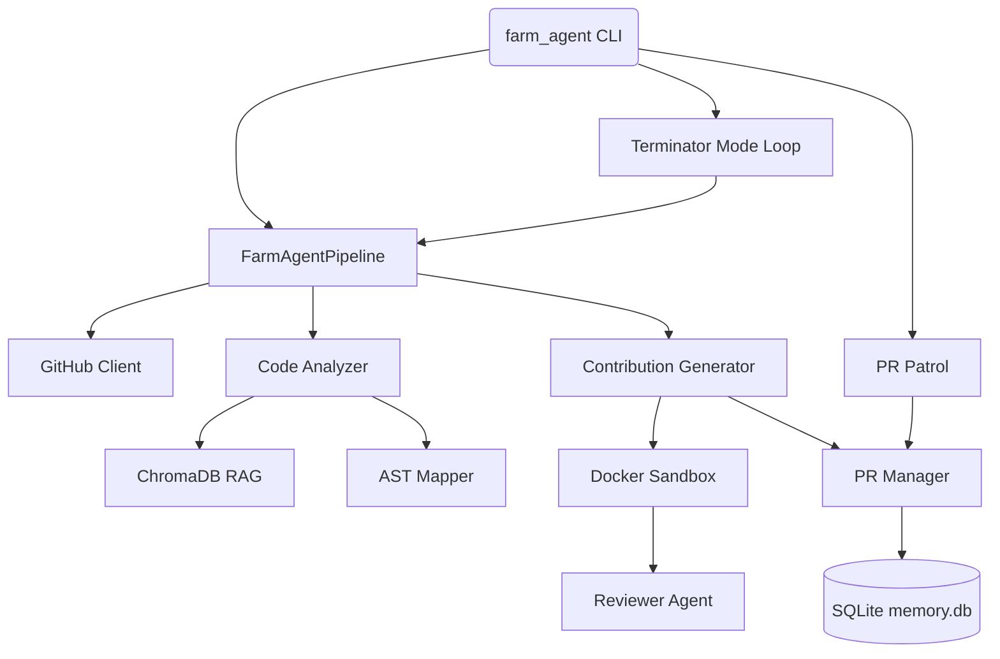

# 🗺️ Agent-Farm Project Architecture Map

This document serves as the deep-dive architectural blueprint for the Agent-Farm codebase. It reflects the true state of the internal system.

---

## 1. System Overview & Tech Stack

| Component | Technology | Description |
|-----------|------------|-------------|
| **Core Language** | Python 3.11+ | Main programming language, utilizing `asyncio` for high concurrency. |
| **Packaging & Build** | Hatchling | Modern PEP 517 build backend configured in `pyproject.toml`. |
| **CLI Framework** | Click & Rich | Click routes CLI commands; Rich provides aesthetic terminal outputs. |
| **State Persistence** | SQLite (`aiosqlite`) | `memory.db` stores repositories, PR states, findings, and leaderboards using WAL mode. |
| **Vector Database** | ChromaDB | Local vector store for the Omniscient Context Engine (RAG-based codebase mapping). |
| **Execution Sandboxing** | Docker | Dynamically creates secure sandboxes to validate PoCs and regressions. |
| **Git Interactions** | GitPython & GitHub REST/GraphQL APIs | Manages branches, commits, PR creation, and repository discovery. |

---

## 2. Directory Structure

```ascii
.
├── Dockerfile                  # Multi-stage Docker build file
├── docker-compose.yml          # Defines agent-farm service and isolated networks
├── start.sh                    # Unix initialization script
├── start.bat                   # Windows initialization script
├── pyproject.toml              # Build dependencies and project metadata
├── requirements.txt            # Minimal pip requirements (e.g., test/dev dependencies)
├── farm_agent/                 # Main Python package
│   ├── cli/
│   │   └── main.py             # Entry point for CLI commands
│   ├── core/
│   │   ├── config.py           # Configuration loading via pydantic
│   │   ├── leaderboard.py      # Computes success rates and repository stats
│   │   ├── rag.py              # ChromaDB vector index mapping logic
│   │   ├── sandbox.py          # DockerSandbox class for dynamic isolated PoC execution
│   │   └── ...                 # Other core utilities (logging, models, retries)
│   ├── analysis/
│   │   ├── analyzer.py         # CodeAnalyzer (Bloodhound Red Team ast-grep + Semgrep logic)
│   │   └── mapper.py           # Module dependency graphing using AST parsing
│   ├── generator/
│   │   ├── engine.py           # ContributionGenerator for patch and PR descriptions
│   │   ├── poc.py              # PoC validation orchestration
│   │   ├── reviewer.py         # Blast radius and regression self-auditing
│   │   └── scorer.py           # Layer 1 Expert Appraisal logic (Qwen)
│   ├── github/
│   │   └── client.py           # Asynchronous GitHub API wrappers
│   ├── issues/
│   │   └── solver.py           # Issue-First Pipeline to resolve open GitHub issues
│   ├── llm/
│   │   ├── provider.py         # OpenRouter integration and API calls
│   │   └── router.py           # Task routing between general, expert, and audit models
│   ├── orchestrator/
│   │   ├── memory.py           # SQLite database interface for historical state
│   │   ├── pipeline.py         # FarmAgentPipeline coordinating the main execution logic
│   │   └── human.py            # Terminator Mode relentless scheduler
│   └── pr/
│       ├── manager.py          # Pull Request lifecycle tracking and branch management
│       └── patrol.py           # PR Patrol to handle maintainer comments and CI errors
├── tests/                      # Pytest suite
└── scripts/                    # Development/maintenance scripts
```
*(Note: Files with a `.DISABLED` extension have been excluded as they are inactive in this deployment.)*

---

## 3. Core Module Dependency Graph



---

## 4. Core Execution Loops & Entry Points

### A. Standard Pipeline Flow (`farm_agent run`)
1. **Initialization:** The CLI invokes `FarmAgentPipeline`. Context, memory, and GitHub connections are established.
2. **Targeting:** A repository is selected from the internal target queue or provided explicitly via arguments.
3. **Analysis:** The `CodeAnalyzer` scans the repository to identify potential flaws using Bloodhound Red Team heuristics and the Omniscient Context Engine.
4. **Appraisal:** The Anti-Farming Filter evaluates the finding for viability, rejecting low-value noise.
5. **Generation & Verification:** `ContributionGenerator` crafts a Proof of Concept (PoC) and a patch. The patch is then validated within the `DockerSandbox`.
6. **Submission:** Upon successful regression-free validation, the `PRManager` commits the code, creates the Pull Request, and logs the attempt in `memory.db`.

### B. Terminator Mode (`farm_agent superhuman`)
A continuous, relentless loop designed for background daemon execution. It repeatedly:
- Patrols existing PRs (`PR Patrol`) to interact with maintainers or fix broken CI runs.
- Pops target repositories out of `target_repos` and executes the Standard Pipeline.

---

## 5. Database/State Schema

The persistence layer relies on a local SQLite database (`memory.db`), managing multiple critical tables for operational intelligence:

* **analyzed_repos**: Maps repositories that have undergone analysis (prevents redundant crawls).
* **submitted_prs**: Logs PR metadata, statuses (open, merged, closed), and limits tracking.
* **findings**: (or `findings_cache`) Holds queued or logged codebase flaws before generation.
* **run_log**: Tracks execution metrics (duration, PRs created, errors encountered).
* **pr_outcomes**: Stores finalized states of PRs alongside specific maintainer feedback.
* **repo_preferences**: Retains learned project parameters (accepted vs. rejected contribution types).
* **blacklisted_repos**: Tracks repositories permanently excluded due to hostility or strict rules.
* **api_usage_log**: Monitors API call volume across different LLM providers for quota enforcement.
* **tasks**: Internal queue tracking state for the superhuman loops.
* **knowledge_base**: Stores learned experiences, architectural contexts, and persistent rules.
* **targets** (or `target_repos`): The deterministic queue fueling continuous hunting modes.
* **style_guides**: Stores contributing templates and formatting mandates learned per repository.