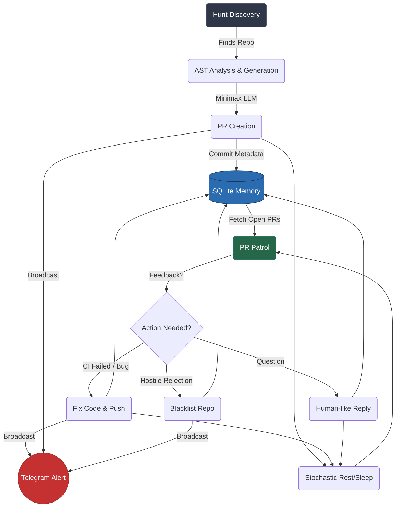

# 🤖 ContribAI: The Edge-Deployable Open Source Agent

[](https://www.python.org/downloads/)
[](LICENSE)
[](#)
[](#)

> **A fully autonomous, 24/7 AI developer that hunts repositories, creates expert-level code contributions, and interacts naturally with human maintainers.**

ContribAI isn't just a code generator—it's a complete, stateful digital persona that relentlessly pushes the open source ecosystem forward.

---

## 🌟 The "Super Human" Features

* **CI Auto-Healing:** Pushes a PR, monitors the GitHub Actions build, and autonomously intercepts, diagnoses, and patches any subsequent CI/CD test failures without user intervention.
* **Telegram Dispatcher:** Get beautiful, non-blocking mobile push notifications the exact second ContribAI opens a new PR, resolves a CI failure, or blacklists a hostile repository.
* **Edge-Optimized Docker:** Designed to run 24/7 on resource-constrained devices (Raspberry Pi/Orange Pi) under 512MB RAM using a highly optimized, multi-stage Alpine/Slim builder (`Dockerfile.superhuman`).
* **Minimax Overdrive:** Maximizes parallel asynchronous throughput using the Minimax API. Includes a proprietary, SQLite-backed sliding window memory manager to ride safely along the 5-hour/1000-request hard limit.
* **Human Persona GitHub Interactions:** Reads repository guidelines and past PRs to mimic local coding styles. Automatically reacts to maintainer feedback (+1) and pushes contextual, natural language conversational responses.

## 🏗️ Architecture Flow



## 🚀 Quick Start Guide

### 1. Local Setup
```bash
git clone https://github.com/tang-vu/ContribAI.git
cd ContribAI

# Create your virtual environment
python -m venv venv
source venv/bin/activate  # On Windows: .\venv\Scripts\activate

pip install -e ".[dev]"

# Launch the Command Center
./start.bat
```

### 2. Environment Configuration
Copy the configuration template:
```bash
cp config.example.yaml config.yaml
```
Inside `config.yaml`, ensure you supply your core keys:
```yaml
github:
  token: "ghp_your_github_token"

llm:
  provider: "minimax"
  model: "MiniMax-M2.7"
  api_key: "your_minimax_token"
  minimax_group_id: "your_minimax_group"

notifications:
  telegram_token: "your_telegram_bot_token"
  telegram_chat_id: "your_chat_id"
```

### 3. Edge Deployment (Docker)
Built specifically for 24/7 deployment on devices like Orange Pi or Raspberry Pi.

```bash
# Build and run the ultra-lightweight Super Human loop
docker-compose -f docker-compose.superhuman.yml up -d --build
```
You can safely detach; the agent will maintain its own SQLite memory state and log daily progress to the `daily_log/` directory.

## ⚠️ Disclaimer & Responsible Use

ContribAI automates real code submissions to live public repositories. 
* **Rate Limits:** Respect the API caps of the platforms you query. The system utilizes automated backoffs, but misuse can result in GitHub API bans.
* **Open Source Etiquette:** Do not unleash this bot in a manner that spam-floods maintainers with low-quality PRs. The architecture requires you to review generated code during tests before switching to unsupervised Super Human mode. Be a good neighbor.

---
**Powered by Minimax M2.7 | Built for the Open Source Community**
