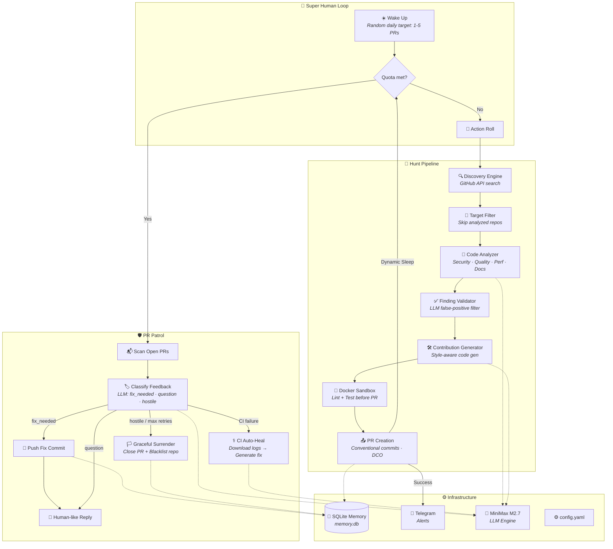

<p align="center">
  <h1 align="center">🤖 ContribAI</h1>
  <p align="center">
    <strong>The autonomous AI agent that hunts, fixes, and contributes to open-source projects — 24/7, like a relentless developer who never sleeps.</strong>
  </p>
  <p align="center">
    
    
    
    
    
    
  </p>
</p>

---

ContribAI is a fully autonomous, edge-deployable AI agent that discovers GitHub repositories, analyzes codebases for real issues, generates production-quality fixes, opens Pull Requests, and then **monitors, defends, and heals its own PRs** — all without human intervention.

> *"It doesn't just open PRs. It reads maintainer feedback, pushes follow-up fixes, auto-heals CI failures, and gracefully surrenders when it's wrong."*

---

## ✨ Core Features

| Feature | Description |
|---|---|
| 🦅 **Autonomous Discovery** | Searches GitHub by language, stars, and activity. Stochastic criteria rotation prevents repetition. |
| 🔬 **LLM-Powered Analysis** | Multi-strategy code analysis (security, quality, performance, docs) with language-specific rulesets. |
| 🐳 **Docker Sandbox Validation** | Shift-left testing — runs linters/tests inside ephemeral Docker containers *before* opening a PR. |
| 🛡️ **CI Auto-Healing** | Detects failing CI checks, downloads logs, generates fixes, and pushes follow-up commits. Capped at 3 retries. |
| 🗣️ **Human-Persona Interactions** | Randomized natural English replies to maintainer feedback. Answers questions, pushes code fixes, and knows when to gracefully surrender. |
| 📱 **Telegram Dispatcher** | Real-time push notifications for PR creation, CI events, merges, and critical errors. |
| 🧠 **SQLite Persistent Memory** | Tracks analyzed repos, PR outcomes, rejection patterns, repo preferences, daily quotas, and API usage — survives reboots. |
| 🎲 **Stochastic Daily Quotas** | Random daily PR target (1-5), infinite hunting until quota met, then patrol-only mode. |
| ⚡ **Dynamic Sleep** | 2-5 min retry on dry runs, 30-90 min rest after productive hunts. No wasted idle time. |
| 🔌 **Edge-Optimized** | Multi-stage Docker build for ARM64/AMD64. Runs on Orange Pi, Raspberry Pi, or any SBC with 512MB RAM. |

---

## 🥸 Deep Cover Anti-Abuse System

To bypass sophisticated ML bot-detection heuristics, ContribAI employs a multi-layered behavioral spoofing engine:
* **Human Imperfections:** Introduces stochastic "Notification Lag" (10m-2h delay before reading maintainer replies).
* **Git Timestamp Spoofing:** Backdates `author.date` payloads by 15-45 minutes to simulate offline local coding rather than synchronous API automation.
* **Circadian & Fatigue Modeling:** Implements mandatory lunch breaks, WPM-based typing delays tied to payload size, and a 10% probabilistic chance of "ghosting" maintainers in long feedback loops.
* **API Throttling:** Utilizes a "Soft Fetch Throttler" with micro-sleeps and checks repo interaction limits to avoid 403s and 422s.

## 📱 Telegram Command Center

ContribAI can be controlled and monitored securely from your mobile device via Telegram Long-Polling. Send commands directly to the bot:
* `/status`: Check if the background Super Human Loop is active.
* `/rptoday`: Fetches a report of all successful PRs opened today.
* `/quota`: Checks LLM token and API budget constraints.

## 🎮 Gamification (WIP)

A lightweight 2D pixel-art visualizer for the dashboard using a newly implemented WebSocket endpoint (`/ws/bot-state`). This emits real-time state transitions (`working`, `sleeping`, `coffee_break`) mapped directly to the bot's internal orchestrator state, allowing an interactive "Tamagotchi-style" observation of the agent's behavior.

---

## 🏗️ Architecture



---

## 🚀 Quick Start

### Prerequisites

- **Python 3.11+**
- **Git** (with `gh` CLI recommended)
- **Docker** (optional, for sandbox validation and edge deployment)

### 1. Clone & Install

```bash
git clone https://github.com/hieuit095/ContribAI.git
cd ContribAI

# Create virtual environment
python -m venv venv
source venv/bin/activate    # Linux/macOS
venv\Scripts\activate       # Windows

# Install dependencies
pip install -e ".[dev]"
# Or: pip install -r requirements.txt
```

### 2. Configure

```bash
cp config.example.yaml config.yaml
```

Edit `config.yaml` with your credentials:

```yaml
github:
  token: "ghp_your_token_here"

llm:
  provider: "minimax"
  model: "MiniMax-M2.7"
  api_key: "your_minimax_api_key"

notifications:
  telegram_token: "123456:ABC-DEF"
  telegram_chat_id: "your_chat_id"
```

Or use environment variables:

```bash
export GITHUB_TOKEN="ghp_..."
export MINIMAX_API_KEY="..."
```

### 3. Run

#### Interactive Command Center (Windows)

```cmd
start.bat
```

#### CLI Commands

```bash
# 🧠 Super Human Mode — autonomous 24/7 loop
contribai superhuman

# 🦅 Single hunt session (5 rounds)
contribai hunt --rounds 5

# 🎯 Target a specific repo
contribai run https://github.com/owner/repo

# 🛡️ Patrol open PRs
contribai patrol

# 📊 View dashboard
contribai dashboard

# ⏩ Time-warp test mode (1-3s delays, 10 iterations)
contribai superhuman --time-warp
```

---

## 🐳 Edge Deployment

Deploy ContribAI to an Orange Pi, Raspberry Pi, or any ARM64/AMD64 device:

```bash
# Create .env with your secrets
echo "GITHUB_TOKEN=ghp_..." > .env
echo "MINIMAX_API_KEY=..." >> .env

# Deploy with Docker Compose
docker compose -f docker-compose.superhuman.yml up -d

# Monitor logs
docker compose -f docker-compose.superhuman.yml logs -f
```

**Resource constraints** are pre-configured for low-power SBCs:
- **512MB RAM** hard limit
- **0.5 CPU** cap
- Log rotation (10MB × 3 files) prevents SD card fill-up
- SQLite memory persisted via volume mount

---

## 🧪 Testing

```bash
# Run all tests
python -m pytest tests/ -v

# Run unit tests only
python -m pytest tests/unit/ -v

# Run with coverage
python -m pytest tests/ --cov=contribai --cov-report=term
```

---

## 📁 Project Structure

See [`project_map.md`](project_map.md) for the complete annotated file tree.

```
contribai/
├── analysis/       # Multi-strategy code analysis engine
├── cli/            # Click-based CLI + interactive TUI
├── core/           # Config, models, sandbox, memory, notifier
├── generator/      # LLM-powered contribution generation
├── github/         # GitHub API client + repo discovery
├── issues/         # Issue solver (deep multi-file planning)
├── llm/            # LLM provider abstraction (MiniMax M2.7)
├── orchestrator/   # Pipeline, SuperHumanLoop, Memory
├── pr/             # PR manager + Patrol (CI auto-heal)
├── scheduler/      # Cron-based background scheduling
├── templates/      # PR description + commit templates
├── tools/          # DeerFlow-pattern tool registry
└── web/            # FastAPI dashboard + webhook server
```

---

## 🛡️ Safety & Ethics

ContribAI is designed to be a **good citizen** of the open-source ecosystem:

- **Daily PR caps** prevent repo spam (random 1-5 target, hard cap at 6)
- **Graceful surrender** — closes PR and blacklists repo after 3 CI retries or 3 discussion rounds
- **AI transparency** — PRs are clearly labeled as AI-generated contributions
- **CONTRIBUTING.md respect** — reads and follows repo guidelines, commit conventions, and PR templates
- **Repo blacklisting** — hostile repos are permanently excluded from future targeting
- **DCO sign-off** — automatic `Signed-off-by` on all commits

---

## 📄 License

This project is licensed under the **GNU General Public License v3.0** — see [`LICENSE`](LICENSE) for details.

---

<p align="center">
  <sub>Built with 🔥 by a developer who believes AI should contribute to open source, not just consume it.</sub>
</p>
